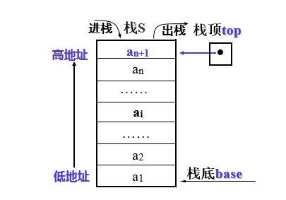
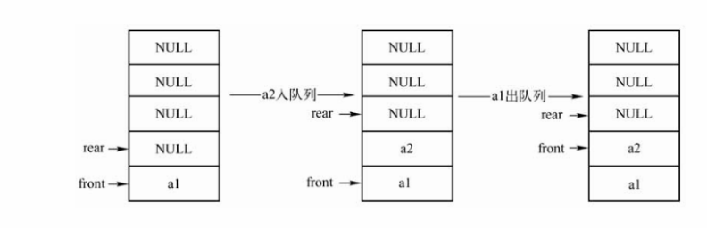
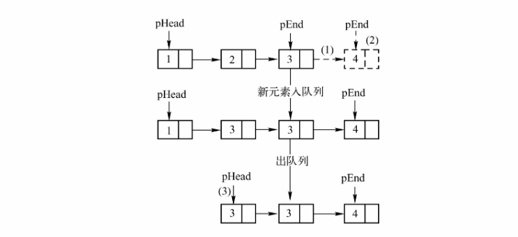

# [数据结构] 栈与队列
## 一、基本结构

### 1. 概念

&emsp;&emsp;栈和队列是两种常见的数据结构。它们都是线性结构，但它们的操作方式不同。栈是一种后进先出（LIFO）的数据结构，即最后进入的元素最先被访问。而队列是一种先进先出（FIFO）的数据结构，即最先进入的元素最先被访问。

&emsp;&emsp;在具体实现时，栈和队列也有所不同。栈只在一端进行插入和删除操作，这一端称为栈顶。而队列则在两端进行插入和删除操作，分别称为队头和队尾。

### 2. 实现方式

栈和队列的实现方式有很多种，这里我提供一些常见的实现方式。

栈的实现方式：

1. 用数组来模拟栈，用top变量表示栈顶元素的下标，用push()方法向栈顶添加元素，用pop()方法弹出栈顶元素。
2. 用链表来模拟栈，用head指针表示栈顶元素，用push()方法向栈顶添加元素，用pop()方法弹出栈顶元素。
3. 用双端队列（deque）来模拟栈，用append()方法向栈顶添加元素，用pop()方法弹出栈顶元素。

队列的实现方式：

1. 用数组来模拟队列，用front和rear变量分别表示队头和队尾的下标，用push()方法向队尾添加元素，用pop()方法弹出队头元素。为了节省空间，常用循环队列来存放数据。循环队列的核心在于`求余%`
2. 用链表来模拟队列，用head和tail指针分别表示队头和队尾元素，用push()方法向队尾添加元素，用pop()方法弹出队头元素。
3. 用两个栈来模拟队列，一个栈作为输入栈，一个栈作为输出栈。当需要弹出队头元素时，如果输出栈为空，则将输入栈中的所有元素依次弹出并压入输出栈中；否则直接从输出栈中弹出。

>注：队列可以分为两种模式：
>>  1. front存第一个数据，rear指向最后一个数据的下一个位置。数据是从0开始存的。
>>  2. fornt指向第一个数据的上一个位置，rear存最后一个数据。数据是从1开始存的。

### 3. 结构图解

#### 栈的实现图解

1. 数组栈



2. 链表栈   


入栈
  

出栈


#### 队列的实现图解

1. 数组队列(用的1的模式)


  

2. 链表队列



<br>
<br>

---

## 二、栈与队列的c语言实现


### 顺序栈

```c
#include <stdio.h>
#include <stdlib.h>
#include <string.h>
#define SIZE 10 

typedef int data_t;

//构造顺序栈类型
typedef struct {
	data_t data[SIZE];//顺序栈
	int top;//保存栈顶元素的下标
}stack;

//创建空栈
stack *createSeqstack()
{
	stack *sq = (stack *)malloc(sizeof(stack));//给顺序栈开空间
	if(NULL == sq)
		return NULL;
	memset(sq->data, 0, sizeof(sq->data));//清空顺序栈
	sq->top = -1;//说明栈中无元素

	return sq;
}

//判空
int seqstack_is_empty(stack *sq)
{
	if(NULL == sq)
		return -1;
	else
		return ((sq->top == -1)?1:0);
}

//判满
int seqstack_is_full(stack *sq)
{
	if(NULL == sq)
		return -1;
	else
		return ((sq->top == SIZE-1)?1:0);
}

//求栈中元素个数
int getLengthStack(stack *sq)
{
	if(sq == NULL)
		return -1;
	else
		return (sq->top+1);
}	

//进栈
int pushStack(stack *sq, data_t data)
{
	if(NULL == sq)
		return -1;
	if(seqstack_is_full(sq))//判满
		return -1;
	
	sq->data[sq->top+1] = data;
	sq->top++;

	return 0;
}

//出栈
data_t popStack(stack *sq)
{
	if(sq == NULL)
		return -1;
	if(seqstack_is_empty(sq))
		return -1;
		
	data_t data = sq->data[sq->top];//data变量保存栈顶元素的值
	sq->top--;

	return data;
}

//打印栈中元素
void printStack(stack *sq)
{
	if(NULL == sq)
		return ;
	if(seqstack_is_empty(sq))
		return ;
	int i;
	for(i=sq->top;i>=0;i--)
		printf("%d ",sq->data[i]);
	printf("\n");
	return ;
}
```

<br>
<br>
<br>

### 链表栈

```c
#include <stdio.h>
#include <stdlib.h>

typedef int data_t;

//构造链式栈节点类型
typedef struct node{
	data_t data;//节点的数据域
	struct node *next;//保存下一个节点的地址
}lstack;

//创建空链式栈
lstack *createLstack()
{
	lstack *top = (lstack *)malloc(sizeof(lstack));
	if(NULL == top)
		return NULL;
	top->data = -1;
	top->next = NULL;
	
	return top;
}

//判空
int lstack_is_empty(lstack *top)
{
	if(NULL == top)
		return -1;
	else
		return ((top->next == NULL)?1:0);
}

//求栈中节点个数
int getLengthLstack(lstack *top)
{
	if(NULL == top)
		return -1;
	int num = 0;
	lstack *p = top->next;
	while(p != NULL)
	{
		num++;
		p = p->next;
	}

	return num;
}

//入栈
int pushLstack(lstack *top, data_t data)
{
	if(NULL == top)
		return -1;
	lstack *new = (lstack *)malloc(sizeof(lstack));
	if(NULL == new)
		return -1;
	new->data = data;
	new->next = NULL;

	//将 new节点插入到栈顶位置，即  pos=0 位置处
	new->next = top->next;
	top->next = new;
	
	return 0;
}

//出栈
data_t popLstack(lstack *top)
{
	if(NULL == top)
		return -1;
	if(lstack_is_empty(top))
		return -1;
	lstack *p = top->next;//p指针保存的是栈顶元素的地址
	data_t data = p->data;//data变量保存的是栈顶节点的值
	top->next = p->next;
	free(p);
	p = NULL;

	return data;
}

//打印栈中各个节点的data值
void printfLstack(lstack *top)
{
	if(NULL == top)
		return ;
	if(lstack_is_empty(top))
		return;
	lstack *p = top->next;
	while(p != NULL)
	{
		printf("%d ",p->data);
		p = p->next;
	}
	printf("\n");

	return ;
}
```

<br>
<br>
<br>

### 数组队列(求余思想)

```c
#include <stdio.h>
#include <stdlib.h>
#include <string.h>

#define SIZE 10

typedef int data_t;

typedef struct{
	data_t data[SIZE];
	int front; //对头元素的位置
	int rear; //队尾元素的下一个位置
}squeue;

//创建
squeue *createSqueue()
{
	squeue *sq = (squeue *)malloc(sizeof(squeue));
	if(NULL == sq)
		return NULL;

	memset(sq->data, 0, sizeof(sq->data));

	sq->front = sq->rear = 0;

	return sq;
}

//判空
int squeue_is_empty(squeue *sq)
{
	if(NULL == sq)
		return -1;

	return ((sq->front == sq->rear)?1:0);
}

//判满
int squeue_is_full(squeue *sq)
{
	if(NULL == sq)
		return -1;

	return (sq->front == (sq->rear+1)%SIZE )?1:0;
}

//求长度
int squeue_length(squeue *sq)
{

	if(NULL == sq)
		return -1;
/*
	int num= 0;
	int temp = sq->front;

	while(temp != sq->rear)
	{
		num++;
	
		temp = (temp+1)%SIZE;
	}

	return num;
*/
	return (sq->rear  + SIZE  -  sq->front)%SIZE;

}

//入队, 在队尾进行入队操作
int squeue_in(squeue *sq, data_t data)
{
	if(NULL == sq)
		return -1;

	if(sq->rear != 0 && sq->rear%(SIZE-1)==0)
		sq->rear = (sq->rear+1)%SIZE;

	sq->data[sq->rear] = data;

	sq->rear = (sq->rear+1)%SIZE;
}

//出队
data_t squeue_out(squeue *sq)
{
	if(NULL == sq)
		return -1;

	if(squeue_is_empty(sq) == 1)
		return -1;

	data_t data = sq->data[sq->front];

	sq->front = (sq->front+1)%SIZE;

	return data;
}

//打印
void dispalySqueue(squeue *sq)
{
	if(NULL == sq)
		return;

	int temp = sq->front;

	while(temp != sq->rear)
	{
		printf("%d ", sq->data[temp]);
	
		temp = (temp+1)%SIZE;
	}

	puts("");
}


```


<br>
<br>
<br>

### 链表队列

```c
#include <stdio.h>
#include <stdlib.h>
#include <string.h>

typedef int data_t;

typedef struct node{
	data_t data;
	struct node *next;
}linklist;

typedef struct{
	linklist *front; //指向对头元素的前一个位置
	linklist *rear; //指向队尾元素的位置
}lqueue;

lqueue *createLqueue()
{
	lqueue *lq = (lqueue *)malloc(sizeof(lqueue));
	if(NULL == lq)
		return NULL;

	lq->front = (linklist *)malloc(sizeof(linklist)); //返回头结点的地址
	if(NULL == lq->front)
		return NULL;

	lq->rear = lq->front;

	lq->front->next = NULL;

	return lq;
}

int lqueue_is_empty(lqueue *lq)
{
	if(NULL == lq)
		return -1;

	return (lq->front == lq->rear)?1:0;
}

//求长度
int lqueue_length(lqueue *lq)
{
	if(NULL == lq)
		return -1;

	linklist *p = lq->front->next; //p指向第一个有效结点

	int num = 0;
	while(p != NULL)
	{
		num++;

		p=p->next;
	}
	
	return num;
}

//入队
int lqueue_in(lqueue *lq, data_t data)
{
	if(NULL == lq)
		return -1;

	linklist *new = (linklist *)malloc(sizeof(linklist));
	if(NULL == new)
		return -1;

	new->data = data;
	new->next = NULL;


	lq->rear->next = new; 

	lq->rear = new;

}


//出队
data_t lqueue_out(lqueue *lq)
{
	if(NULL == lq)
		return -1;

	if(lqueue_is_empty(lq))
		return -1;

	linklist *p = lq->front->next; //指向对头元素

	data_t data = p->data;

	lq->front->next = p->next;

	if(lq->front->next == NULL)
		lq->front == lq->rear;

	free(p);
	p = NULL;

	return data;
}


//打印
void displayLqueue(lqueue *lq)
{
	if(NULL == lq)
		return;

	linklist *p = lq->front->next;

	while(p != NULL)
	{
		printf("%d ", p->data);

		p=p->next;
	}

	puts("");
}
```