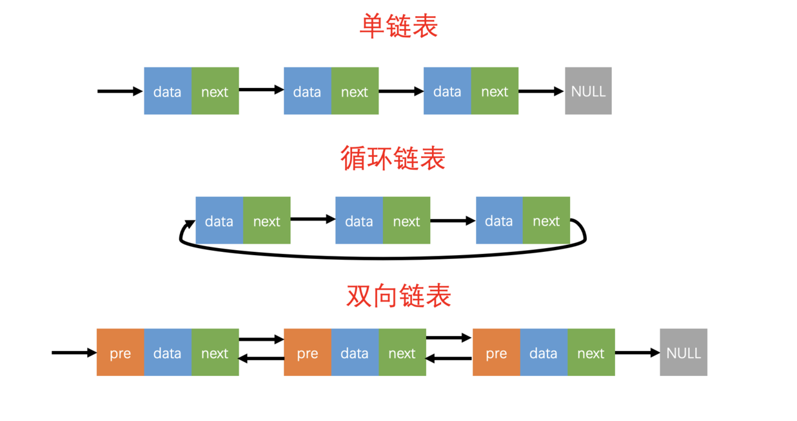
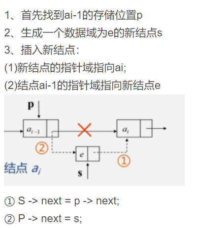
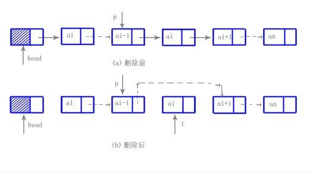

# [数据结构] 链表与哈希表
## 一、基本结构
链表是一种常见的数据结构，由一系列节点组成，每个节点包含数据和指向下一个节点的指针。

链表可以分为单向链表和双向链表两种类型。在单向链表中，每个节点只包含一个指向下一个节点的指针，而在双向链表中，每个节点同时包含指向上一个节点和下一个节点的指针。

相比于数组，链表的一个重要优势是可以动态地增加和删除节点，而不需要移动整个数据结构中的其他元素。但是，链表的访问效率较低，因为需要遍历整个链表才能找到所需节点。

<br>
<br>

---

## 二、链表图解
### 整体

### 插入

### 删除


<br>
<br>

---

## 三、链表的代码实现
```c
#include <stdlib.h>
#include <stdio.h>
#include "linklist.h"
//创建链表的结构体
typedef int data_t;
typedef struct node_t{
    data_t data;  //数据域
    struct node_t *next; //next 域
}linklist; 

//创建链表头节点
linklist* create_linklist()
{
    linklist* head = (linklist*) malloc(sizeof(linklist));
    if(NULL == head) return NULL;
    head->data = -1;
    head->next = NULL; 
    return head;
}

//判空
int linklist_is_empty(linklist* head)
{
    if(NULL == head) return -1;
    return ((head->next == NULL) ?1:0);
}
//求有效节点个数(求长度)
int get_num_linklist(linklist* head)
{
    if(NULL == head) return -1;
    linklist *p = head->next; //定义p指针指向第一个有效节点
    int num = 0;
    while(p != NULL)  //循环遍历
    {
        num++;              //统计节点数
        p = p->next;        //p指针向后偏移
    }
    return num; 
}
//头插法
int insert_head_linklist(linklist* head, data_t val)
{
    if(NULL == head) return -1;
    //准备new 节点
    linklist *new  = (linklist *)malloc(sizeof(linklist));
    new->data = val; //
    new->next = NULL;
    //头插法 插入
    new->next = head->next; 
    head->next = new; 
    return 0;
}

//按位置插入
int insert_by_pos_linklist(linklist *head, int pos, data_t val)
{
    if(NULL == head) return -1;
    //判断位置合法性
    int len = get_num_linklist(head); 
    if(pos < 0 || pos > len) return -1;
    //准备new 节点 和p 指针 
    linklist* p = head; 
    linklist* new = (linklist*)malloc(sizeof(linklist));
    new->data = val;
    new->next = NULL;
    //将p 找到pos-1的位置
    while(pos--)
        p = p->next;
    //将新节点插入pos 位置
    new->next = p->next;
    p->next   = new; 
    return 0;
}

//按位置修改
int change_by_pos_linklist(linklist*head, int pos, data_t new_val)
{
    if(NULL == head) return -1;
    if(linklist_is_empty(head)== 1) return -1;
    //判断位置合法性
    int len = get_num_linklist(head); 
    if(pos < 0 || pos > len-1) return -1;
    linklist* p = head->next; 
    //找到pos 位置
    while(pos--)  
        p   = p->next;
    p->data = new_val;  //修改
    return 0;
}
//
//按位置查询
data_t find_by_pos_linklist(linklist*head, int pos)
{
    if(NULL == head) return -1;
    if(linklist_is_empty(head)== 1) return -1;
    //判断位置合法性
    int len = get_num_linklist(head); 
    if(pos < 0 || pos > len-1) return -1;
    linklist* p = head->next; 
    //找到pos 位置
    while(pos--)  
        p = p->next;
    return p->data; 
}
//按位置删除
int delete_by_pos_linklist(linklist* head, int pos)
{
    if(NULL == head) return -1;
    if(linklist_is_empty(head)== 1) return -1;
    //判断位置合法性
    int len = get_num_linklist(head); 
    if(pos < 0 || pos > len-1) return -1;
    //准备p 指向pos-1， q 指向要删除的pos 节点
    linklist* p = head;
    linklist* q = NULL; 
    //找到pos -1位置
    while(pos--) 
        p = p->next;
    q = p->next;
    //连接
    p->next = q->next; 
    //删除节点
    free(q); 
    q = NULL; //
    return 0;
}


//打印有效节点的值
void show(linklist* head)
{
    if(NULL == head) return;
    linklist *p = head->next;
    while(p != NULL)
    {
        printf("%-4d",p->data);
        p = p->next; 
    }
    printf("\n");
    return; 
}
//清空链表
int clear_linklist(linklist* head)
{
    if(NULL == head) return -1;
    linklist *p = head->next;
    head->next = NULL;
    linklist* q = NULL;
    while(p != NULL)
    {
        q = p->next; //q 偏移
        free(p);
        p = q;  //p 向后偏移
    }
    return 0;
}
//销毁链表（销毁时要注意不能只free头节点，必须要逐个遍历节点并一个个free）

int destory_linklist(linklist** head)
{
    ListNode* current = *head;
    ListNode* nextNode = NULL;

    while (current != NULL) {
        nextNode = current->next; // 保存下一个节点的地址
        free(current); // 释放当前节点
        current = nextNode; // 移动到下一个节点
    }

    // 确保调用者的头指针被设置为NULL
    *head = NULL;

    return 0;
}
// 命令行模式下：gg=GG 自动缩进
```

<br>
<br>

---

## 四、单向循环链表  
即把链表代码中表示的最后一位的NULL都改为head就行。


<br>
<br>

---

## 五、双向链表
双向链表的主要不同点便是
1. 头插法插入时要判断后面是否是NULL，按位置插入和删除时要判断是否是尾部
2. 插入的顺序主要分四部：(先右后左，先赋值给new再把原数据指向new)
>new->next=p->next;
>p->next->piror=new;
>new->prior=p;
>p->next=new;

下面是双向链表的c的实现
```c
#include <stdlib.h>
#include <stdio.h>
#include "dlinklist.h"

//创建链表头节点
dlinklist* create_dlinklist()
{
    dlinklist* head = (dlinklist*) malloc(sizeof(dlinklist));
    if(NULL == head) return NULL;
    head->data = -1;
    head->prior = head->next = NULL; 
    //head->prior = NULL; 
    return head;
}
//判空
int dlinklist_is_empty(dlinklist* head)
{
    if(NULL == head) return -1;
    return ((head->next == head->prior) ?1:0);
}
//求有效节点个数(求长度)
int get_num_dlinklist(dlinklist* head)
{
    if(NULL == head) return -1;
    dlinklist *p = head->next; //定义p指针指向第一个有效节点
    int num = 0;
    while(p != NULL)  //循环遍历
    {
        num++;              //统计节点数
        p = p->next;        //p指针向后偏移
    }
    return num; 
}
//头插法
int insert_head_dlinklist(dlinklist* head, data_t val)
{
    if(NULL == head) return -1;
    //准备new 节点
    dlinklist *new  = (dlinklist *)malloc(sizeof(dlinklist));
    new->data = val; //
    new->next = NULL;
    new->prior = NULL;
    //头插法 插入
    if(head->next   == NULL)
    {
        new->next = head->next;
        new->prior = head;
        head->next = new; 
    }else
    {
        new->next = head->next;
        head->next->prior = new; 
        new->prior = head;
        head->next = new; 
    }
    return 0;
}
//打印有效节点的值
void show(dlinklist* head)
{
    if(NULL == head) return;
    dlinklist *p = head->next;
    while(p != NULL)
    {
        printf("%-4d",p->data);
        p = p->next; 
    }
    printf("\n");
    return; 
}

//按位置插入
int insert_by_pos_dlinklist(dlinklist *head, int pos, data_t val)
{
    if(NULL == head) return -1;
    //判断位置合法性
    int len = get_num_dlinklist(head); 
    if(pos < 0 || pos > len) return -1;
    //准备new 节点 和p 指针 
    dlinklist* p = head; 
    dlinklist* new = (dlinklist*)malloc(sizeof(dlinklist));
    new->data = val;
    new->next = NULL;
    new->prior = NULL;
    //将p 找到pos-1的位置
    while(pos--)
        p = p->next;
    //将新节点插入pos 位置
    if(p->next == NULL) //尾插
    {
        new->next = NULL; 
        new->prior = p;
        p->next = new;
    }else{
        new->next = p->next;
        p->next->prior = new;
        new->prior = p;
        p->next = new; 
    }
    return 0;
}
//按位置删除
int delete_by_pos_dlinklist(dlinklist* head, int pos)
{
    if(NULL == head) return -1;
    if(dlinklist_is_empty(head)== 1) return -1;
    //判断位置合法性
    int len = get_num_dlinklist(head); 
    if(pos < 0 || pos > len-1) return -1;
    //准备p 指向pos-1， q 指向要删除的pos 节点
    dlinklist* p = head;
    dlinklist* q = NULL; 
    //找到pos -1位置
    while(pos--) // pos -1
        p = p->next;
    //连接
    //q = p->next ; 
    //if(q->next == NULL) //尾删
    if(p->next->next == NULL) //尾删
    {
        q = p->next;
        p->next = NULL;
        free(q);
        q = NULL;
    }else {
        q = p->next;
        p->next = q->next;
        q->next->prior = p; 
        free(q);
        q = NULL; 
    }
    return 0;
}

```

<br>
<br>

---

## 六、哈希表
哈希表即是通过哈希函数（如除余）将关键字映射到表中的一个位置，以加快查找速度。哈希表的主要操作包括插入、删除和查找。

哈希表的主要问题是哈希冲突，即两个关键字映射到同一个位置。常见的解决方法包括链地址法和线性探测法。

线性探测法是在哈希表中寻找下一个空位置，直到找到一个空位置或者遍历整个哈希表。链地址法是将哈希表中的每个位置都指向一个链表，当发生哈希冲突时，将新关键字插入到链表中。

链地址法是将哈希表中的每个位置都指向一个链表，当发生哈希冲突时，将新关键字插入到链表中。开放地址法是在哈希表中寻找下一个空位置，直到找到一个空位置或者遍历整个哈希表。

下面是哈希表的c的实现：
* hash.h
```c
#include <stdio.h>
#include <unistd.h>
#include <stdlib.h>
#include <math.h>
#include <limits.h>

typedef unsigned int u64_t;

//每个数据元素
typedef struct data{
    u64_t key;
    u64_t val;
}DATA;

//由数据元素形成的链表的节点
typedef struct Node{
    DATA data;
    struct Node *prev;
    struct Node *next;
}Node;

//每个hash值后的链表
typedef struct LinkList{
    Node *head;
    int length;
}LinkList;

//链表法哈希,这里二级指针表明是一个*LinkList的数组，数组元素大小为capacity
typedef struct HASH{
    LinkList **nums;
    int capacity;
}HASH ;


HASH *init_myhash();
int insert_hash(HASH *hash,DATA data);
int delete_hash(HASH *hash,u64_t key);
int search_hash(HASH *hash,u64_t key);
void print_hash(HASH *hash);
void free_hash(HASH *hash);

```

* hash.c
```c
#define INT_CAPA 10
#define TRUE 1
#define FALSE 0

HASH *init_myhash()
{
    HASH *hash = NULL;

    //哈希表初始化
    hash = calloc(1,sizeof(HASH));
    if(hash==NULL){printf("hash_calloc failed");return NULL;}

    //哈希表中整个链表数组初始化
    hash->capacity = INT_CAPA;
    hash->nums = calloc(hash->capacity,sizeof(LinkList));
    if(hash->nums ==NULL){printf("nums_calloc failed");return NULL;}

    //链表数组中的每个链表初始化
    for(int i=0;i<hash->capacity;i++)
    {
        hash->nums[i] = calloc(1,sizeof(LinkList));
        if(hash->nums[i] == NULL ){printf("nums[i]_calloc failed");return NULL;}
    }

    return hash;
}

int intsert_hash(HASH *hash,DATA data){
    int keys = (data.key % hash->capacity);//计算要存储的位置

    //创建一个链表元素节点
    Node *temp = calloc(1,sizeof (Node));
    if(temp==NULL){printf("temp_calloc failed");return FALSE;}
    temp->data = data;

    //将新节点插入到链表中
    temp->next = hash->nums[keys]->head;
    hash->nums[keys]->head = temp;
    hash->nums[keys]->length++;
    return TRUE;
}

//用两个指针prev和temp遍历链表，temp指向要删除的节点，prev指向temp的前一个节点
int delete_hash(HASH *hash,u64_t key){
    int keys = (key % hash->capacity);
    Node *temp = hash->nums[keys]->head;
    Node *prev = NULL;

    while(temp!=NULL)
    {
        if(temp->data.key == key)
        {
            if(prev == NULL)
            {
                hash->nums[keys]->head = temp->next;
            }else{
                prev->next = temp->next;
            }
            free(temp);
            hash->nums[keys]->length--;
            return TRUE;
        }
        prev = temp;
        temp = temp->next;
    }
    return FALSE;
}

int search_hash(HASH *hash,u64_t key){
    int keys = (key % hash->capacity);
    Node *temp = hash->nums[keys]->head;

    while(temp!=NULL)
    {
        if(temp->data.key == key)
        {
            return TRUE;
        }
        temp = temp->next;
    }
    return FALSE;
}

void print_hash(HASH *hash){
    for(int i=0;i<hash->capacity;i++)
    {
        Node *temp = hash->nums[i]->head;
        printf("hash[%d]:",i);
        while(temp!=NULL)
        {
            printf("key=%d,val=%d ",temp->data.key,temp->data.val);
            temp = temp->next;
        }
        printf("\n");
    }
}

//因为链表中的每个节点都是动态分配的，所以在释放哈希表时，需要释放每个节点
void free_hash(HASH *hash){
    for(int i=0;i<hash->capacity;i++)
    {
        Node *temp = hash->nums[i]->head;
        //释放链表中的每个节点
        while(temp!=NULL)
        {
            Node *del = temp;
            temp = temp->next;
            free(del);
        }
        //释放链表
        free(hash->nums[i]);
    }
    //释放链表数组
    free(hash->nums);
    //释放哈希表
    free(hash);
}

int main(){
    HASH *hash = init_myhash();
    DATA data;
    data.key = 1;
    data.val = 1;
    intsert_hash(hash,data);
    data.key = 2;
    data.val = 2;
    intsert_hash(hash,data);
    data.key = 3;
    data.val = 3;
    intsert_hash(hash,data);
    data.key = 21;
    data.val = 10;
    intsert_hash(hash,data);
    print_hash(hash);
    int b=search_hash(hash,1);
    printf("search 1:%d\n",b);
    delete_hash(hash,1);
    print_hash(hash);
    int a=search_hash(hash,21);
    printf("search 21:%d\n",a);
    free_hash(hash);
    return 0;
}

```


