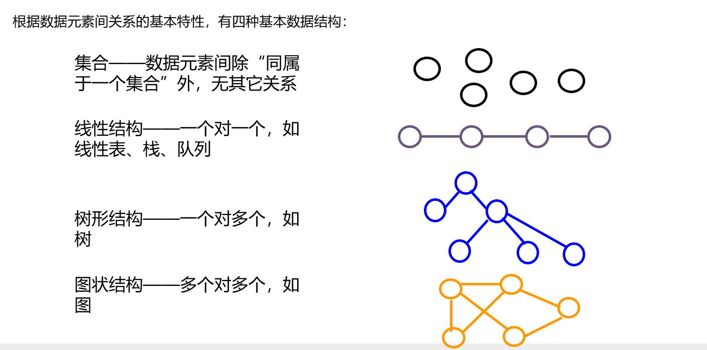
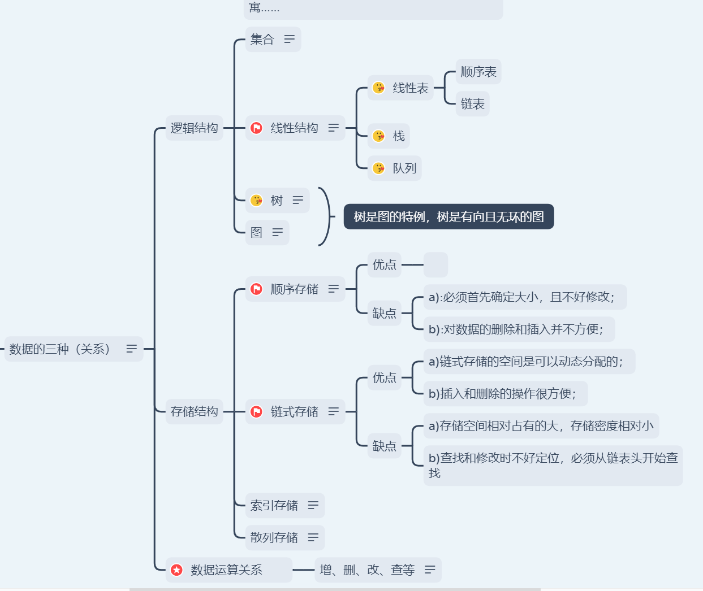
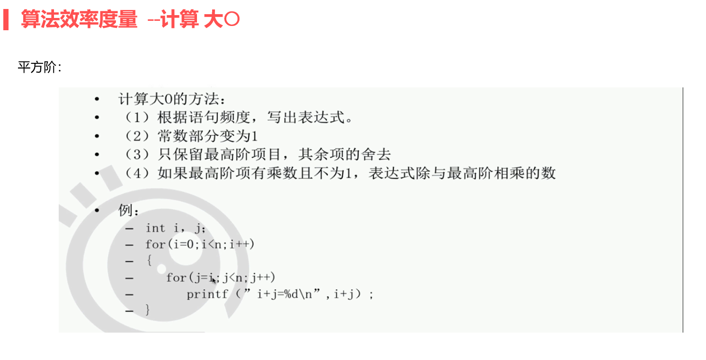
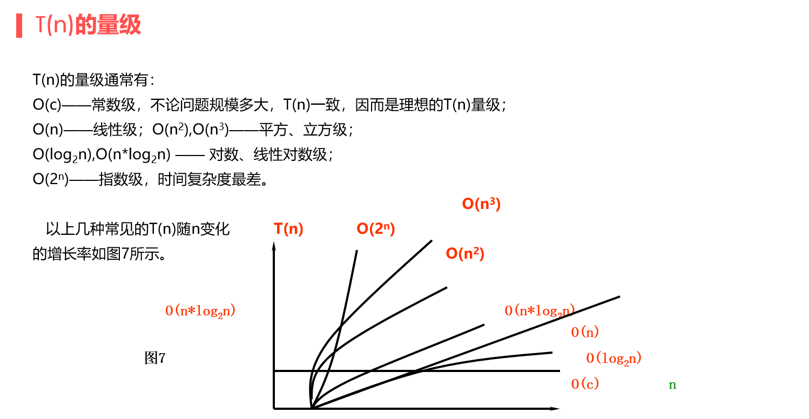
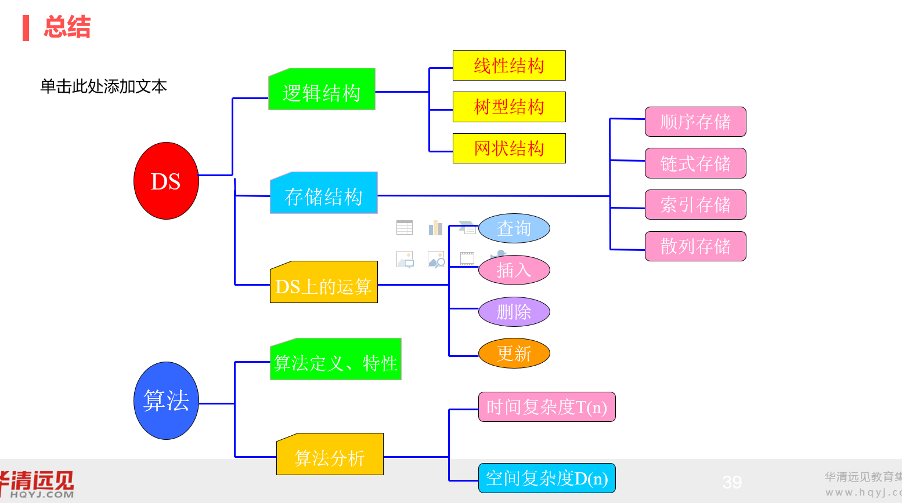
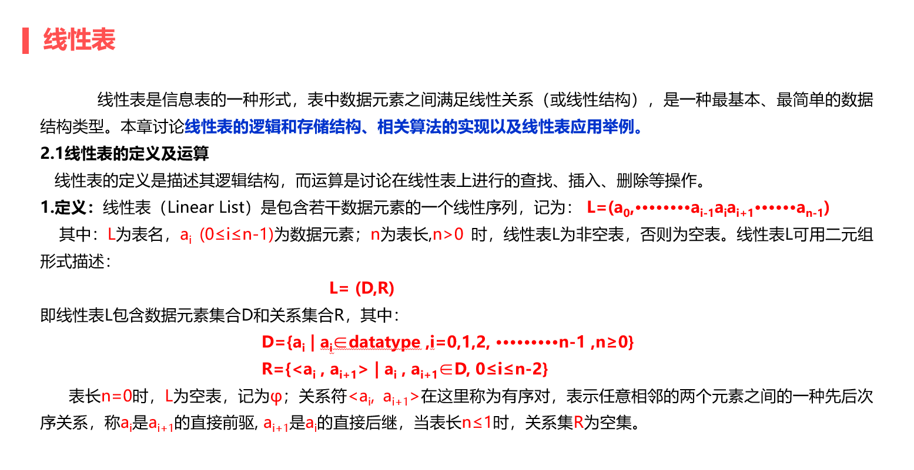
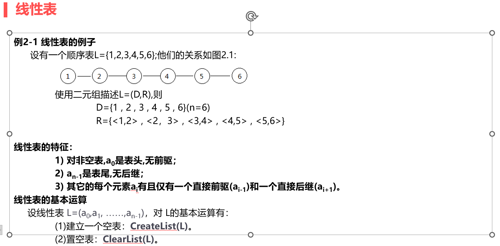

# [数据结构] 顺序表入门

后面的链表、栈、队列、树已经各自写成一篇，不在这篇里重复。这篇只讲顺序表。

## 一、课程大纲
1. 数据结构基础及算法基础+ 顺序表
2. 链表
3. 双向链表、双向循环链表 、栈、队列
4. 树、图
5. 常见的算法


<br>
<br>

---
## 二、数据结构和算法简介

### 1.数据结构基础

 1. 了解数据的基本概念和术语：

     * 数据：
         	(1)数据即信息的载体，是能够输入到计算机中且能被计算机识别、存储和处理的符号总称。
         	(2)数据不仅包括:
            a. 数值型数据：整型、实型、字符型数值型数据
            b. 非数值型数据：图片、视频、声音等

     * 数据项：
        数据元素由若干数据项组成，数据项是数据中的最小单位。
            
        数据由多种数据项组成：
          
        正比如：我们在讨论一个电影角色等时候，我们讨论的是该角色的姓名、性别、住址、等
            
        注意：数据项是数据不可分隔的最小组成单位

     * 数据结构（DS）：

        (1)可用形式化语言描述，即DS是一个二元组：
              	DS =（D,R）其中，D为数据元素的集合，R为D上关系的集合。 

    	(2)数据结构的逻辑关系

        

    * 存储结构：

    >a. 顺序存储
    >b. 链式存储
    >c. 索引存储
    >d. 散列存储

    * 运算：增、删、改、查、排

    

  

### 2.算法
(1)什么是算法？

        1. 算法（Algorithm）是一个有穷规则（或语句、指令）的有序集合。它确定了解决某一问题的一个运算序列。对于问题的初始输入，通过算法有限步的运行，产生一个或多个输出。

        2. 算法的特性：

            (1)  有穷性 —— 算法执行的步骤（或规则）是有限的

            (2)  确定性 —— 每个计算步骤无二义性

            (3)  可行性 —— 每个计算步骤能够在有限的时间内完成

            (4)  输入  —— 算法有零个或多个外部输入

            (5)  输出  —— 算法有一个或多个输出

    	3. 算法和程序的区别：

        	共同点：二者都是为完成某个任务，或解决某个问题而编制的规则（或语句）的有序集合，这是它们的。
        	不同点：
            	* 算法与计算机无关，但程序依赖于具体的计算机语言。
            	* 算法必须是有穷尽的，但程序可能是无穷尽的。
            	* 算法可忽略一些语法细节问题，重点放在解决问题的思路上，但程序必须严格遵循相应语言工具的语法。算法转换成程序后才能在计算机上运行。另外，在设计算法时，一定要考虑它的确定性，即算法的每个步骤都是无二义性的（即一条规则不能有两种以上的解释）

    	4. 程序的基本概念：

        	1. 可执行的有序二进制指令、存放在磁盘、不占用系统资源（ cpu、内存等）

    	5. 算法的优劣：

        	消耗时间的多少 ：

            消耗存储空间的多少 ：

            容易理解、容易编程和调试、容易维护。时间复杂度的概念介绍 ：

            问题的规模 ：输入数据量的大小，用n来表示。

            算法的时间复杂度 ：算法消耗时间，它是问题规模的函数 T(n)。

        	其中好算法代表了：

            	算法对应的程序所耗时间少；

                算法对应的程序所耗存储空间少；

                算法结构性好、易读、易移植和调试等等。

        	3. 时间复杂度：算法的时间复杂度定义为算法中可执行语句的频度之和，记为T(n)





### 3.数据结构常见的结构-


 

<br>
<br>

---

## 三、数据结构之顺序表

1. 线性表：



2. 线性表特征：



3. 顺序表的代码实现：

（1）memset(&emsp;)函数

   
```c
      功能：memset - fill memory with a constant byte
      
      头文件：
             #include <string.h>
      函数原型：
             void *memset(void *s, int c, size_t n);
      参数说明：
      	void *s：要清空的目标数组或指针所指空间  buf
      	int c：给定的填充的数据   0 1 等
          size_t n： 大小     sizeof（buf）；
      返回值
      	无返回值：
```

      

（2）bzero(&emsp;)函数

```c
      功能： bzero - write zero-valued bytes
      
      头文件：
             #include <strings.h>
      函数原型：
             void bzero(void *s, size_t n);
      参数说明：
      	void *s：要清空的目标数组或指针所指空间  buf
          size_t n： 大小     sizeof（buf）；
      返回值
      	无返回值：
      
```

      

（3）printf 变色打印(Linux)

```c
          字背景颜色范围:40 - 49
          40:黑
          41:深红
          42:绿
          43:黄色
          44:蓝色
          45:紫色
          46:深绿
          47:白色
           
          字颜色:30 - 39
          30:黑
          31:红
          32:绿
          33:黄
          34:蓝色
          35:紫色
          36:深绿
          37:白色
          \33[0m 关闭所有属性
          \33[1m 设置高亮度
          \33[4m 下划线
          \33[5m 闪烁
          \33[7m 反显
          \33[8m 消隐
          \33[30m -- \33[37m 设置前景色
          \33[40m -- \33[47m 设置背景色
          \33[nA 光标上移n行
          \33[nB 光标下移n行
          \33[nC 光标右移n行
          \33[nD 光标左移n行
          \33[y;xH设置光标位置
          \33[2J 清屏
          \33[K 清除从光标到行尾的内容
          \33[s 保存光标位置
          \33[u 恢复光标位置
          \33[?25l 隐藏光标
          \33[?25h 显示光标
      #include <stdio.h>
      
      int main(int argc, char *argv[])
      {
          //printf("hello world\n"); 
          printf("\033[40;32;5m hello world\033[1m\n");
      
          //printf("\033[40;31;5m hello world\033[0m\n");
      
      }
      
```
（3）printf 变色打印(Windows)
```c
#include <stdio.h>
#include <windows.h>

int main(){
    HANDLE hConsole= GetStdHandle(STD_OUTPUT_HANDLE);
    SetConsoleTextAttribute(hConsole,FOREGROUND_RED);
    printf("hello world");
    return 0;
}

/*1. 引入Windows.h头文件。
2. 使用SetConsoleTextAttribute函数设置控制台输出的字体颜色。该函数的第一个参数是控制台输出的句柄，可以使用GetStdHandle函数获取标准输出句柄；第二个参数是字体颜色，可以使用预定义的常量或自定义的颜色值。
   例如，以下代码将控制台输出的字体颜色设置为红色预定义的颜色常量包括：
- FOREGROUND_BLUE：蓝色
- FOREGROUND_GREEN：绿色
- FOREGROUND_RED：红色
- FOREGROUND_INTENSITY：高亮
- BACKGROUND_BLUE：背景色为蓝色
- BACKGROUND_GREEN：背景色为绿色
- BACKGROUND_RED：背景色为红色
- BACKGROUND_INTENSITY：背景色高亮
可以使用位运算符|和&来组合多个颜色常量，
例如：
SetConsoleTextAttribute(hConsole, FOREGROUND_RED | BACKGROUND_GREEN | FOREGROUND_INTENSITY);
该代码将字体颜色设置为红色、背景色设置为绿色、高亮显示。*/
```

（4）线性表c的实现
```c
#include <stdio.h>
#include <string.h>
#include <stdlib.h>

int perr_exit(char *s)
{
    printf("%s\n", s); 
    return -1;
}
//构造顺序表结构
#define SIZE 100
typedef int data_t; 
typedef struct {
    data_t data[SIZE]; //保存元素
    int last;        //保存尾元素下标
}seqlist; 
//创建表头及初始化表
seqlist *create_seqlite()
{
    seqlist* head =(seqlist*) malloc(sizeof(seqlist)); //创建表头 head 
    if(NULL == head)
        return NULL;
    head->last = -1;   //初始化 last为-1  表示空表
    memset(head->data, 0, sizeof(head->data)); //清空 表
    return head; 
}
//求表长
int  get_leng_seqlist(seqlist *head)
{
    if(NULL == head) return -1;
    return head->last+1;  //
}
//判空
int  seqlist_is_empty(seqlist *head)
{
    if(NULL == head) return -1;
    return ((head->last == -1)?1:0);  //
}
//判满
int  seqlist_is_full(seqlist *head)
{
    if(NULL == head) return -1;
    return ((head->last+1 == SIZE)?1:0);  //
}
//按位置插入
int insert_by_pos_seqlist(seqlist* head, int pos, data_t value)
{
    if(NULL == head) perr_exit("insert_by_pos_seqlist:");  //
    if(seqlist_is_full(head) == 1) return -1; //
    if(pos < 0 || pos > head->last+1) return -1;
    //挪位置
    int i ;
    for(i=head->last+1; i>pos; i--)
    {
        head->data[i] = head->data[i-1];
    }
    //插入数据
    head->data[pos] = value;
    //更新 last 
        head->last++; 
    return 0;   
}
//按位置 查询
data_t find_by_pos_seqlist(seqlist *head, int pos)
{
    if(NULL == head) return -1;
    if(seqlist_is_empty(head) == 1) return -1;
    if(pos < 0 || pos >head->last) return -1;
    return head->data[pos]; 
}
//按值 查询
int find_by_data_seqlist(seqlist *head, data_t val)
{
    if(NULL == head) return -1;
    if(seqlist_is_empty(head) == 1) return -1;
    int i; 
    for(i=0; i<= head->last; i++) // 0-5 
    {
        if(head->data[i] == val)
            return i; 
    }
    return -1;  
}

//按位置 修改
int change_by_pos_seqlist(seqlist* head, int pos, data_t new_val)
{
    if(NULL == head) return -1;
    if(seqlist_is_empty(head) == 1) return -1;
    if(pos < 0 || pos >head->last) return -1;
    head->data[pos] = new_val; 
    return 0;
}
//按位置 删除
int delete_by_pos_seqlist(seqlist *head, int pos)
{
    if(NULL == head) return -1;;  //
    if(seqlist_is_empty(head) == 1) return -1; //
    if(pos < 0 || pos > head->last) return -1;
    //挪位置 并覆盖删除
    int i ;
    for(i=pos; i<head->last; i++)
    {
        head->data[i] = head->data[i+1];
    }
    //更新 last 
        head->last--; 
    return 0;   
    
}
void clear_seqlist(seqlist* head)
{
    if(NULL==head) return ;
    head->last = -1;
}

int destory_seqlist(seqlist **head) // 为什么要用2级指针 看 3_getmem_point.c
{
    free(*head);
    *head = NULL; 
    
}
//打印看结果
void prn(seqlist *head)
{ 
    printf("\033[40;32;5m\033[1m\n");   //开启打印颜色
    if(NULL == head) return ;
    int i;
    int len = get_leng_seqlist(head); 
    for(i=0; i<len; i++)
    {
        printf("%-3d", head->data[i]);
    }
     printf("\033[40;32;5m\033[0m\n");   //关闭打印颜色
    printf("\n"); 
}
//错误打印

int main(int argc,const char *argv[])
{
//
    seqlist* head = create_seqlite();
    if(NULL == head) return -1;
    int i;
    for(i=0; i<5; i++)
    {
        insert_by_pos_seqlist(head, i, i+1); // 
    }
    prn(head); 
    change_by_pos_seqlist(head, 4, 666);
    prn(head); 
    printf("%d\n", find_by_data_seqlist(head, 666));


    delete_by_pos_seqlist(head, 5); 
    prn(head); 
clear_seqlist(head); 
    destory_seqlist(&head);  //
    return 0;
}
```


<br>
<br>

---

## 四、指针，函数和空间的关系 

总的来说，就是指针在作为函数的参数进行传参的时候是用的是值传参。也就是说指针之间的传参只是在函数中得到了主函数指针的样本，两个不同的指针指向了同一个地址。
先来看一段代码
```c
int *create（）
{
    int *p=（int *）malloc（sizeof（int））；
    return p；
}
int destory(int *p)
{
     free(p);
     P=NULL;
     }
int main()
{
    int *p = create();
    destory(p);
}

```
这一段代码有个问题，就是在destory()中创建一个指针，这个指针指向的是和main()中的p指针指向的同一个空间。在释放了空间后，destory()中的指针空了，但是mian()中的指针还在，并且因为空间被释放了所以变成了野指针。

再来看另一段代码
```c

typedef struct {
    int *a;
}st; 

void getmem(int *s)
{
    s = (int *)malloc(4);
    *s = 100;
}
void getmem_2(int **s)
{
    *s = (int *)malloc(4);
    *(int *)*s = 100;
}
int main(int argc,const char *argv[])
{
    st *p = (st*)malloc(sizeof(st));
    //getmem(p->a); //指针变量名 不能改变实参
    getmem_2(&(p->a)); 
    printf("%d\n",*(p->a)); 
    return 0;
}


```

getmem()函数是错误的，因为是在getmem()函数中创建了一个指针，然后让该指针指向了一个开辟的空间，但是主函数的指针并没有指向该空间而处于未初始化的状态。

要想用主函数里的指针开辟空间，就要在函数中用到二级指针来传递主函数指针的地址