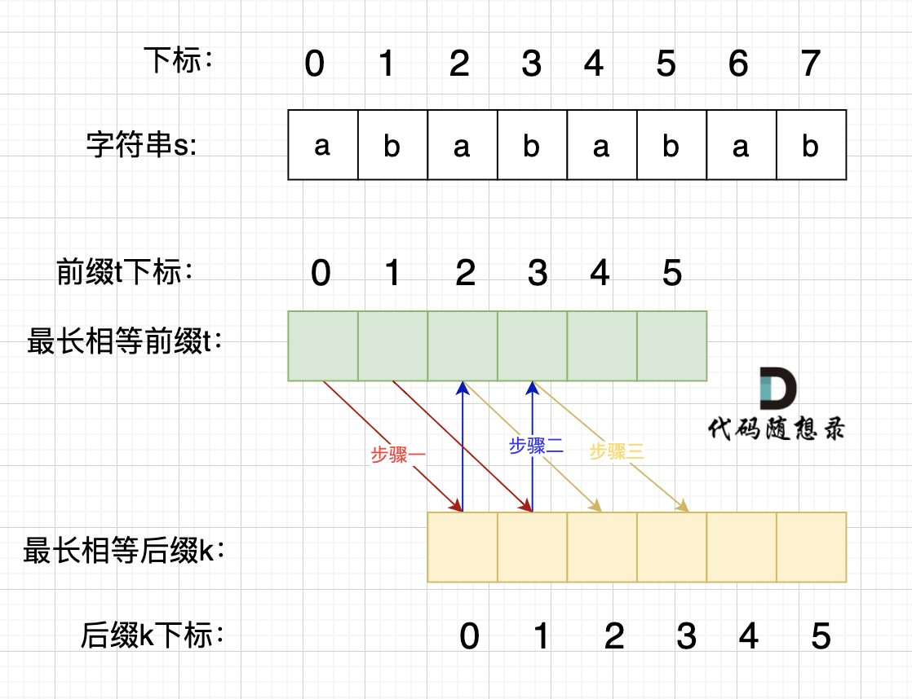
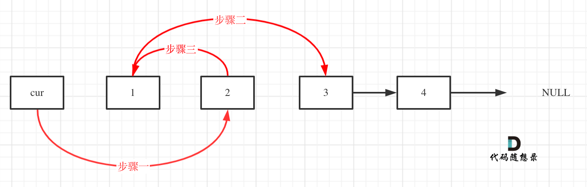
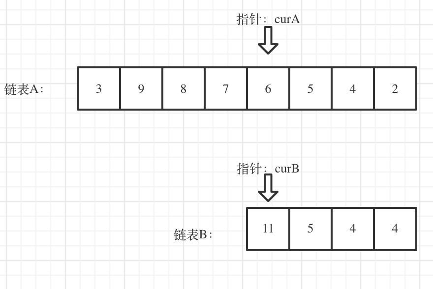
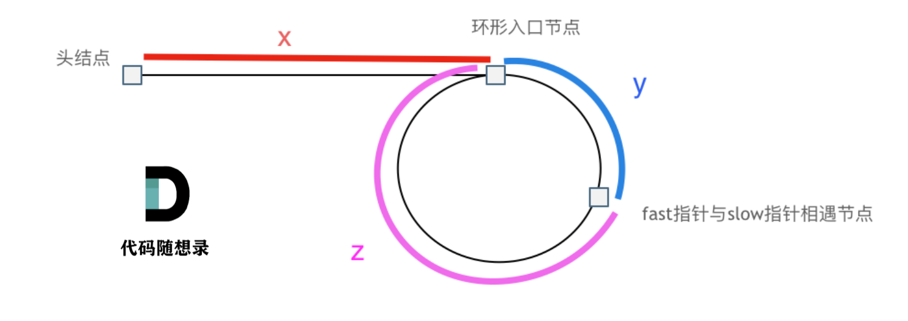
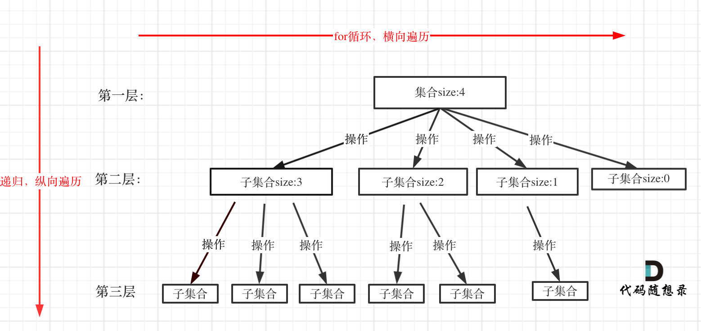

# <font color=green>leetcode算法题</font>

<br>
<br>

---


## 1.矩阵

### 1.1 54.螺旋矩阵

* 题目：
给定一个包含 m*n 个元素的矩阵（m 行, n 列），请按照顺时针螺旋顺序，返回矩阵中的所有元素。


* 思路：
设置四个边界，每次遍历完一个方向，就缩小边界，直到边界超过（只是相遇会导致相遇那的元素没有遍历到）。

进行循环：
1.从左到右，先判断左右边界是否超过，超过则结束，没有超过则从左到右，行为top，走完直到right。然后top++。
2.从上到下，先判断上下边界是否超过，超过则结束，没有超过则从上到下，列为right，走完直到bottom。然后right--。
3.从右到左，先判断左右边界是否超过，超过则结束，没有超过则从右到左，行为bottom，走完直到left。然后bottom--。
4.从下到上，先判断上下边界是否超过，超过则结束，没有超过则从下到上，列为left，走完直到top。然后left++。

```c++

class Solution {
public:
    vector<int> spiralOrder(vector<vector<int>>& matrix)
    {
        int h = matrix.size();
        int l = matrix[0].size();

        int left = 0, right = l - 1, top = 0, bottom = h - 1;

        vector<int> res;
        while(1){
            if(left > right) { return res; }
            for(int j = left; j <= right; j++)
            {
                res.push_back(matrix[top][j]);
            }
            top++;
            if(top > bottom) { return res; }
            for(int j = top; j <= bottom; j++)
            {
                res.push_back(matrix[j][right]);
            }
            right--;
            if(left > right) { return res; }
            for(int j = right; j >= left; j--)
            {
                res.push_back(matrix[bottom][j]);
            }
            bottom--;
            if(top > bottom) { return res; }
            for(int j = bottom; j >= top; j--)
            {
                res.push_back(matrix[j][left]);
            }
            left++;
        }
        return res;
    }
};

```

### 1.2 289.生命游戏

* 题目：

给定一个包含 m * n 个格子的面板，每一个格子都可以看成是一个细胞。每个细胞都具有一个初始状态： 1 即为 活细胞，或 0 即为 死细胞。每个细胞与其八个相邻位置（水平，垂直，对角线）的细胞都遵循以下四条生存定律：

如果活细胞周围八个位置的活细胞数少于两个，则该位置活细胞死亡；
如果活细胞周围八个位置有两个或三个活细胞，则该位置活细胞仍然存活；
如果活细胞周围八个位置有超过三个活细胞，则该位置活细胞死亡；
如果死细胞周围正好有三个活细胞，则该位置死细胞复活；
下一个状态是通过将上述规则同时应用于当前状态下的每个细胞所形成的，其中细胞的出生和死亡是同时发生的。给你 m * n 网格面板 board 的当前状态，返回下一个状态。

* 注意：

1. 不能普通地边遍历边更新，因为更新会影响后面的判断。
2. 考虑边界问题

* 思路：

因为不能边遍历边更新(0死1活)，但可以通过新的数来代表状态（2是死变活，3是活变死）。最后再遍历一次，将2变为1，3变为0。

1. 遍历每个位置，统计周围活细胞数(考虑边界，考虑变成了2，3的细胞)
2. 通过当前状态和周围活细胞数，判断下一个状态，有变化的位置用2或3表示。
3. 遍历一次，将2变为1，3变为0。

```c++
class Solution {
public:
    int h,l;
    void gameOfLife(vector<vector<int>>& board) {
        h = board.size();
        l = board[0].size();
        for (int i = 0; i < h; i++) {
            for (int j = 0; j < l; j++) {
                int count = confirm(board,i,j);
                if(board[i][j]==1) {
                    if (count < 2 || count > 3) board[i][j] = 3;
                }else if(board[i][j]==0){
                    if(count==3) board[i][j] = 2;
                }
            }
        }
        //遍历一次，更新状态
        for (int i = 0; i < h; i++) {
            for (int j = 0; j < l; j++) {
                if(board[i][j]==2) board[i][j] = 1;
                if(board[i][j]==3) board[i][j] = 0;
            }
        }
    }
    
    //统计周围活细胞数
    int confirm(vector<vector<int>>& board,int i,int j){
        int count = 0;
        int x=i-1,y=j-1;
        for(int m=0;m<3;m++){
            for(int n=0;n<3;n++){
                if(x+m>=0 && x+m<h && y+n>=0 && y+n<l){
                    if(board[x+m][y+n]==1 || board[x+m][y+n]==3) count++;
                }
            }
        }
        //因为自己也算进去了，所以判断一下
        if(board[i][j]==1) count--;
        return count;
    }
};
```


### 1.3 48.旋转图像

* 题目：

给定一个 n × n 的二维矩阵表示一个图像。将图像顺时针旋转 90 度。且原地旋转。

* 思路：

元素翻转后的位置：
matrix[i][j] == matrix[j][n-1-i] 

可得：
matrix[i][j] -> matrix[j][n-1-i] -> matrix[n-1-i][n-1-j] -> matrix[n-1-j][i] -> matrix[i][j]

1. 单个位置的旋转。
单个位置的旋转，一共会旋转4次，保存一个临时变量，然后依次旋转。

考虑要这样旋转几次，因为旋转90度，一次单旋转会改变四个位置的值，因而，只要分别以矩阵左上角1/4的各元素为起始点执行以上旋转操作，即可完整实现矩阵旋转。（n/2）

但当n为奇数时中间不用动，且如果i=n/2,j=n/2的话，会重复旋转，因而只需要让其中一个等于n/2即可。偶数时就不能等于n/2。所以可以用其中一个小于n/2，另一个小于（n+1）/2。（不能是等于n/2，因为偶数时就会重复翻转）


2. 水平翻转后，再对角线翻转。

数学计算后发现，水平翻转后，再对角线翻转，就是顺时针旋转90度。


* 代码：
1. 单个位置的旋转。
```c++

class Solution {
public:
    void rotate(vector<vector<int>>& matrix) {
        int n = matrix.size();
        int temp;
        for(int i = 0;i<n/2;i++){
            for(int j=0;j<=(n+1)/2;j++){ //j<=(n+1)/2，保证n为奇数时中间动一次，偶数不用动，且如果i=n/2,j=n/2的话，会重复旋转，因而只需要让其中一个等于n/2即可。偶数时就不能等于n/2
                temp = matrix[i][j];
                matrix[i][j] = matrix[n-1-j][i];
                matrix[n-1-j][i] = matrix[n-1-i][n-1-j];
                matrix[n-1-i][n-1-j] = matrix[j][n-1-i];
                matrix[j][n-1-i] = temp;
            }
        }
    }
};

```

2. 水平翻转后，再对角线翻转。
```c++
class Solution {
public:
    void rotate(vector<vector<int>>& matrix) {
        int n = matrix.size();
        // 水平翻转
        for (int i = 0; i < n / 2; ++i) {
            for (int j = 0; j < n; ++j) {
                swap(matrix[i][j], matrix[n - i - 1][j]);
            }
        }
        // 主对角线翻转
        for (int i = 0; i < n; ++i) {
            for (int j = 0; j < i; ++j) {
                swap(matrix[i][j], matrix[j][i]);
            }
        }
    }
};

```

### 1.4 73.矩阵置零

* 题目：

给定一个 m x n 的矩阵，如果一个元素为 0 ，则将其所在行和列的所有元素都设为 0。请使用原地算法。

* 思路：

这个题不能用题目2的方法，因为题目2中元素只有0和1，而这个题中元素有多种，所以不能用2和3来表示状态。

将数组的第一行和第一列作为标志位，用来记录该行或该列是否有0。然后遍历数组，如果有0，则将该行和该列的第一个元素置为0。最后再遍历一次数组，元素的行列中如果对应的行标志位或列标志位为0，则将该元素置为0。

但是，第一行和第一列要用来记录标志位，所以要先判断第一行和第一列是否有0，并记录下来。

* 代码：

```c++

class Solution {
public:
    void setZeroes(vector<vector<int>>& matrix) {
        int m = matrix.size();
        int n = matrix[0].size();

        // 第一行和第一列中是否有0
        int flag_col0 = false, flag_row0 = false;
        for (int i = 0; i < m; i++) {
            if (!matrix[i][0]) {
                flag_col0 = true;
            }
        }
        for (int j = 0; j < n; j++) {
            if (!matrix[0][j]) {
                flag_row0 = true;
            }
        }

        // 遍历数组，如果有0，则将该行和该列的第一个元素置为0
        for (int i = 1; i < m; i++) {
            for (int j = 1; j < n; j++) {
                if (!matrix[i][j]) {
                    matrix[i][0] = matrix[0][j] = 0;
                }
            }
        }

        // 再遍历一次数组，元素的行列中如果对应的行标志位或列标志位（即该行的第一列或该列的第一行）为0，则将该元素置为0
        for (int i = 1; i < m; i++) {
            for (int j = 1; j < n; j++) {
                if (!matrix[i][0] || !matrix[0][j]) {
                    matrix[i][j] = 0;
                }
            }
        }

        // 最后再判断第一行和第一列是否有0，有0则将第一行或列置为0
        if (flag_col0) {
            for (int i = 0; i < m; i++) {
                matrix[i][0] = 0;
            }
        }
        if (flag_row0) {
            for (int j = 0; j < n; j++) {
                matrix[0][j] = 0;
            }
        }
    }
};

```

<br>
<br>

---

## 2.数组

### 2.1 704.二分查找

* 题目：

给定一个 n 个元素有序的（升序）整型数组 nums 和一个目标值 target ，写一个函数搜索 nums 中的 target，如果目标值存在返回下标，否则返回 -1。

如：输入：nums = [-1,0,3,5,9,12], target = 9 。 输出：4

* 思路：

二分查找，每次取中间值，然后判断中间值和目标值的大小，然后缩小范围。

左闭右闭:创建两个下标left=0和right=mun.size()-1，分别指向数组的第一个元素和最后一个元素。然后不断将中间位置的元素与目标值进行比较，根据比较的结果调整 `left = mid+1` 和`right = mid-1` 。

二分查找有易错点：
1. 循环条件：left <= right(左闭右闭)还是left < right(左闭右开) 
2. mid的取值：mid = left + (right - left) / 2
3. 判断条件：当target > nums[mid]时，left是mid+1。但当target < nums[mid]时，right是mid-1(左闭右闭)还是mid(左闭右开) 。

* 代码：

```c++
class Solution {
public:
    int search(vector<int>& nums, int target) {
        int left = 0,right = nums.size()-1; //左闭右闭
        //int left = 0,right = nums.size(); //左闭右开

        //循环条件：left <= right(左闭右闭)还是left < right(左闭右开)
        while(left<=right){
            int middle = left+(right-left)/2;
            if(target<nums[middle]) right = middle-1; //right=mid-1(左闭右闭)right=mid(左闭右开)
            else if(target>nums[middle]) left = middle+1;
            else return middle;
        }
        return 1;
    }
};

```

### 2.2 27.移除元素

* 题目：

给你一个数组 nums 和一个值 val，你需要原地移除所有数值等于 val 的元素，并返回移除后数组的新长度。不要使用额外的数组空间，你必顫在原地修改输入数组并在使用 O(1) 额外空间的条件下完成。

即删除数组中等于val的元素后将数组后面的元素前移，返回新数组的长度。

* 思路：

双指针，一个指针用来遍历数组，另一个指针用来记录不等于val的元素。

1. 快指针遍历数组
2. 当快指针指向的元素不等于val时，将快指针指向的元素赋值给慢指针指向的元素，然后慢指针+1。（当快指针指向的元素等于val时，慢指针不变，快指针后移，即跳过了val元素）

* 代码：

```c++
class Solution {
public:
    int removeElement(vector<int>& nums, int val) {
        int front ,slow = 0;
        for(front=0;front <nums.size();front++){
            if(!(nums[front] == val)){ 
                nums[slow] = nums[front];
                slow ++; //当快指针指向的元素不等于val时，将快指针指向的元素赋值给慢指针指向的元素，然后慢指针+1。等于时，慢指针不变，快指针后移，即跳过了val元素
            }
        }
        return slow;
    }
};

```


### 2.3 977.有序数组的平方

* 题目：

给你一个按 非递减顺序 排序的整数数组 nums，返回每个数字的平方组成的新数组，要求也按 非递减顺序 排序。

如：输入：nums = [-4,-1,0,3,10]。输出：[0,1,9,16,100]

* 思路：

因为是平方，所以负数也有可能比正数大，但平方数肯定是从两边最大到中间某个数最小。这样就可以新创一个数组，对原数组用双指针，分别指向两端，然后比较两端的平方大小，大的放在新数组的最后（从小到大），然后大数的指针移动。

1. 新建一个数组，用来存放平方后的数。
2. 用双指针，分别指向两端。
3. 比较两端的平方大小，大的放在新数组的最后（从小到大），然后大数的指针移动。

* 代码：

```c++
class Solution {
public:
    vector<int> sortedSquares(vector<int>& nums) {
        vector<int> result(nums.size(), 0);
        int k = result.size()-1;
        
        //p<=q，因为p和q可能会移动到中间,如果p<q，那么p和q会错过中间的数
        for(int p=0,q=nums.size()-1;p<=q;){
            //p平方大于q的平方,则将p的平方放在result的最后,然后p++
            if(nums[p]*nums[p] > nums[q]*nums[q]){
                result[k--] = nums[p]*nums[p];
                p++;
            } else{ //p平方小于q的平方,则将q的平方放在result的最后,然后q--
                result[k--] = nums[q]*nums[q];
                q--;
            }
        }

        return result;
    }
};
```

### 2.4 209.长度最小的子数组

* 题目：

给定一个含有 n 个正整数的数组和一个正整数 target。找出该数组中满足其和 ≥ target 的长度最小的**连续子数组** [numsl, numsl+1, ..., numsr-1, numsr] ，并返回其长度。如果不存在符合条件的子数组，返回 0 。

如：
输入：target = 7, nums = [2,3,1,2,4,3]。输出：2
输入：target = 4, nums = [1,4,4]。输出：1

* 思路：

1. 暴力解法：遍历数组，i为起始位置，j为结束位置，j内部移动到最后，然后i移动一位直到最后。然后计算i到j的和，如果大于等于target，记录长度，然后找出最小的长度。时间复杂度O(n^2)。

2. 滑动窗口：双指针，i指向起始位置，j指向结束位置。然后**不断移动结束位置**，直到和大于等于target，大于等于后然后判断长度是否是当前最小，是的话保存，然后移动i起始位置，直到和小于target。时间复杂度O(n)。

* 代码：

```c++

class Solution {
public:
    int minSubArrayLen(int target, vector<int>& nums) {
        int i=0,result=0,sum=0;
        for(int j=0;j<nums.size();j++){
            sum += nums[j];
            while(sum >= target){
                //判断长度是否是当前最小，是的话保存。还要判断result是否为0，为0的话说明是第一次找到大于等于target的长度，要直接赋值
                if((j-i+1) <result|| !result) result = j-i+1; 
                sum -= nums[i];
                i++;
            }
        }
        return result;
    }
};

```

### 2.5 59.螺旋矩阵II

* 题目：

给定一个正整数 n，生成一个包含 1 到 n^2 所有元素，且元素按顺时针顺序螺旋排列的 n x n 正方形矩阵。
```txt
如：输入：n = 3。输出： [[1,2,3],
                      [8,9,4],
                      [7,6,5]]
```

* 思路：

和螺旋矩阵I一样，设置四个边界，每次遍历完一个方向，就缩小边界，直到边界超过（因为只是相遇的话会导致两个重合的地方的元素没有遍历到。

* 代码：

```c++
class Solution {
public:
    vector<vector<int>> generateMatrix(int n) {
        int node = 1;
        vector<vector<int>> result(n,vector<int>(n,0));
        int left=0, right=n-1, up=0, bottom=n-1;
        while(1){
            if(left>right) return result;
            for(int i=left;i<=right;i++) result[up][i] = node++;
            up++;

            if(up>bottom) return result;
            for(int i=up;i<=bottom;i++) result[i][right] = node++;
            right--;

            if(left>right) return result;
            for(int i=right;i>=left;i--) result[bottom][i] = node++;
            bottom--;

            if(up>bottom) return result;
            for(int i=bottom;i>=up;i--) result[i][left] = node++;
            left++;
        }
        return result;
    }
};
```
<br>
<br>

---

## 3.字符串

### 3.1 344.反转字符串

* 题目：

编写一个函数，其作用是将输入的字符串反转过来。输入字符串以字符数组 char[] 的形式给出。

* 思路：

双指针，一个指向头，一个指向尾，然后交换两个指针指向的元素。

* 代码：

```c++
class Solution {
public:
    void reverseString(vector<char>& s) {
        int i=0,j=s.size()-1;
        char temp;
        while(i<j){
            temp= s[i];
            s[i] = s[j];
            s[j] = temp;
            i++;
            j--;
        }
    }
};
```

### 3.2 541.反转字符串II

* 题目：

给定一个字符串 s 和一个整数 k，你需要对从字符串开头算起的每隔 2k 个字符的前 k 个字符进行反转。如果剩余字符少于 k 个，则将剩余字符全部反转。如果剩余字符小于 2k 但大于或等于 k 个，则反转前 k 个字符，并将剩余字符保持原样。

如：输入: s = "abcdefg", k = 2。输出: "bacdfeg"

* 思路：

1. 从头开始，i每次移动2k个位置
2. 判断i+k-1是否大于s.size()-1，大于的话，就将i到s.size()-1的字符反转，小于的话，就将i到i+k-1的字符反转。

* 代码：

```c++
class Solution {
public:
    string reverseStr(string s, int k) {
        for (int i = 0; i < s.size(); i += (2 * k)) {
            // 1. 每隔 2k 个字符的前 k 个字符进行反转
            // 2. 剩余字符小于 2k 但大于或等于 k 个，则反转前 k 个字符
            if (i + k -1<= s.size()-1) {
                reverse(s.begin() + i, s.begin() + i + k ); //左闭右开,s.begin() + i + k 指向的是第k个字符的下一个位置
            } else {
                // 3. 剩余字符少于 k 个，则将剩余字符全部反转。
                reverse(s.begin() + i, s.end());
            }
        }
        return s;
    }
};

```
>注：reverse函数是左闭右开的，s.end()是指向最后一个元素的下一个位置。

### 3.3 151.翻转字符串里的单词

* 题目：

给定一个字符串，逐个翻转字符串中的每个单词。如果有多余的空格，删除。

如：输入："  the sky is blue  "。输出："blue is sky the"

* 思路：

1. 用双指针，一个指向单词的起始位置，一个指向单词的结束位置。删除多余空格。即遇到空格，就跳过，直到遇到单词，然后将单词放到新的字符串中。（2.2删除元素思路）
2. 翻转整个字符串
3. star代表一个单词的起始位置。用i遍历字符串，遇到空格就或到达末尾说明遇到了单词并在i在末尾+1（所以for循环中是`i <= s.size()`）。然后翻转该字符串，并将`star = i+1`（因为i指向空格，而删除空格函数后只有一个空格，空格后就是下一个单词开始的位置）

* 代码：

```c++
class Solution {
public:
    string delet_space(string s){
        int i,j=0;
        for(i=0;i<s.size();i++){
            if(s[i] != ' ') {
                if (j != 0) s[j++] = ' ';
                while (s[i] != ' ' && i < s.size()) s[j++] = s[i++];
            }
        }
        s.resize(j);
        return s;
    }
    string reverseWords(string s) {
        s = delet_space(s);
        std::reverse(s.begin(), s.end());
        int star = 0;
        for(int i=0;i<=s.size();i++){
            if(s[i]==' '||i==s.size()){
                reverse(s.begin()+star,s.begin()+i);
                star = i+1;
            }
        }
        return s;
    }
};

```

### 3.4 28.实现strStr()

* 题目：

实现 strStr() 函数。给定一个 haystack 字符串和一个 needle 字符串，在 haystack 字符串中找出 needle 字符串出现的第一个位置 (从0开始)。如果不存在，则返回 -1。

如：输入: haystack = "hello", needle = "ll"。输出: 2

* 思路：

1. 暴力解法：一个一个进行匹配
2. KMP算法：通过前缀表，来减少匹配次数。

* KMP算法：

KMP的主要思想是**当出现字符串不匹配时，可以知道一部分之前已经匹配的文本内容，可以利用这些信息避免从头再去做匹配了。**所以如何记录已经匹配的文本内容，是KMP的重点，也是next数组肩负的重任。

简单点来说就是当出现不匹配的字符时，我们要利用已经部分匹配这个有效信息，在已经匹配的字符串中找到尽可能多的相同前缀后缀，然后把要匹配的子字符串的后缀能移动到长字符串已经匹配过字符的前缀(因为后缀和前缀相同的地方可以把前缀移动到后缀的位置处从前后缀不匹配的地方再开始匹配)

kmp实现了遍历的指针不会向后退，而是根据next数组的值来移动，这样就避免了暴力匹配的重复匹配。

>前后缀：前缀是不包括最后一个字符的所有字符，后缀是不包括第一个字符的所有字符。（如abc的前缀是a,ab，后缀是b,bc）
>前后缀最长公共前后缀：前缀和后缀相同的最长的长度。
>next数组（前缀表）：next数组是一个数组，存储的是字符串的前缀和后缀的最长公共前后缀的长度。next数组的值是字符串的前缀和后缀的最长公共前后缀的长度，但是是不包括最后一个字符的。
```txt
needl:a b c a a b c d
next: 0 0 0 1 1 2 3 0
```
匹配步骤：
1. 求出next数组
2. 遍历haystack和needle，当不匹配时，haystack指针不变，needle指针根据next数组移动needle的指针。（这里是next[j-1]，即不匹配字符的前一位的next数组值。也因为j-1，所以判断中要有j>0的判断）
3. 当匹配时，haystack和needle同时后移。直到匹配完成即j==needle.size()，返回i+1-needle.size()。


* 代码：

1. 求next数组

用i和j两个指针，先让next[0] = 0。i从1开始(代表后缀或者说遍历的)，j从0开始(代表前缀，或者说目前匹配了的长度)，

如果needle[i] != needle[j]，则j = next\[j-1](因为是j-1所以要判断j>0)，然后再次判断（即让j指向j前面的最大前缀后的一个元素）直到needle[i] == needle[j]或者j=\=0。如果j==0退出(这一步可以直接跳出循环后赋值)。

如果i,j匹配(next[i] == next[j])，则将j++并让next[i]=j(因为j加1之前是指前缀匹配的最后字符的j也代表了最大公共前后缀的长度，这就是next需要记录的东西)

最后让next[i] = j(因为j此时就是是最大公共前后缀的长度，也是最大公共前缀的最后一个元素的后一位，所以next\[i] = j)


>注：动态图中的数组都整体减了1

next数组：
```c++
    void getnext(vector<int>& next,const string& needle){
        int j=0; //用来记录i元素的最大公共前后缀的长度
        next[0]=0;
        for(int i=1;i<needle.size();i++){
            while(needle[i]!=needle[j]&&j>0){
                j=next[j-1];//j-1是要回退到的位置，即j-1的前缀的下一个元素（再和i进行比较）
            }
            if(needle[i]==needle[j]){
               j++; //比较下一个元素和记录i元素的最大公共前后缀的长度
            }
            next[i] = j;
        }
    }

```
整体代码：
```c++
class Solution {
public:
    int strStr(string haystack, string needle) {
        vector<int> next(needle.size()); //一定要初始化
        getnext(next,needle);
        int j=0;
        for(int i=0;i<haystack.size();i++){
            while(j>0 && needle[j]!=haystack[i]){
                j=next[j-1];
            }
            if(needle[j]==haystack[i]){
                j++;
            }
            //当匹配完成后,j的位置应该在needle的最后一个元素的后一位
            if(j==needle.size()){
                return(i+1-needle.size());//因为i是从0开始的
            }
        }
        return -1;
    }

    void getnext(vector<int>& next,const string& needle){
        int j=0; //用来记录i元素的最大公共前后缀的长度
        next[0]=0;
        for(int i=1;i<needle.size();i++){
            while(needle[i]!=needle[j]&&j>0){
                j=next[j-1];//j-1是要回退到的位置，即j-1的前缀的下一个元素（再和i进行比较）
            }
            if(needle[i]==needle[j]){
               j++; //比较下一个元素和记录i元素的最大公共前后缀的长度
            }
            next[i] = j;
        }
    }

};
```

### 3.5 459.重复的子字符串

* 题目：

给定一个非空的字符串，判断它是否可以由它的一个子串重复多次构成。给定的字符串只含有小写英文字母，并且长度不超过10000。

如：输入: "abab"。输出: True

* 思路：

1. 暴力解法：就是一个for循环获取 子串的终止位置， 然后判断子串是否能重复构成字符串，又嵌套一个for循环，所以是O(n^2)的时间复杂度。

2. 移动匹配：如果当一个字符串s：abcabc，内部由重复的子串组成，那么s+s：abcabcabcabc，的子串中也一定包含了s，所以s+s中去掉首尾两个字符，如果s在s+s中，那么s一定是由重复的子串组成的。

3. kmp算法：在由重复子串组成的字符串中，最长相等前后缀不包含的子串就是最小重复子串，这里拿字符串s：abababab 来举例，最长前后缀是abab，不包含的子串是ab，所以abababab中最小重复子串是ab。

为什么呢：设s:abababab首先得保证s是由重复子串组成的，那么s的最长前缀或者后缀（abab）一定缺少了最小重复子串(ab)，又因为通过推算可以得到s[0]s[1] == s[2]s[3],s[2]s[3] == s[4]s[5]，所以s[0]s[1] == s[4]s[5]，所以s是由重复子串组成的。 

>推算：步骤一：因为 这是相等的前缀和后缀，t[0] 与 k[0]相同， t[1] 与 k[1]相同，所以 s[0] 一定和 s[2]相同，s[1] 一定和 s[3]相同，即：，s[0]s[1]与s[2]s[3]相同 。
步骤二： 因为在同一个字符串位置，所以 t[2] 与 k[0]相同，t[3] 与 k[1]相同。
步骤三： 因为 这是相等的前缀和后缀，t[2] 与 k[2]相同 ，t[3]与k[3] 相同，所以，s[2]一定和s[4]相同，s[3]一定和s[5]相同，即：s[2]s[3] 与 s[4]s[5]相同。
步骤四：循环往复。
所以字符串s，s[0]s[1]与s[2]s[3]相同， s[2]s[3] 与 s[4]s[5]相同，s[4]s[5] 与 s[6]s[7] 相同。
正是因为 最长相等前后缀的规则，当一个字符串由重复子串组成的，最长相等前后缀不包含的子串就是最小重复子串



所以，我们可以通过kmp算法求出next，next的倒数第二位就是最长相等前后缀的长度，让字符串长度减去最长相等前后缀的长度，就是最小重复子串的长度，如果最小重复子串的长度能被整除，那么就是由重复子串组成的。


* 代码：

1. 移动匹配

```c++

class Solution {
public:
    bool repeatedSubstringPattern(string s) {
        string s2 = s+s;
        s2.erase(s2.begin()); s2.erase(s2.end() - 1); // 掐头去尾
        if(s2.find(s) != string::npos) return true; // 查找s是否在s2中，该过程与kmp算法类似
        return false;
    }
};

```

2. kmp算法

```c++
class Solution {
public:
    bool repeatedSubstringPattern(string s) {
        if(s.size()==0) return false;
        int len = s.size();
        int next[len];
        getnext(s,next);
        if(next[len-1] != 0 && len%(len-next[len-1])==0) return true; //next[len-1] != 0 说明有最长相等前后缀，len%(len-next[len-1])==0 说明能被整除
        return false;

    }


    void getnext(const string& s,int *next){
        int j=0;
        next[0] = 0;
        for(int i=1;i<s.size();i++){
            while(j>0&&s[i]!=s[j]) j=next[j-1]; //j-1是要回退到的位置，即j-1的前缀的下一个元素（再和i进行比较）
            if(s[i]==s[j]) j++;
            next[i]=j;
        }
    }
};
```

<br>
<br>

---

## 4.链表

### 4.1 203.移除链表元素

* 题目：

删除链表中等于给定值 val 的所有节点。

如：输入: 1->2->6->3->4->5->6, val = 6。输出: 1->2->3->4->5

* 思路：

无头节点：
1. 判断头节点是否等于val，等于的话，删除头节点，然后头节点指向下一个节点。（循环判断，可能头节点后面还有val）
2. 判断当前节点的下一个节点是否等于val，等于的话，删除下一个节点，然后当前节点的下一个节点指向下下个节点。

有头节点：
1. 有头节点的话，就不用判断头节点是否等于val，直接从头节点的下一个节点开始判断。（用完后记得返回头节点->next并删除头节点）

* 代码：

无头节点：

```c++
class Solution {
public:
    ListNode* removeElements(ListNode* head, int val) {
        //删除头节点
        while(head!=NULL && head->val == val){ //注意这里是循环判断，可能头节点后面还有val
            ListNode *temp = head;
            head = head->next;
            delete (temp);
        }
        //删除非头节点
        ListNode *p=head;
        while(p!=NULL && p->next != NULL){ //p->next != NULL，因为可能p=head时head==NULL
            if(p->next->val == val){
                ListNode *temp = p->next;
                p->next = temp->next;
                delete(temp);
            }else p=p->next;
        }

        return head;
    }
};

```

### 4.2 206.反转链表

* 题目：

反转一个单链表。

如：输入: 1->2->3->4->5->NULL。输出: 5->4->3->2->1->NULL

* 思路：

1. 迭代：用三个指针，一个指向当前节点（cur），一个指向当前节点的前一个节点(pr)，一个指向当前节点的下一个节点(temp)。然后将当前节点的next指向前一个节点(pr)，然后三个指针都后移。
2. 递归：和迭代思路一样，当递归到最后一个节点时（即cur==NULL），返回pr。

* 代码：

迭代：

```c++
class Solution {
public:
    ListNode* reverseList(ListNode* head) {
        ListNode *pr=NULL,*temp;
        while(head!=NULL){
            temp = head->next; //保存下一个节点
            head->next = pr; //当前节点的next指向前一个节点
            pr = head; //pr和head都后移
            head = temp;
        }
        return pr;
    }
};

```

递归：

```c++

class Solution {
public:
    ListNode* reverse(ListNode* pre,ListNode* cur){
        if(cur == NULL) return pre;
        ListNode* temp = cur->next; //保存下一个节点
        cur->next = pre; //当前节点的next指向前一个节点
        // 可以和双指针法的代码进行对比，如下递归的写法，其实就是做了这两步
        // pre = cur;
        // cur = temp;
        return reverse(cur,temp);
    }
    ListNode* reverseList(ListNode* head) {
        // 和双指针法初始化是一样的逻辑
        // ListNode* cur = head;
        // ListNode* pre = NULL;
        return reverse(NULL, head);
    }

};

```

### 4.3 24.两两交换链表中的节点

* 题目：

给定一个链表，两两交换其中相邻的节点，并返回交换后的链表。

如：输入：1->2->3->4。输出：2->1->4->3

* 思路：

1. 创建一个虚拟头节点dummyhead，然后将虚拟头节点指向head，再创建cur指针指向dummyhead
2. 判断cur的下一个节点和下下个节点是否为空，不为空的话。先用保存temp保存cur->next,然后cur->next指向cur->next->next，temp->next指向cur->next->next,cur->next->next指向temp。
(比如cur->1->2->3,temp指向1，cur(cur->next)->2(cur->next->next)，1(temp)->3(cur->next->next)，2(cur->next)->1)



* 代码：

```c++
/**
 * Definition for singly-linked list.
 * struct ListNode {
 *     int val;
 *     ListNode *next;
 *     ListNode() : val(0), next(nullptr) {}
 *     ListNode(int x) : val(x), next(nullptr) {}
 *     ListNode(int x, ListNode *next) : val(x), next(next) {}
 * };
 */
class Solution {
public:
    ListNode* swapPairs(ListNode* head) {
        ListNode *dummyhead = new ListNode(0);
        dummyhead ->next = head;
        ListNode* cur = dummyhead;
        while(cur->next!=NULL&&cur->next->next!=NULL){
            ListNode* temp = cur->next;
            cur->next = cur->next->next;
            temp->next = cur->next->next;
            cur->next->next = temp;

            cur = cur->next->next;
        }
        return dummyhead->next;

    }
};

```
### 4.4 19.删除链表的倒数第N个节点

* 题目：

给定一个链表，删除链表的倒数第 n 个节点，并且返回链表的头结点。

如：输入：head = [1,2,3,4,5], n = 2。输出：[1,2,3,5]

* 思路：

1. 双指针:创建一个虚拟头，再创建两个指针，一个指针先走n+1步（即两个指针中间要间隔n个元素），然后两个指针一起走，当快指针走到末尾（NULL）时，慢指针就是倒数第n个节点的前一个节点。然后删除慢指针的下一个节点。

* 代码：

```c++
class Solution {
public:
    ListNode* removeNthFromEnd(ListNode* head, int n) {
        if(head == NULL) return head;
        ListNode* dummyhead = new ListNode(0);
        dummyhead->next = head;
        ListNode* fast = dummyhead,*slow=dummyhead;
        for(int i=0;i<=n;i++){
            if(fast!=NULL) fast = fast->next;
        }
        while(fast!=NULL){
            slow = slow->next;
            fast = fast->next;
        }
        
        ListNode* temp = slow->next;
        slow->next = slow->next->next;
        delete(temp);
        return dummyhead->next;
    }
};
```

### 4.5 02.07.链表相交

* 题目：

给定两个（单向）链表，判定它们是否相交并返回交点。请注意相交的定义基于节点的引用，而不是基于节点的值。

如：输入：intersectVal = 8, listA = [4,1,8,4,5], listB = [5,0,1,8,4,5], skipA = 2, skipB = 3。输出：Reference of the node with value = 8（即A中的8和B中的8是同一个节点的地址）

* 思路：

1. 两个链表右对齐：先遍历两个链表，得到两个链表的长度，然后让长的链表先走两个链表长度的差值，然后两个链表一起走，当两个节点相等时，就是相交的节点。



* 代码：

```c++

class Solution {
public:
    ListNode *getIntersectionNode(ListNode *headA, ListNode *headB) {
        //计算两个链表的长度
        int lenA=0,lenB=0;
        ListNode *curA=headA,*curB=headB;
        while(curA!=NULL){
            lenA++;
            curA = curA->next;
        }
        while(curB!=NULL){
            lenB++;
            curB = curB->next;
        }
        
        curA = headA;
        curB = headB;
        
        //让lenA代表长的链表
        if(lenB>lenA){
            swap(lenA,lenB);
            swap (curA,curB);
        }
        
        int gap = lenA-lenB;
        
        //让长的链表先走两个链表长度的差值
        while(gap--) curA = curA->next; 
        
        while(curA!=NULL){
            if(curA == curB) return curA; //注意是判断地址是否相等
            curA = curA->next;
            curB = curB->next;
        }
        return NULL;
    }
};

```

### 4.6 142.环形链表II

* 题目：

给定一个链表，返回链表开始入环的第一个节点。 如果链表无环，则返回 null。

如：输入：head = [3,2,0,-4], pos = 1（即-4后面指向了2）。输出：返回索引为 1 的链表节点。解释：链表中有一个环，其尾部连接到第二个节点。

* 思路：

1. 哈希表：遍历链表，将节点存入哈希表，如果遇到重复的节点，说明有环，返回该节点。
2. 快慢指针：快指针一次走两步，慢指针一次走一步，当快指针追上慢指针时，说明有环。然后让快指针指向头节点，然后快慢指针一起走，当两个指针相遇时，就是环的入口。

>* 链表是否有环:fast指针一定先进入环中，如果fast指针和slow指针相遇的话，一定是在环中相遇，这是毋庸置疑的。
>* 如何找到这个环的入口:假设从头结点到环形入口节点 的节点数为x。 环形入口节点到 fast指针与slow指针相遇节点 节点数为y。 从相遇节点 再到环形入口节点节点数为 z。那么相遇时： slow指针走过的节点数为:` x + y`， fast指针走过的节点数：`x + y + n (y + z)`，n为fast指针在环内走了n圈才遇到slow指针， （y+z）为 一圈内节点的个数。整理一下得`x = z + (n - 1) (y + z) `。这个公式的意思是：从头结点到环形入口节点的距离 = 从相遇节点到环形入口节点的距离 + n-1圈的环的长度。所以，当fast指针与slow指针相遇时，让fast指针指向头节点，然后fast指针和slow指针一起走(此时速度一样)，当两个指针相遇时，就是环的入口。



* 代码：

1. 哈希表：

```c++
class Solution {
public:
    ListNode *detectCycle(ListNode *head) {
        unordered_set<ListNode *> inset;
        while(head!=NULL){
            if(inset.find(head)!=NULL) return head;
            inset.insert(head);
            head = head->next;
        }
        
        return head;
    }
};
```

2. 快慢指针：

```c++
class Solution {
public:
    ListNode *detectCycle(ListNode *head) {
        ListNode* fast = head;
        ListNode* slow = head;
        while(fast != NULL && fast->next != NULL) { //因为fast指针一次走两步，所以要判断fast和fast->next
            slow = slow->next; // 慢指针一次走一步
            fast = fast->next->next; // 快指针一次走两步
            // 快慢指针相遇，此时从head 和 相遇点，同时查找直至相遇
            if (slow == fast) {
                ListNode* index1 = fast;
                ListNode* index2 = head;
                while (index1 != index2) { // 都一次走一步
                    index1 = index1->next;
                    index2 = index2->next;
                }
                return index2; // 返回环的入口
            }
        }
        return NULL;
    }
};

```

<br>
<br>

---

## 5.栈和队列

### 5.1 232.用栈实现队列

* 题目：

使用两个栈实现队列的下列操作：

void push(int x) 将一个元素放入队列的尾部。
int pop() 从队列的头部移除并返回元素。
int peek() 返回队列头部的元素。
boolean empty() 如果队列为空，返回 true ；否则，返回 false。

>注：stack.pop()是删除栈顶元素（没有返回），stack.top()是返回栈顶元素(返回不会删除)
* 思路：

1. 创建两个栈：一个栈（st1）用来存放元素，一个栈(st2)用来输出元素
2. push时，将元素放入栈st1
3. pop时，判断栈st2是否为空，为空的话，将栈st1的元素全部放入栈st2，再次判断st2是否为空，然后输出栈st2的栈顶元素
4. peek时，和pop一样，只是不删除栈顶元素
5. empty时，判断两个栈是否都为空

* 代码：

```c++
class MyQueue {
public:
    stack<int> *st1,*st2;
    MyQueue():st1(new stack<int>),st2(new stack<int>){
    }

    void push(int x) {
        st1->push(x);
    }

//出元素时必须得让st2中的元素全部出栈再把st1中的元素放入st2中。不然会出现顺序错误
    int pop() {
        if(st2->empty()){
            while(!st1->empty()) { //将st1中的元素全部放入st2中
                st2->push(st1->top());
                st1->pop();
            }
        }
        if(st2->empty()) return -1; //再次判断st2是否为空
        int temp = st2->top(); //先返回栈顶元素
        st2->pop();//再删除栈顶元素
        return temp;
    }

    int peek() {
        if(st2->empty()){
            while(!st1->empty()) {
                st2->push(st1->top());
                st1->pop();
        }
        }
        if(st2->empty()) return -1;
        return st2->top();
    }

    bool empty() {
        if(st1->empty() && st2->empty()) return true;
        return false;
    }
};

```

### 5.2 225.用队列实现栈

* 题目：

使用两个队列实现栈的下列操作：

void push(int x) 将一个元素放入栈顶。
int pop() 移除栈顶元素并返回这个元素。
int top() 返回栈顶元素。
boolean empty() 如果栈是空的，返回 true ；否则，返回 false。

* 思路：

1. 创建两个队列：一个队列（q1）用来存放元素，一个队列(q2)用来辅助输出
2. push时，将元素放入队列q1
3. pop时，将队列q1的元素放入队列q2，直到q1中只剩下一个元素，然后输出该元素，再将q2中的元素放入q1
4. top时，和pop一样，只是不删除栈顶元素

>注：queue.front()是返回队列头部元素(不删除)，queue.pop()是删除队列头部元素（没返回）

* 代码：

```c++

class MyStack {
    queue<int>* qe1;
    queue<int>* qe2;
public:
    MyStack():qe1(new queue<int>),qe2(new queue<int>){
    }

    void push(int x) {
        qe1->push(x);
    }

    int pop() {
        if(qe1->empty()) return -1;
        int len1 = qe1->size()-1; //这里特别注意不能把size()放在for循环中，因为size()在循环中是动态变化的，并且qe1要留一个元素
        for(int i=0;i<len1;i++){
            qe2->push(qe1->front());
            qe1->pop();
        }
        int result = qe1->front();
        qe1->pop();
        int len2 = qe2->size(); //这里也是一样
        for(int i=0;i<len2;i++){
            qe1->push(qe2->front());
            qe2->pop();
        }

        return result;
    }

    int top() {
        if(qe1->empty()) return -1;
        int len1 = qe1->size()-1;
        for(int i=0;i<len1;i++){
            qe2->push(qe1->front());
            qe1->pop();
        }
        int result = qe1->front();
        qe2->push(qe1->front()); //查看了栈顶元素后也要将其放入qe2中，不然会出现顺序错误
        qe1->pop();
        int len2 = qe2->size();
        for(int i=0;i<len2;i++){
            qe1->push(qe2->front());
            qe2->pop();
        }

        return result;
    }

    bool empty() {
        return qe1->empty();
    }
};

```

### 5.3 20.有效的括号

* 题目：

给定一个只包括 '('，')'，'{'，'}'，'['，']' 的字符串，判断字符串是否有效。

如：输入: "()[]"。输出: true. 输入: "()[]{}}". 输出: false,输入: "(({[]}". 输出: false

* 思路：

用栈遍历字符串，遇到左括号就入栈一个右括号，遇到左花括号就入栈一个右花括号，遇到左中括号就入栈一个右中括号，没遇到左括号时就开始判断栈顶元素是否和当前元素相等（**同时也要判断栈是否为空防止左括号少于右括号的情况**），相等就出栈，不相等就返回false。

1. 右括号过多（即栈中元素过少）
2. 左括号过多（即栈中元素过多）
3. 匹配不上（栈顶元素不等于右边符号）

* 代码：

```c++
class Solution {
public:
    bool isValid(string s) {
        if(s.size()%2 != 0) return false; //如果是奇数个括号，直接返回false
        stack<char> st; //栈上分配
        for(int i=0;i<s.size();i++){
            if(s[i] == '(') st.push(')');
            else if(s[i] == '[') st.push(']');
            else if(s[i] == '{') st.push('}');
            else if(st.empty()||s[i] != st.top()) return false; //栈为空(左边符号过少)或者栈顶元素不等于右边符号
            else st.pop();
        }
        return st.empty(); //栈为空(左边符号过多)
    }
};

```

### 5.4 1047.删除字符串中的所有相邻重复项

* 题目：

给出由小写字母组成的字符串 S，重复项删除操作会选择两个相邻且相同的字母，并删除它们。

在 S 上反复执行重复项删除操作，直到无法继续删除。

如：输入："abbaca"。输出："ca"

* 思路：

用栈遍历字符串，当栈不为空且栈顶元素等于当前元素时，出栈，否则入栈。

* 代码：

```c++
class Solution {
public:
    string removeDuplicates(string s) {
        stack<char> st;
        string result = "";
        for(int i=0;i<s.size();i++){
            if(!st.empty()&&st.top() == s[i]){
                st.pop();
                continue;
            }
            st.push(s[i]);
        }
        //将栈中元素放入result中
        while(!st.empty()){
            result +=st.top();
            st.pop();
        }
        //因为栈是先进后出，所以要反转
        reverse(result.begin(),result.end());
        return result;
        
    }
};

```

### 5.5 150.逆波兰表达式求值

* 题目：

根据 逆波兰表示法，求表达式的值。

有效的运算符包括 +, -, *, / 。每个运算对象可以是整数，也可以是另一个逆波兰表达式。

如：输入: ["2", "1", "+", "3", "*"]。输出: 9 。 解释: ((2 + 1) * 3) = 9

* 思路：

用栈遍历字符串，遇到数字就入栈，遇到运算符就出栈两个元素进行运算，然后将结果入栈。

* 代码：

```c++
class Solution {
public:
    int evalRPN(vector<string>& tokens) {
        // 力扣修改了后台测试数据，需要用longlong
        stack<long long> st; 
        for (int i = 0; i < tokens.size(); i++) {
            //遇到运算符就出栈两个元素进行运算
            if (tokens[i] == "+" || tokens[i] == "-" || tokens[i] == "*" || tokens[i] == "/") {
                long long num1 = st.top();
                st.pop();
                long long num2 = st.top();
                st.pop();
                if (tokens[i] == "+") st.push(num2 + num1);
                if (tokens[i] == "-") st.push(num2 - num1);
                if (tokens[i] == "*") st.push(num2 * num1);
                if (tokens[i] == "/") st.push(num2 / num1);
            } else {
                //遇到数字就入栈,stoi是将字符串转换为长整数
                st.push(stoll(tokens[i]));
            }
        }

        int result = st.top();
        st.pop(); // 把栈里最后一个元素弹出（其实不弹出也没事）
        return result;
    }
};

```

### 5.6 239.滑动窗口最大值

* 题目：

给定一个数组 nums 和滑动窗口的大小 k，请找出所有滑动窗口里的最大值。

如：输入: nums = [1,3,-1,-3,5,3,6,7], 和 k = 3。输出: [3,3,5,5,6,7]

* 思路：

1. 用双端队列deque实现一个单调队列que，队列最左边是最大值，且单调递减

单调队列的实现：

void pop(int value): 如果value等于队列最左边的值(此时这是原数组中最左边的要出窗口的值value是否是que的最左边的值，如果是说明原数组中该数要被弹出了)，就弹出队列最左边的值

void push(int value): 如果要入队列的value大于队列最右边的值，就弹出队列最右边的值，直到value小于队列最右边的值（或者队列为空），然后将value放入队列

int front(): 返回队列最左边的值

2. 先将前k个元素放入队列，然后从第k个元素开始遍历，每次将窗口最左边的元素弹出（但只有数相等时才会实际弹出），然后将当前元素放入队列，然后将队列最左边的元素放入结果数组中。

```txt
滑动窗口的位置                       最大值             队列
[1  3  -1] -3  5  3  6  7           3               [3,-1]      下一次时，因为nums[3-3] ！= que.front()，所以没有弹出
1 [3  -1  -3] 5  3  6  7            3               [3,-1,-3]   下一次时，因为nums[4-3] = que.front()，所以要弹出3
1  3 [-1  -3  5] 3  6  7            5               [5]         (5和-3比较，把-3弹出，再和-1比较，把1弹出)
1  3  -1 [-3  5  3] 6  7            5               [5,3]
1  3  -1  -3 [5  3  6] 7            6               [6]
1  3  -1  -3  5 [3  6  7]           7               [7]
```

* 代码：

```c++

class Solution {
private:
    class MyQueue { //单调队列（从大到小）
    public:
        deque<int> que; // 使用deque来实现单调队列
        // 每次弹出的时候，比较当前要弹出的数值是否等于队列出口元素的数值，如果相等则弹出。
        // 同时pop之前判断队列当前是否为空。
        void pop(int value) {
            if (!que.empty() && value == que.front()) {
                que.pop_front();
            }
        }
        // 如果push的数值大于入口元素的数值，那么就将队列后端的数值弹出，直到push的数值小于等于队列入口元素的数值为止。
        // 这样就保持了队列里的数值是单调从大到小的了。
        void push(int value) {
            while (!que.empty() && value > que.back()) {
                que.pop_back();
            }
            que.push_back(value);

        }
        // 查询当前队列里的最大值 直接返回队列前端也就是front就可以了。
        int front() {
            return que.front();
        }
    };
public:
    vector<int> maxSlidingWindow(vector<int>& nums, int k) {
        MyQueue que;
        vector<int> result;
        for (int i = 0; i < k; i++) { // 先将前k的元素放进队列
            que.push(nums[i]);
        }
        result.push_back(que.front()); // result 记录前k的元素的最大值
        for (int i = k; i < nums.size(); i++) {
            que.pop(nums[i - k]); // 滑动窗口移除最前面元素
            que.push(nums[i]); // 滑动窗口前加入最后面的元素
            result.push_back(que.front()); // 记录对应的最大值
        }
        return result;
    }
};

```

### 5.7 347.前 K 个高频元素

* 题目：

给定一个非空的整数数组，返回其中出现频率前 k 高的元素。

如：输入: nums = [1,1,1,2,2,3], k = 2。输出: [1,2]

* 思路：

1. 用哈希表记录每个元素出现的次数，用优先队列（最小堆）记录前k个高频元素(用小根堆的原因是，当堆的元素个数大于k时，弹出堆顶元素，用小根堆的话，堆顶元素是最小的，弹出后，堆中的元素仍然是前k个高频元素)
2. 遍历哈希表，将元素放入优先队列，当优先队列的元素个数大于k时，将队列的最小元素弹出

* 知识

1. unordered_map：用来记录元素出现的次数,其底层实现是哈希表，查找时间复杂度是O(1)
2. priority_queue：优先队列，底层实现是堆，默认是最大堆，这里用的模板是`priority_queue<pair<int,int>,vector<pair<int,int>>,mycomparison>`，**表示由pair中的第二个值的最小堆**，pair<int,int>表示元素和出现次数，vector<pair<int,int>>表示存放元素和出现次数的容器，mycomparsion表示比较函数，这里是自定义的比较函数，用来比较pair中的第二个值。
3. pair：pair<int,int>是一个模板类，用来存放多个不同数据(这里用的int,int)，这里用来存放元素和出现次数
4. ()运算符重载：重载()运算符，使得mycomparison对象可以像函数一样调用，这里是用来比较pair中的第二个值的大小。

* 代码：

```c++

class Solution {
public:
    // 小顶堆

    //用于比较pair中的第二个值的大小
    class mycomparison {
    public:
    // 重载()运算符，使得mycomparison对象可以像函数一样调用
        bool operator()(const pair<int, int>& lhs, const pair<int, int>& rhs) {
            return lhs.second > rhs.second;
        }
    };


    vector<int> topKFrequent(vector<int>& nums, int k) {
        // 要统计元素出现频率
        unordered_map<int, int> map; // map<nums[i],对应出现的次数>
        for (int i = 0; i < nums.size(); i++) {
            map[nums[i]]++;
        }

        // 对频率排序
        // 用优先队列定义一个小顶堆（比较方式用自定义的mycomparison），大小为k
        priority_queue<pair<int, int>, vector<pair<int, int>>, mycomparison> pri_que;

        // 用固定大小为k的小顶堆，扫面所有频率的数值
        for (unordered_map<int, int>::iterator it = map.begin(); it != map.end(); it++) {
            pri_que.push(*it);
            if (pri_que.size() > k) { // 如果堆的大小大于了K，则队列弹出，保证堆的大小一直为k
                pri_que.pop();
            }
        }

        // 创建保存结果的数组，找出前K个高频元素，因为小顶堆先弹出的是最小的，所以倒序来输出到数组
        vector<int> result(k);
        for (int i = k - 1; i >= 0; i--) {
            result[i] = pri_que.top().first;
            pri_que.pop();
        }
        return result;

    }
};

```
<br>
<br>

---

## 6.二叉树

### 6.1 226.翻转二叉树

* 题目：

翻转一棵二叉树，即交换每个节点的左右子树。

如：输入：[4,2,7,1,3,6,9]。输出：[4,7,2,9,6,3,1]


* 思路：

1. 递归：交换左右子树，然后递归左右子树
2. 迭代：用队列，将根节点放入队列，然后遍历队列，每次取出队列的节点，交换左右子树，然后将左右子树放入队列


* 代码：

```c++
//递归
class Solution {
public:
    TreeNode* invertTree(TreeNode* root) {
        if (root == NULL) return root;
        swap(root->left, root->right);  // 中
        invertTree(root->left);         // 左
        invertTree(root->right);        // 右
        return root;
    }
};

//迭代
class Solution {
public:
    TreeNode* invertTree(TreeNode* root) {
        if (root == NULL) return root;
        stack<TreeNode*> st;
        st.push(root);
        while(!st.empty()) {
            TreeNode* node = st.top();              // 中
            st.pop();
            swap(node->left, node->right);
            if(node->right) st.push(node->right);   // 右
            if(node->left) st.push(node->left);     // 左
        }
        return root;
    }
};
```

### 6.2 101.对称二叉树

* 题目：

给定一个二叉树，检查它是否是镜像对称的。

如：输入：[1,2,2,3,4,4,3]。输出：true

* 思路：

由最小的单位看起，判断两个左右子树是否对称，首先左子树的左节点和右子树的右节点是否相等，然后左子树的右节点和右子树的左节点是否相等。(左右根，后序)

如果都相等，再递归判断左子树的左节点和右子树的右节点他们的左右子节点，左子树的右节点和右子树的左节点他们的左右子节点。

如果都相等，返回true，否则返回false。

* 代码：

```c++
class Solution {
public:
    bool compare(TreeNode* left, TreeNode* right) {
        // 首先排除空节点的情况
        if (left == NULL && right != NULL) return false;
        else if (left != NULL && right == NULL) return false;
        else if (left == NULL && right == NULL) return true;
        // 排除了空节点，再排除数值不相同的情况
        else if (left->val != right->val) return false;

        // 此时就是：左右节点都不为空，且数值相同的情况
        // 此时才做递归，做下一层的判断
        bool outside = compare(left->left, right->right);   // 左子树：左、 右子树：右
        bool inside = compare(left->right, right->left);    // 左子树：右、 右子树：左
        bool isSame = outside && inside;                    // 左子树：中、 右子树：中 （逻辑处理）
        return isSame;

    }
    bool isSymmetric(TreeNode* root) {
        if (root == NULL) return true;
        return compare(root->left, root->right);
    }
};

```

### 6.3 110.平衡二叉树

* 题目：

给定一个二叉树，判断它是否是高度平衡的二叉树。平衡二叉树的定义是：二叉树的每个节点的左右两个子树的高度差的绝对值不超过1。

如：输入：[3,9,20,null,null,15,7]。输出：true

* 思路：

当要求解高度时，一般是要让父节点知道字节点的高度，+1然后返回给父节点的父节点。**所以父节点需要知道左右字节点的信息，即要先遍历左右子节点来获取信息，这里就要用到后序遍历（左右中）**

1. 当节点为空时，返回0（空节点高度为0）
2. 获取左子树的高度，如果左子树高度为-1，说明不是平衡二叉树，返回-1。同理再获取右子树
3. 如果左右子树的高度差的绝对值大于1，返回-1，否则返回左右子树的最大高度+1

* 代码：

```c++
class Solution {
public:
    // 返回以该节点为根节点的二叉树的高度，如果不是平衡二叉树了则返回-1
    int getHeight(TreeNode* node) {
        if (node == NULL) {
            return 0;
        }
        int leftHeight = getHeight(node->left);
        if (leftHeight == -1) return -1;
        int rightHeight = getHeight(node->right);
        if (rightHeight == -1) return -1;
        return abs(leftHeight - rightHeight) > 1 ? -1 : 1 + max(leftHeight, rightHeight);
    }
    bool isBalanced(TreeNode* root) {
        return getHeight(root) == -1 ? false : true;
    }
};
``` 

### 6.4 98.验证二叉搜索树

* 题目：

给定一个二叉树，判断其是否是一个有效的二叉搜索树。

如：输入：[2,1,3]。输出：true

* 思路：

二叉搜索树的特点是：左子树的所有节点都小于根节点，右子树的所有节点都大于根节点。所以可以用中序遍历，遍历的结果是一个递增的序列。

但是会需要一个数组来保存中序遍历的结果，可以使用双指针，一个指向前一个节点，一个指向当前节点，然后比较两个节点的值。

* 代码：

```c++
//递归
class Solution {
public:
    TreeNode* pre = NULL; // 用来记录前一个节点，要用全局变量（易错点）
    bool isValidBST(TreeNode* root) {
        if (root == NULL) return true;
        bool left = isValidBST(root->left);

        if (pre != NULL && pre->val >= root->val) return false;
        pre = root; // 记录前一个节点（在比较后就要更新，易错点）

        bool right = isValidBST(root->right);
        return left && right;
    }
};

//迭代
class Solution {
public:
    bool isValidBST(TreeNode* root) {
        stack<TreeNode*> st;
        TreeNode* cur = root;
        TreeNode* pre = NULL; // 记录前一个节点
        while (cur != NULL || !st.empty()) {
            if (cur != NULL) {
                st.push(cur);
                cur = cur->left;                // 左
            } else {
                cur = st.top();                 // 中
                st.pop();
                if (pre != NULL && cur->val <= pre->val)
                return false;
                pre = cur; //保存前一个访问的结点

                cur = cur->right;               // 右
            }
        }
        return true;
    }
};
```

### 6.5 450.删除二叉搜索树中的节点

* 题目：

给定一个二叉搜索树的根节点 root 和一个值 key，删除二叉搜索树中的 key 对应的节点，并保证二叉搜索树的性质不变。返回二叉搜索树（有可能被更新）的根节点的引用。

如：输入：root = [5,3,6,2,4,null,7], key = 3。输出：[5,4,6,2,null,null,7]

* 思路：

1. 单层逻辑，即当前节点的值。会有五种情况：
第一种情况：没找到删除的节点，遍历到空节点直接返回了
找到删除的节点：
第二种情况：左右孩子都为空（叶子节点），直接删除节点， 返回NULL为根节点
第三种情况：删除节点的左孩子为空，右孩子不为空，删除节点，右孩子补位，返回右孩子为根节点
第四种情况：删除节点的右孩子为空，左孩子不为空，删除节点，左孩子补位，返回左孩子为根节点
第五种情况：左右孩子节点都不为空，则将删除节点的左子树头结点（左孩子）放到删除节点的右子树的最左面节点的左孩子上，返回删除节点右孩子为新的根节点。**因为要删除点的右子树的最左边的节点一定是刚好大于删除节点的最小节点，所以将删除节点的左子树放到删除节点的右子树的最左边节点的左孩子上是可行的。**

2. 遍历逻辑：
处理当前节点（找不到或等于要删除的值，即单层逻辑）
如果当前节点的值大于要删除的值，递归遍历左子树
如果当前节点的值小于要删除的值，递归遍历右子树
返回当前节点

3. 返回逻辑：
每次返回的都是当前节点（已经处理好的节点），即将当前节点符合条件的左右子树进行处理后返回当前节点。

* 代码：

```c++
class Solution {
public:
    TreeNode* deleteNode(TreeNode* root, int key) {
        if (root == nullptr) return root; // 第一种情况：没找到删除的节点，遍历到空节点直接返回了
        if (root->val == key) {
            // 第二种情况：左右孩子都为空（叶子节点），直接删除节点， 返回NULL为根节点
            if (root->left == nullptr && root->right == nullptr) {
                ///! 内存释放
                delete root;
                return nullptr;
            }
            // 第三种情况：其左孩子为空，右孩子不为空，删除节点，右孩子补位 ，返回右孩子为根节点
            else if (root->left == nullptr) {
                auto retNode = root->right;
                ///! 内存释放
                delete root;
                return retNode;
            }
            // 第四种情况：其右孩子为空，左孩子不为空，删除节点，左孩子补位，返回左孩子为根节点
            else if (root->right == nullptr) {
                auto retNode = root->left;
                ///! 内存释放
                delete root;
                return retNode;
            }
            // 第五种情况：左右孩子节点都不为空，则将删除节点的左子树放到删除节点的右子树的最左面节点的左孩子的位置
            // 并返回删除节点右孩子为新的根节点。
            else {
                TreeNode* cur = root->right; // 找右子树最左面的节点
                while(cur->left != nullptr) {
                    cur = cur->left;
                }
                cur->left = root->left; // 把要删除的节点（root）左子树放在cur的左孩子的位置
                TreeNode* tmp = root;   // 把root节点保存一下，下面来删除
                root = root->right;     // 返回旧root的右孩子作为新root
                delete tmp;             // 释放节点内存（这里不写也可以，但C++最好手动释放一下吧）
                return root;
            }
        }
        if (root->val > key) root->left = deleteNode(root->left, key);
        if (root->val < key) root->right = deleteNode(root->right, key);
        return root;
    }
};
```

<br>
<br>

---


## 7.哈希表

### 7.1 1.两数之和

* 题目：

给定一个整数数组 nums 和一个整数目标值 target，请你在该数组中找出和为目标值 target 的那 两个 整数，并返回它们的数组下标。

如：输入：nums = [2,7,11,15], target = 9。输出：[0,1]

* 思路：

哈希表：遍历数组，将元素放入哈希表，然后判断target-nums[i]是否在哈希表中，如果在，返回两个元素的下标.如果不在，将元素放入哈希表。
>这道题本身不难，主要是对C++中的unordered_map的使用

* 代码：

```c++
class Solution {
public:
    vector<int> twoSum(vector<int>& nums, int target) {
        std::unordered_map <int,int> map;
        for(int i = 0; i < nums.size(); i++) {
            // 遍历当前元素，并在map中寻找是否有匹配的key
            auto iter = map.find(target - nums[i]); 
            if(iter != map.end()) {
                return {iter->second, i};
            }
            // 如果没找到匹配对，就把访问过的元素和下标加入到map中
            map.insert(pair<int, int>(nums[i], i));  // pair<int,int>是一个模板类，用来存放多个不同数据(这里用的int,int)，这里用来存放元素和下标
        }
        return {};
    }
};
```


<br>
<br>

---

## 8.回溯算法

回溯算法：可以将回溯算法从两个维度来理解，一个是树的深度，一个是树的宽度。宽度用for循环来实现，深度用递归来实现。每当遍历到合适的位置时，就将结果放入结果数组中。并进入递归。当递归结束时，将结果弹出，这时进行一次回溯。



通用模板：
    
```txt
void backtracking(参数) {
    if (终止条件) {
        存放结果;
        return;
    }

    for (选择：本层集合中元素（树中节点孩子的数量就是集合的大小）) {
        处理节点;
        backtracking(路径，选择列表); // 递归
        回溯，撤销处理结果
    }
}
```


### 8.1 131.分割回文串

* 题目：

给定一个字符串 s，将 s 分割成一些子串，使每个子串都是回文串。返回 s 所有可能的分割方案。

如：输入：s = "aab"。输出：[["a","a","b"],["aa","b"]]

* 思路：

1. 用两个指针，一个指向开始位置，一个指向结束位置。开始位置从0开始，结束位置从0开始，然后结束位置遍历字符串。
2. 判断开始位置到结束位置的子串是否是回文串，如果是，将子串放入结果数组中，开始递归。不是则逃过本次循环。（一层逻辑）
3. 递归时，开始位置变为结束位置+1，结束位置从开始位置开始继续遍历字符串。（递归行为）
4. 当开始位置指向了字符串的末尾时（即大小为字符串长度），说明已经遍历完了，将结果放入结果数组中。（返回条件）
5. 当递归返回时，说明已经遍历完一次，开始进行回溯，将保存的字符数组弹出一位，继续遍历。（回溯行为）

* 代码：

```c++
class Solution {
private:
    vector<vector<string>> result;
    vector<string> path; // 放已经回文的子串
    void backtracking (const string& s, int startIndex) {
        // 如果起始位置已经大于s的大小，说明已经找到了一组分割方案了
        if (startIndex >= s.size()) {
            result.push_back(path);
            return;
        }
        for (int i = startIndex; i < s.size(); i++) {
            if (isPalindrome(s, startIndex, i)) {   // 是回文子串
                // 获取[startIndex,i]在s中的子串
                string str = s.substr(startIndex, i - startIndex + 1);
                path.push_back(str);
            } else {                                // 不是回文，跳过
                continue;
            }
            backtracking(s, i + 1); // 寻找i+1为起始位置的子串
            path.pop_back(); // 回溯过程，弹出本次已经添加的子串
        }
    }
    bool isPalindrome(const string& s, int start, int end) {
        for (int i = start, j = end; i < j; i++, j--) {
            if (s[i] != s[j]) {
                return false;
            }
        }
        return true;
    }
public:
    vector<vector<string>> partition(string s) {
        result.clear();
        path.clear();
        backtracking(s, 0);
        return result;
    }
};

```

