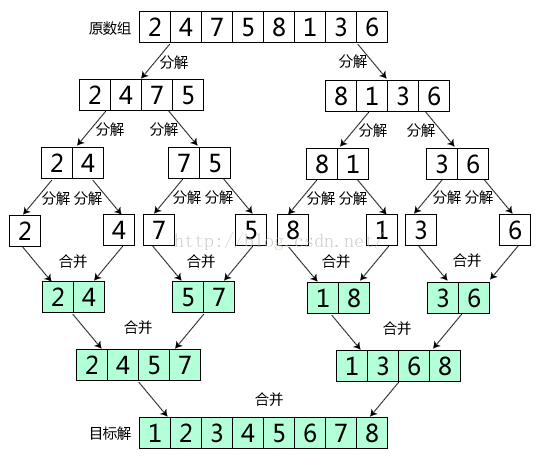
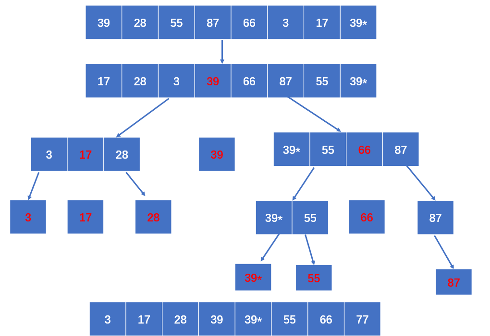

# <font color=green>简介</font>

我们关注的主要对象是重新排列数组元素的算法，其中每个元素都有一个主键，排序算法的目的就是将所有的元素的主键按照某种方式排列（通常是按照大小或是字母顺序） 
 
常见的十大算法：


> 稳定：指如果有相同的数，排序后本来在前面的还是在前面
> out-place：指用了额外的空间

---

<br>

下面我们在介绍排序算法时将从这几个方向入手：

 + 算法思路
 + 算法图解
 + 基本代码实现
 + 易踩坑点
 + 优化思路

**如未特别说明，下面的变量都是从0开始的**

---

<br>

# <font color=green>冒泡排序</font>

## 算法思路

 1. 从头开始遍历数据，当前者的主键(值)大于后者时，两者交换位置，直到最后一位
 2. 此时数据的最大值一定排在了最后一位，排好的最大值便固定，无需再排
 3. 重复1的操作，直到最后两个数排序完成

总结：外部循环`数据个数-1`次，内部循环`数组长度-n-1`次，每次内部循环比较当前位和后一位的值的大小，判断是否交换


## 代码实现

java：
 ``` java
public static void bubble(int[] arr){
            int temp; //帮助交换
            boolean falg = false; //检查是否已经排好
            for(int i=0;i<arr.length-1;i++){
                falg = false;
                for(int j=0;j<arr.length-1-i;j++){ //每次排序后的最大位可以忽略
                    if(arr[j]>arr[j+1]){
                        falg =true;
                        temp=arr[j+1];
                        arr[j+1]=arr[j];
                        arr[j]=temp;
                    }
                }
                if(!falg) break;
            }
        }

 ```

c++:
```c++
#include <vector>

void bubble(std::vector<int>& arr) {
    int temp; // 用于交换元素
    bool flag = false; // 用于检查数组是否已经排好序

    // 外层循环控制排序的轮数
    for(int i = 0; i < arr.size() - 1; i++) {
        flag = false; // 每轮开始时重置flag
        
        // 内层循环进行元素比较和交换
        for(int j = 0; j < arr.size() - 1 - i; j++) { // 减去i是因为每轮排序后，最后i位已经是排好的
            if(arr[j] > arr[j + 1]) {
                // 如果前一个元素大于后一个元素，就交换它们
                flag = true;
                temp = arr[j + 1];
                arr[j + 1] = arr[j];
                arr[j] = temp;
            }
        }

        // 如果这一轮没有进行任何交换，说明数组已经排好序，可以提前退出
        if(!flag) break;
    }
}

```

 ## 易踩坑点
  1. 一共循环 `数据个数-1` 次 ，因为最后一次确定第二个值的同时也把最小值确定了
  2. 每次遍历后的最大值要忽略，所以每次内部循环时循环次数要-1次
  3. 因为比较是和后面的数比较，所以当后面的数到最大值即当前数到倒数第二个时就说明内部循环完，否则数组越界

## 优化思路

如果有次内循环中没有发生交换，说明已经有序

---

<br>

# <font color=green>选择排序</font>

## 算法思路

1. 先把第一个数记成最小值，遍历整个数组，记录遍历时遇见的最小值
2. 遍历完一次后将最小值和第一个数交换位置，下一次遍历从第二个数开始
3. 重复上述操作，直到最后两个数遍历完成


## 代码实现
java:
```java
public static void select(int[] arr){
        int min;//记录最小数
        int temp; //帮助交换
        for(int i=0; i<arr.length;i++){
            min = i; //将最小值初始化为遍历的第一个数
            for(int j=i+1;j<arr.length;j++){
                if(arr[j]<arr[min]){ //*当某数小于当前最小数(别写成i)时，将最小数的索引改成该数的索引
                    min =j;
                }
            }
            //进行交换
            temp = arr[i];
            arr[i] = arr[min];
            arr[min] = temp;
        }
    }
```
c++:
```c++
#include <vector>

// 选择排序函数
void select(std::vector<int>& arr) {
    int min; // 用于记录最小数的索引
    int temp; // 用于帮助交换元素

    // 外层循环负责遍历数组的每一个元素
    for (int i = 0; i < arr.size(); ++i) {
        min = i; // 将当前遍历的第一个元素设置为最小值

        // 内层循环负责寻找剩余元素中的最小值
        for (int j = i + 1; j < arr.size(); ++j) {
            // 如果找到一个更小的数，则更新最小数的索引
            if (arr[j] < arr[min]) {
                min = j;
            }
        }

        // 进行交换，将找到的最小值放到它应在的位置
        temp = arr[i];
        arr[i] = arr[min];
        arr[min] = temp;
    }
}

```

## 易踩坑点
1. 开始时我们是把第一个数当成最小值的，所以是从第二个数开始遍历的
2. i值的含义有两个，一个是遍历次数，一个是当前遍历最小时应所处的位置

---

<br>

# <font color=green>插入排序</font>

## 算法思路

1. 遍历数组，将当前数组插入左边已排好数据中
2. 插入方法：先记录当前值，遍历左边，将当前数左边的数向右移动，直到遇见比当前数小的数，此时空白部分便是要插入的地方

## 算法图解


## 代码实现
java:
```java
public static void insertion(int[] arr) {    
        //插入法
        int temp;
        int j;
        for(int i=1;i<arr.length;i++){
            temp=arr[i];
            for(j=i-1;j>=0 && temp<arr[j];j--){ //别忘了j要大于0
                arr[j+1]=arr[j];
            }
            arr[j+1]=temp;
        }
    }
```
c++:
```c++
#include <vector>

// 插入排序函数
void insertion(std::vector<int>& arr) {
    int temp; // 用于暂存当前要插入的元素
    int j; // 用于寻找插入位置

    // 从数组的第二个元素开始遍历，因为假设第一个元素本身就是已排序的
    for (int i = 1; i < arr.size(); ++i) {
        temp = arr[i]; // 暂存当前元素

        // 向左遍历已排序的元素，寻找插入位置
        for (j = i - 1; j >= 0 && temp < arr[j]; --j) {
            // 将比当前元素大的元素向右移动一位
            arr[j + 1] = arr[j];
        }

        // 将当前元素插入到找到的位置
        arr[j + 1] = temp;
    }
}
```


## 易踩坑点
1. i是从第二个数开始的
2. 为了插入而进行的遍历一定别忘了j要大于0，(因为每次都是j和j+1比较)如果当前值正好是最小值，则数组会越界
3. 这里j的含义是当前值最后插入的位置的左边

---

<br>

# <font color=green>希尔排序</font>

## 算法思路

1. 先将数据分成间隔为h的许多小组，先让小组进行排序(插入排序法)
2. 在把间隔缩短（小组变少，每个组中数变多）再进行插入排序
3. 重复上述步骤，直到最后间隔为1时排序(即整个数据排序)

> 注：h也称为增量序列，对于最优增量序列目前还没有结论，主要的增量序列有Shell 增量序列，Hibbard 增量序列，Knuth 增量序列

## 算法图解


## 代码实现

```java
public static void shell(int[] arr) {
        int N = arr.length; //总数
        int h=1;//增量序列
        while(h<N/3) h= h*3+1; //Knuth 增量序列计算得来的h
        //插入法
        while(h>=1){
            for(int i=h;i<N;i++){
                int j=i;
                int temp = arr[i]; //因为arr[i]的值可能会变，保存插入值
                for(;j-h>=0 && temp<arr[j-h];j=j-h){
                    arr[j] = arr[j-h];
                }
                arr[j] = temp;
            }
            h=h/3;
        }
    }
```
c++:
```c++
#include <vector>

// 希尔排序函数
void shell(std::vector<int>& arr) {
    int N = arr.size(); // 数组总数
    int h = 1; // 增量序列初始值

    // 使用Knuth增量序列计算初始增量h
    while (h < N / 3) {
        h = h * 3 + 1; // 根据Knuth序列公式计算
    }

    // 当增量h大于等于1时，执行插入排序
    while (h >= 1) {
        // 从第h个元素开始，对数组进行分组插入排序
        for (int i = h; i < N; ++i) {
            int j = i;
            int temp = arr[i]; // 保存当前要插入的值

            // 对当前分组进行插入排序
            for (; j - h >= 0 && temp < arr[j - h]; j -= h) {
                // 将大于temp的值整体后移h位
                arr[j] = arr[j - h];
            }

            // 插入当前元素到正确位置
            arr[j] = temp;
        }

        // 减小增量h的值
        h = h / 3;
    }
}
```
## 易踩坑点
1. 和插入排序一样，i是从h而不是0开始的(h代表的是第一个小组的第二个数)
2. 这里j的含义是当前数再小组中该插入的位置(和插入排序j的含义不同)，所以不是要 j>=0而是要 j-h>=0 (因为每次都是j和j-h比较)
3. 这里是从h开始遍历到结束，效果是先让每个小组的第二个数和前面比较后再让每个小组的第三个数和前面比较，如此循环

## 优化思路

增量序列的不同会影响排序算法效率

---

<br>

# <font color=green>归并排序</font>

## 算法思路

1. 将数组分成两部分
2. 左部分和右部分分别排序，直到左部分或右部分只有一个数时返回
3. 将两部分合并起来

合并方法：
+ 传入需要合并的部分的开头，中间和结尾数，将该部分数组放入辅助数组对应位置中
+ 左部分开头和右部分开头创建指针分别遍历：
+ 当左边遍历完时，将右边的数传入原数组
+ 当右边遍历完时，将左边的数传入原数组
+ 当左边小于右边时，将左边的数传入原数组
+ 当右边小于左边时，将右边的数传入原数组

即左右两边同时遍历，其中一边更大的  先放入原数组

## 算法图解



## 代码实现

```java
public class Merge {
    private static int[] aux; //归并时所用的辅助数组

    //归并两个有序子数据：先将要归并的数据保存到辅助数组中，用两个指针指向辅助数组的前面和中间+1分成两数组
    //两数组依次比较，将较小的数放进原数组对应位置，然后较小数所在的数组指针上移

    //合并子数组，先将数据存入辅助数组中，用两指针二分辅助数组并遍历
    //mid为左边数组的最右边，即最大值
    public static void merge(int[] a,int lo,int mid,int hi){
        //辅助指针
        int i = lo;
        int j = mid+1;
        //将要归并的数据保存到辅助数组中
        for(int k=lo;k<=hi;k++){
            aux[k] = a[k];
        }
        for(int k=lo;k<=hi;k++){
            if(i>mid) a[k] = aux[j++];//左边数组遍历完时，直接加右边
            else if(j>hi) a[k] = aux[i++];//右边数组遍历完时，直接加左边
            else if(aux[i]>aux[j]) a[k] = aux [j++]; //当右边的比左边的小时，加右边
            else a[k] = aux [i++]; //当左边的比右边的小时，加左边
        }
    }

    //自顶向下的归并排序,将数组不断地二分直到直到只有一个数，再向上合并返回
    //将数组分成左右两部分，每个部分进行排序，排完后再合并排序
    public static void mergeSort1(int[] a){
        aux = new int[a.length];
        mergeSort1(a,0,a.length-1);
    }
    private static void mergeSort1(int[] a,int lo ,int hi){
        if(lo>=hi) return; //如果最前面和最后面一样说明已经分成最小单位
        int mid = (hi-lo)/2+lo;
        mergeSort1(a,lo,mid);
        mergeSort1(a,mid+1,hi);
        if(a[mid+1]>=a[mid]) return; //优化，如果排好序的右边最小值已经大于左边最大值，说明已经有序
        merge(a,lo,mid,hi);
    }
}
```

c++:
```c++
#include <vector>

class Merge {
private:
    static std::vector<int> aux; // 归并时使用的辅助数组

public:
    // 归并两个有序子数组的函数
    static void merge(std::vector<int>& a, int lo, int mid, int hi) {
        // 辅助指针初始化
        int i = lo, j = mid + 1;

        // 将数据复制到辅助数组中
        for (int k = lo; k <= hi; k++) {
            aux[k] = a[k];
        }

        // 归并回到原数组
        for (int k = lo; k <= hi; k++) {
            if (i > mid) {
                a[k] = aux[j++];
            } else if (j > hi) {
                a[k] = aux[i++];
            } else if (aux[i] > aux[j]) {
                a[k] = aux[j++];
            } else {
                a[k] = aux[i++];
            }
        }
    }

    // 自顶向下的归并排序函数
    static void mergeSort(std::vector<int>& a) {
        aux.resize(a.size()); // 初始化辅助数组大小
        mergeSort(a, 0, a.size() - 1);
    }

private:
    // 归并排序的递归函数
    static void mergeSort(std::vector<int>& a, int lo, int hi) {
        if (lo >= hi) return; // 分到最小单位时结束递归
        int mid = lo + (hi - lo) / 2;
        mergeSort(a, lo, mid); // 排序左半部分
        mergeSort(a, mid + 1, hi); // 排序右半部分
        if (a[mid + 1] >= a[mid]) return; // 优化，如果已经有序，则不合并
        merge(a, lo, mid, hi); // 合并两个有序子数组
    }
};

// 静态成员的定义
std::vector<int> Merge::aux;
```

## 易踩坑点

1. 合并时传入的 mid (中间值)含义是左部分的最后一个数，算 mid 时记得要加 lo，写右边排序时记得传入的是 mid+1
2. 合并中，将数据存入辅助数组是记得要<=最后一位数而不是<
3. 判断是否左部分或右部分只含有一个数(传入的最左边的索引`lo` >= 最右边的索引`hi`)

## 优化思路

左右两边排好了之后，如果这时左部分的最大值<=右部分的最小值的，说明已经有序，不用再合并

### 自下向顶的归并

除了上面的自顶向下的归并方法，还存在自下向顶的归并的方法：
 + 每个子数组长度为1开始，2个一组归并，再4个一组归并，直到整个归并

 图解：


代码：

```java
public static void mergeSort2(int[] a){
        aux = new int[a.length];
        for(int i=1;i<a.length;i*=2) {
            //因为归并是两个归并，所以每次指针k要移动2个子数组长度
            //可以把一个子数组的i个 数看成一个整体，k的循环就要小于a.length - i
            for (int k = 0; k < a.length - i; k=k+i*2){
                merge(a,k,k+i-1,Math.min(k+i*2-1,a.length-1)); //有可能最后一组数不够，要判断
            }
        }
    }
```
易踩坑点：
 1. 因为k的作用是指向两个子数组合并的开头，如果最后的个数连一个子数组都没达到的话，那在合并时传入的中间值k+i-1就会发生数组出界问题，所以 k<a.length-i
 2. 如果最后只剩一个不全数组，则放到下一轮，如果最后剩一个好的左部分和一个不全的右部分，两者可以合并，但要注意此时传入的最右边的值就不是 k+i*2-1 而是 a.length-1

---

<br>

# <font color=green>快速排序</font>

## 算法思路

和归并排序有异曲同工之妙，都采用分治法，但不同点是归并是先分别排序后归并，快速是分开时先排序再分别排序

1. 确定一位中间值(一般取第一个数),遍历数组，小于等于中间值的放左边，大于等于中间值的放右边
2. 对中间值左边的数组排序
3. 对中间值右边的数组排序
   
上面 1 的具体步骤：
1. 将左边第一个数设为中间值
2. 左边第二个和最右边分别设置两指针向中间遍历，直到左边的指针大于等于右边的指针
3. 当左边遍历时遇见大于中间值的数停下，当右边遍历时遇见小于中间值的数停下
4. 当两指针停下后交换两指针所值的数
5. 遍历完后j所指的一定是小于等于中间值的，将j所在的数与第一个数交换，返回j(中间值所在位置)

## 算法图解

整体思路：



左右排序：

i和j最后一次交换时


i和j最后一次没有交换时


## 代码实现
java:

```java
//将数组有序二分并返回切分元素位置
    private static int partition(int[] a,int lo, int hi){
        //创建两个辅助指针和切分元素
        int i = lo;
        int j = hi+1;
        int v = a[lo];

        //i,j指针向中间遍历，直到遇见不符合的数或边界停下，两者都停下时将两数进行交换
        //当遍历完时i的位置可能会比j大(最后两个数发生交换时，i，j同时移动)可能相等(最后两个数没发生交换时，i，j其中一个移动)
        //遍历完时j的位置一定在小于等于切分元素的数的索引上，将这两个数交换，j所指的便是切分元素索引
        while(true) {
            while (a[++i] < v) if(i==hi) break;
            while (a[--j] > v) ;//这里本来还有个判断j是否跑到了最左边(当切分元素是该数据中最小值时)，但因为v在最左边，j一定会停在lo上
            if(i>=j) break;
            int temp = a[i];
            a[i] = a[j];
            a[j] = temp;
        }
        a[lo] = a[j];
        a[j] = v;

        return j;
    }

    //快速排序
    public static void quick(int[] a){
        quick(a , 0,a.length-1);
    }

    private static void quick(int[] a, int lo, int hi) {
        if(lo>=hi) return;  //可以在某个情况后改成插入排序
        int j = partition(a, lo, hi);
        quick(a,lo,j-1);
        quick(a,j+1,hi);
    }
```

c++:
```c++
#include <vector>

class Quick {
public:
    // 快速排序的公有接口
    static void quick(std::vector<int>& a) {
        quick(a, 0, a.size() - 1);
    }

private:
    // 快速排序的主要递归函数
    static void quick(std::vector<int>& a, int lo, int hi) {
        if (lo >= hi) return; // 基本情况的检查
        int j = partition(a, lo, hi); // 切分
        quick(a, lo, j - 1); // 对左半部分进行排序
        quick(a, j + 1, hi); // 对右半部分进行排序
    }

    // 切分函数,一轮排序后，j的位置一定是切分元素的位置
    static int partition(std::vector<int>& a, int lo, int hi) {
        int i = lo, j = hi + 1;
        int v = a[lo];
        while (true) {
            while (a[++i] < v) if (i == hi) break;
            while (a[--j] > v); // 在C++中，此循环不需要额外检查因为a[lo]充当哨兵
            if (i >= j) break;
            std::swap(a[i], a[j]);
        }
        std::swap(a[lo], a[j]);
        return j;
    }
};

```
## 易踩坑点

1. 数组切分时创建并初始化 i 与 j 是让 i ，j 等于第一个数和最后一个数的后一位，并且先加减再操作。如果是让 i ，j 等于第二个数和最后一个数并且先操作在加减时会很麻烦，不仅要在内循环中写i++，j--，在arr[i]和arr[j]交换后也要写i++，j-- **最好是先移动指针再操作**
2. 返回中间值后，中间值是不再参与排序的
3. 小心i和j出界的问题，当i到最右边或j到左边时，也要停止指针移动(j比较特殊，因为j到最左边时一定是等于v的，不可能越界)

## 优化思路

防止特殊情况，可以先把数据打乱再排

### 三切分法：
思路：
 + 对于有大量的重复数而言，可以使用三分切法，将数据分成大于v，等于，小于iv三部分，v代表中间值
+ 三个辅助指针i,lt,gt，i来遍历数组，直到大于gt(等于gt时还要再判断一次)
+ 如果i遇见小的数，和lt交换并两者++，如果遇见大的数，和gt交换，gt--，i不动(因为无法保证gt所在的值，lt一定为v)
+ 最后lt，gt都在中间段的最左边和最右边

图示：


代码：
```java
public static  void quick3way(int[] a){
        quick(a,0,a.length-1);
    }
    private static void quick3way(int[] a,int lo,int hi){
        if(hi<=lo) return;

        int lt = lo;
        int gt = hi;
        int i  = lo+1;
        int v  = a[lo];

        while(i<=gt){
            if(a[i]<v) exchange(a,i++,lt++); //lt一定为v，交换后i为v，可以移动
            else if(a[i]>v) exchange(a,i,gt--); //无法确定gt处的值，交换后不能动i
            else i++; //i处等于v
            }
        quick3way(a,lo,lt-1);
        quick3way(a,gt+1,hi);
    }

    public static void exchange(int[] a,int x,int y){
        int temp = a[x];
        a[x] = a[y];
        a[y] = temp;
    }
```

易踩坑点：
1. 因为lt是一定等于v的并且在等于v数组的最左边，所以和i所在值交换后两者可以一起++，但由于不知道gt所在的值，所以和i所在值交换后只能让gt--，i不动
2. 记得当i=gt时还要再判断一次

---
<br>

# <font color=green>计数排序</font>

## 算法思路：

1. 找到数组中最大的值
2. 创建一个长度为最大值+1的数组，遍历原数组把数放在值相同的辅助数组下(如遍历到5，则让辅助数组temp[5]++)
3. 遍历辅助数组，将不等于0的索引依次返回给原数组

## 算法图解


## 代码实现
java:
```java
public static void counting(int[] a){
        int max = findMax(a);
        counting(a,max);
    }

    private static void counting(int[] a, int max) {
        int[] temp = new int[max+1];
        int k = 0; //用作a的指针
        for(int x:a){
            temp[x]++;
        }
        for(int i=0;i<temp.length;i++){
            while(temp[i]>0){
                a[k++] = i;
                temp[i]--;
            }
        }
    }

    private static int findMax(int[] a) {
        int max = a[0];
        for(int i=0;i<a.length;i++){
            if(a[i]>max) max = a[i];
        }
        return max;
    }
```

c++:
```c++
#include <vector>
#include <algorithm> // 用于std::max_element

class CountingSort {
public:
    // 计数排序的公有接口
    static void counting(std::vector<int>& a) {
        int max = findMax(a);
        counting(a, max);
    }

private:
    // 实际执行计数排序的函数
    static void counting(std::vector<int>& a, int max) {
        std::vector<int> temp(max + 1, 0); // 使用max + 1大小的临时数组
        for (int x : a) {
            temp[x]++;
        }

        int k = 0; // 用作a的索引
        for (int i = 0; i < temp.size(); ++i) {
            while (temp[i] > 0) {
                a[k++] = i;
                temp[i]--;
            }
        }
    }

    // 查找数组中的最大值
    static int findMax(const std::vector<int>& a) {
        return *std::max_element(a.begin(), a.end());
    }
};
```

## 易踩坑点

1. 数组计数是从0开始的，记得创建数组时长度为 max+1 这样数组的最后一位才是max
2. 当取出一个数后，该数上的计数(即 temp[ i ] )要-1
3. 注意当前给的代码中因为是用的`temp[i]--`所以不稳定，可以改成一个从0开始小于temp[i]的循环

---

<br>

# <font color=green>桶排序</font>

## 算法思路

1. 找到数组最大值(如30)
2. 根据最大值创建n个桶，每个桶中存放一定范围的数(如0~9,10~19,20~29)
3. 将每个桶中的数据排序(即每个桶单独排序)
4. 遍历桶，返回桶中的数

**因为这个算法本身比较麻烦且用得不多，就不再演示了**

---

<br>

# <font color=green>基数排序</font>

## 算法思路
 
 1. 找到数据中 位数最高的数（即最大数有多少位）
 2. 创建一个二维数组，第一维 0~9 代表某位上可能出现的数，第二维用来存某位相同的数（如12，42都放在arr[2][n]中）
 3. 从个位数开始，遍历数组，将个位上相同的数存入相同一维的二维数组中（这里需要一个辅助一维数组来记录二维数组的一维上有多少存储的数）
 4. 遍历二维数组，依次返回给原数组
 5. 再从十位开始，重复上述操作，如果没十位则补0.循环最高位数次

> 二维数组可以这样理解：一共有0~9的桶，某位上值和桶的索引一样时放进桶中，从下到上放入桶中。一维数组也是0~9，每个位置的值就代表桶中有多少存入的值以及下一个该存入该桶的数的位置
## 算法图解


## 代码实现

```java
public static void radix(int[] a){
        int high = findHigh(a);
        radix(a,high);
    }

    private static void radix(int[] a, int high) {
        int[][] bucket = new int[10][a.length]; //放数据的桶，一共要有10个桶(0~9),桶中最多存a中所有的数
        int m = 1; //用于计算某位上的数

        //一共循环的次数
        for(int i=1;i<=high;i++) {
            int[] bucketContent = new int[10]; //记录每个桶有多少数已经下一个数应该存放在桶的哪里,(如有42，22，在个位上，bucketContent[2]就是2)
            int n = 0; //用于将桶中数据返回给数组时对数组的指针

            //计算某位上的数进行分组,放入桶里
            for (int value : a) {
                int temp = (value / m) % 10; //如果该数没有更高位，temp就为0
                bucket[temp][bucketContent[temp]] = value;//bucketContent[temp]可以表示该存入该桶的数的位置
                bucketContent[temp]++;
            }
            //将桶中数据返回数组
            for(int k=0;k<bucket.length;k++){
                if(bucketContent[k]!=0){
                    for(int j=0;j<bucketContent[k];j++){
                        a[n++] = bucket[k][j];
                    }
                }
            }
            m=m*10;
        }
    }

    private static int findHigh(int[] a) {
        int max = a[0];
        for(int i=0;i<a.length;i++){
            if(a[i]>max){
                max = a[i];
            }
        }
        String temp = Integer.toString(max);
        return temp.length();
    }
```

c++:
```c++
#include <vector>
#include <algorithm> // 用于std::max_element
#include <cmath>     // 用于std::log10 和 std::pow

class RadixSort {
public:
    // 基数排序的公有接口
    static void radix(std::vector<int>& a) {
        int high = findHigh(a);
        radix(a, high);
    }

private:
    // 实际执行基数排序的函数
    static void radix(std::vector<int>& a, int high) {
        std::vector<std::vector<int>> bucket(10, std::vector<int>(a.size())); // 10个桶
        std::vector<int> bucketContent(10, 0); // 每个桶的数据量

        int m = 1; // 用于计算某位上的数

        // 一共循环的次数
        for (int i = 1; i <= high; ++i) {
            std::fill(bucketContent.begin(), bucketContent.end(), 0); // 重置桶的数据量计数

            // 分组放入桶里
            for (int value : a) {
                int temp = (value / m) % 10;
                bucket[temp][bucketContent[temp]++] = value;
            }

            // 将桶中的数据返回数组
            int n = 0; // 数组的指针
            for (int k = 0; k < 10; ++k) {
                for (int j = 0; j < bucketContent[k]; ++j) {
                    a[n++] = bucket[k][j];
                }
            }
            m *= 10;
        }
    }

    // 查找最大数的位数
    static int findHigh(const std::vector<int>& a) {
        int max = *std::max_element(a.begin(), a.end());
        return std::log10(max) + 1;
    }
};

```
## 易踩坑点 

1. 每循环完一次后辅助一维数组要清0，即要放入循环中
2. 用m计算位时，没有该位的运算结果就为0
3. 每次记得m*10

---

<br>

# <font color=green>堆排序</font>

学习堆排序之前需要了解堆的概念：

## 堆的概念

堆是一种特殊的树形数据结构，它满足下面的性质：

1. 堆中任意节点的值总是不大于（或不小于）其子节点的值
2. 堆总是一棵完全二叉树
3. 堆中每个节点的子树都是堆
4. 堆中的节点一般是按照层序遍历的顺序存储在数组中的

堆分为大顶堆和小顶堆，大顶堆的根节点是最大的，子节点的值都小于父节点的值，小顶堆的根节点是最小的，子节点的值都大于父节点的值

## 堆的操作

1. 上浮：一般是插入一个新的节点时，如果新节点的值大于父节点的值，就要将新节点和父节点交换位置，直到新节点的值小于父节点的值（大根堆），小根堆反之
2. 下沉：一般是删除根节点时，将最后一个节点放到根节点，然后将根节点和子节点（i*2+1和i*2+2）中较大的交换位置，直到根节点的值大于子节点的值（大根堆），小根堆反之
3. 建堆：自上而下，即正向遍历数组，每次把新节点进行上浮操作，直到最后一个节点。自下而上，即从最后一个节点的父节点开始（设数组长度n，最后一位下标为n-1，则父节点为(（n-1）-1)/2），**如果父节点的值不符合堆序，则要与字节点进行交换并且继续进行下沉操作**

## 算法思路

1. 先将数组构建成一个大根堆
2. 从后向前遍历数组，将根节点和最后一个节点交换位置，然后将根节点下沉
3. 每次将数组长度减一（最后一位已经是最大的了），重复上述操作，直到数组长度为1

## 算法图解


## 代码实现(c)

```c
//1.元素的排序

//下沉一般用于取出元素
//对元素进行下沉操作（大根堆）
void heapify_large_down(int arr[],int n,int i){
    //将父节点与其字节点的最大值移动到父节点中
    int lef = i*2+1;
    int rig = i*2+2;
    int largest = i;
    if(lef<n && arr[largest]<arr[lef]) largest = lef;
    if(rig<n && arr[largest]<arr[rig]) largest = rig;
    if(largest!=i){
        int temp = arr[i];
        arr[i] = arr[largest];
        arr[largest] = temp;

        //对元素进行下沉后是需要将这个值下沉到不能继续下沉的位置（下面的已经是大根堆的样子了，不继续下沉可能会破坏大根堆有序性）
        heapify_large_down(arr,n,largest);
    }
}

//对元素进行下沉操作（小根堆）
void heapify_small_down(int arr[],int n,int i){
    //将父节点与其字节点的最小值移动到父节点中
    int lef = i*2+1;
    int rig = i*2+2;
    int smallest = i;
    if(lef<n && arr[smallest]>arr[lef]) smallest = lef;
    if(rig<n && arr[smallest]>arr[rig]) smallest = rig;
    if(smallest!=i){
        int temp = arr[i];
        arr[i] = arr[smallest];
        arr[smallest] = temp;

        //对元素进行下沉后是需要将这个值下沉到不能继续下沉的位置（下面的已经是小根堆的样子了，不继续下沉可能会破坏小根堆有序性）
        heapify_small_down(arr,n,smallest);
    }
}

//上浮一般用在插入元素
//对元素进行上浮操作（小根堆）
void heapify_small_up(int arr[],int i) {
    int fa = (i-1)/2;
    if(fa>=0&&arr[fa]>arr[i]){
        int temp = arr[fa];
        arr[fa]= arr[i];
        arr[i] = temp;
        heapify_small_up(arr,fa);
    }
}

//对元素进行上浮操作（大根堆）
void heapify_large_up(int arr[],int i) {
    int fa = (i-1)/2;
    if(fa>=0&&arr[fa]<arr[i]){
        int temp = arr[fa];
        arr[fa]= arr[i];
        arr[i] = temp;
        heapify_large_up(arr,fa);
    }
}


//2.堆的创建
void heap_creat_large_down(int arr[],int n){
    //自下而上创建堆，从倒数第二层开始排序到最上面(下沉)
    for(int i = (n-1-1) /2;i>=0;i--){
        heapify_large_down(arr,n,i);
    }
}
void heap_creat_small_down(int arr[],int n){
    //自下而上创建堆，从倒数第二层开始排序到最上面（下沉）
    for(int i = (n-1-1) /2;i>=0;i--){
        heapify_small_down(arr,n,i);
    }
}

//自上而下创建，即从头开始，一个一个放入结尾进行上浮
void heap_creat_large_up(int arr[],int n){
    for(int i=0;i<n;i++) heapify_large_up(arr,i);
}

//自上而下创建，即从头开始，一个一个放入结尾进行上浮
void heap_creat_small_up(int arr[],int n){
    for(int i=0;i<n;i++) heapify_small_up(arr,i);
}


//3.堆排序：i从尾遍历到头，每次交换头节点和arr[i]的值(即把当前最大值放在最后面),再对头节点进行下沉操作
void heap_sort_large(int arr[],int n){
    // 循环将堆顶元素与末尾元素交换，然后减小堆的大小并重新调整为大根堆
    for(int i=n-1;i>0;i--){
        int temp = arr[i];
        arr[i] = arr[0];
        arr[0] = temp;

        heapify_large_down(arr,i,0); //因为i后面的数已经排序完成，所以不用管，堆的下沉到i为止
    }
}

```

>注：优先队列就是用堆实现的，优先队列是一种数据结构，可以用来维护一组元素，这组元素中每个元素都有一个优先级，优先级最高的元素最先被取出。在c++中priority_queue,初始化模板`priority_queue<int,vector<int>,greater<int>>`为小根堆，其中int为数据类型，vector<int>为容器类型，greater<int>为比较函数，可以自定义比较函数,一般用仿函数自定义比较函数，仿函数是一个重载了()运算符的类，可以像函数一样调用。