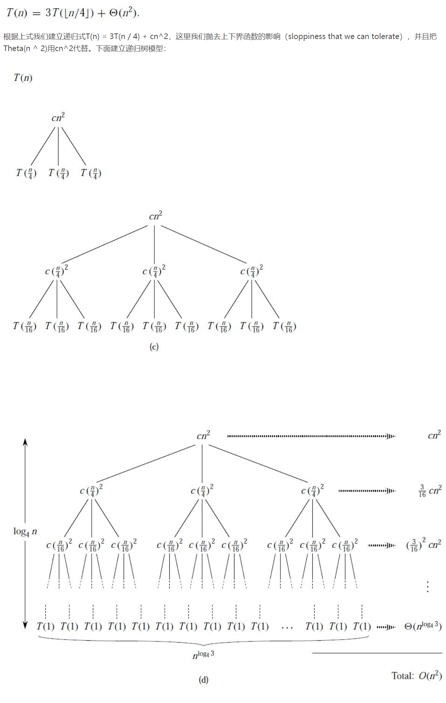

# 概述

算法分析是关于计算机程序和资源利用的研究

## 

# 数学模型

大多数程序得到数学模型所需步骤：

1. 确定输入模型，定义问题规模（n）
2. 识别循环与递归
3. 根据内循环或每部递归的操作确定成本模型
4. 对于给定的输入，判断这些操作的执行频率

---

# 两种常见讨论情况

> 最坏情况：T(n)定义为输入规模为 n 时的最长运行时间
> 平均情况：T(n)定义为输入规模为 n 时所有可能输入的期望值(通常是均匀分布时的情况)

为了不被硬件因素所影响，对算法的分析采用了 渐进分析

> 渐进分析：
>
> 1. 忽略依赖于机器性能的常量
> 2. 只关注运行时间的增长

---

 
 

# 渐进符号

## 大$O$记号法：(上界)

f(n) = $O$(g(n)) 表示存在适当常数 (c>0 $n_0$>0) 使得 0 <= f(n) <= c\*g(n) 其中 n >= $n_0$  
**注：这里的=不是等于的意思，更多是指 f(n) 属于 $O$(g(n)) 集合。 即$O$(g(n))是一个函数集，集合内有 f(n)**

> 例：$2n^2 = O(n^3)$

宏展开：  
&nbsp;&nbsp;&nbsp; 当等式左右两边都存在$O$( )时，这时=相当于$\epsilon$

> 例：$n^2+O(n) = O(n^2)$ > &nbsp;&nbsp;&nbsp;对于任意 f(n)$\epsilon O(n)$，都有对应的 h(n)$\epsilon O(n)$
> 注：不能反推

## 大 $\Omega$记号法：(下界)

f(n) = $O$(g(n)) 表示存在适当常数 (c>0 $n_0$>0) 使得 0 <= c\*g(n) <= f(n) 其中 n >= $n_0$

> 例：$\sqrt{n}=\Omega(\lg n)$

## 大 $\Theta$记号法：

$\Theta(g(n)) = O(g(n)) \bigcap \Omega(g(n))$

理解：左右两边增长速率一样

用法：写个公式，去掉它的低阶项，并忽略前面的常数因子(系数)

## 严格符号：

与渐进符号的区别在于：

- 渐进符号表示渐进符号内的函数在经过某一点后便大于或小于原函数
- 严格符号表示严格符号内的函数是完全大于或小于原函数

### o 记号

f(n)完全小于 o(g(n)),与$O$对应

### $\omega$记号

f(n)完全大于$\omega$(g(n))，与$O$对应

---

 
 

# 递归式的三种解法

## 补充知识：数学归纳法

用来证明一个命题在问题规模为 n 时成立

1. 证明 n=1 时成立
2. 假设 n=n-1 时成立，如求出(n-1)+1 时成立
3. 则命题成立

## 1. 代换法

1. 先猜答案得到最高阶
2. 验证这个递归式是否按照数学归纳法满足条件

> 例：T(n)=4T(n/2)+n
>
> 1. (猜)忽略常数 n，由 T(n)=4T(n/2) 可看出当 n 减 2 倍，系数增加 4 倍。$n^2$符合这一标准,假定 T(n)=$O(n^2)$
> 2. (证)将递归式展开得 T(n)=$4T(n/2)+n$ <= $cn^2$+n = $cn^2$-(-n)
>    > $O(n^2)$=$c(n)^2$
> 3. 因为要证明的是 T(n)=$O(n^2)$ 所以 T(n) <= $cn^2$-(-n) 中(-n)大于等于 0

但这里发现了因为 n>=1 所以上式不成立。是我们做错了吗，让我们想想有什么办法可以改变这个常数。
当我们对 $O(n^2)$ 进行展开时，我们是忽略了常数项的，因为它对 n 为无穷大时作用很小，但作用小就表明还是有一定的作用，我们试着把常数项带进来，即改进 T(n)=$O(n^2)$ 时的条件

> 改进：
> T(n) =$O(n^2)$ <=$c_1n^2-c_2n$ (多了常数项)
> T(n)=$4T(n/2)+n$ <= $4(c_1(n/2)^2-c_2(n/2))+n=c_1n^2-c_2n-(c_2-1)n$
> 要使 T(n)=$O(n^2)$则要满足$(c_2-1)n$ >= 0 (当$c_2$ >= 1 时成立)
> 并且 T(1) <=$c_1-c_2$ 成立
> 可以得出 T(n+1) <= $c_1(n+1)^2-c_2(n+1)$ (当$c_1>>c_2$时成立)(算一下就出来了)
> 这时条件 T(1)，T(n)和 T(1)推出 T(n+1)都有了
> 最后得出 T(n) = $O(n^2)$

## 2. 递归树法

1.  将递归式按树的形式展开(不用全画出来)(并且每次递归时 n 的和都要减少而不是增大)
2.  根据每层的和的规律，求出总子叶节点
    - 如果每层和一样，用每层的和乘以树的高度就行
      > 树要对称，高用每次递归式减少的数(每层为等差)或除以的数(每层为等比)来求
      > 等差的话 h=n-k+1 (k 为每层 n 减少的数)
      > 等比的话 h=$log_kn$ (k 为每层 n 除的数)
    - 如果树不对称或者每层和成等比排列，不用求具体值，都是有规律相加的，求其上界就行
3.  判断总子叶节点小于等于某个相近的值，便可求出其最高阶

例：

## 3.主方法

相当于套公式，且适用情况少
原理是递归树，可以自己去推导下,这三个主要区别是总子叶节点数的判断不同。（1 是因为每层和在增加，最后一层和占主导。2 是因为每层和一样，和乘以高。3 是因为每层和在减少，第一层和占主导）
限制：递归式要满足于 $T(n)=aT(n/b)+f(n)$ &nbsp;&nbsp;&nbsp;a>=1,b>1,f(n)渐进趋正
主思路：比较 f(n)和$n^{\log_ba}$

1.

若对某个常数 $\varepsilon>0$ 有
$f(n)= \omicron (n^{\log_b{a-\varepsilon} })$
那么
$T(n)= \theta (n^{log_ba})$

2.

若
$f(n)=\theta(n^{log_ba})f(n)$
则
$T(n)=\theta(n^{log_ba}\lg n)T(n)$

3.

若对某个常数 $\varepsilon>0$ 有
$f(n) = \Omega(n^{\log_b{a+\varepsilon} })f(n)$
且对于某个常数 c<1 和所有足够大的 n 有
$af(\frac nb)\le cf(n)$
则
$T(n)=\theta(f(n))T(n)$
