# <font color=green>网络编程基础</font>

<br>
<br>

---


## 一、网络编程概述

### 1.1 网络的性能指标

- **速率**：指数据传输速度，单位是 bps（比特每秒）。
- **带宽**：指网络的通信能力，单位是 bps（比特每秒）。
- **吞吐量**：指单位时间内通过某个网络的数据量。
- **时延**：指数据从发送方到接收方所需的时间。
- **时延带宽积**：指网络链路上的数据量，单位是 bps（比特每秒）。
- **往返时间 RTT**：指数据从发送方到接收方再返回发送方所需的时间。
- **利用率**：指网络的实际吞吐量与网络带宽之比。
- **丢包率**：指发送的数据包中丢失的比例。

### 1.2 OSI 体系结构

#### 1.2.1 OSI 体系结构的七层模型

七层模型是国际标准化组织（ISO）制定的一个网络通信的标准体系结构，但是实际上并没有完全按照这个模型来实现网络协议。

- **应用层**：为应用软件提供服务。
- **表示层**：数据的表示、安全、压缩。
- **会话层**：建立、管理、终止会话。
- **传输层**：定义传输数据的协议端口号，以及流控和差错校验。
- **网络层**：进行逻辑地址寻址，实现不同网络之间的路径选择。
- **数据链路层**：进行逻辑地址寻址，实现不同网络之间的路径选择。
- **物理层**：建立、维护、断开物理连接。

#### 1.2.2 TCP/IP 体系结构

TCP/IP 体系结构是实际使用最广泛的网络体系结构，它只有四层，但是实际上也没有完全按照这个模型来实现网络协议。

- **应用层**：应用层、表示层、会话层。
- **传输层**：传输层。
- **网络层**：网络层。
- **网络接口层**：数据链路层、物理层。

>为了便于学习，我们一般要将网络接口层分为数据链路层和物理层。

### 1.2.3 TCP/IP 分层思想

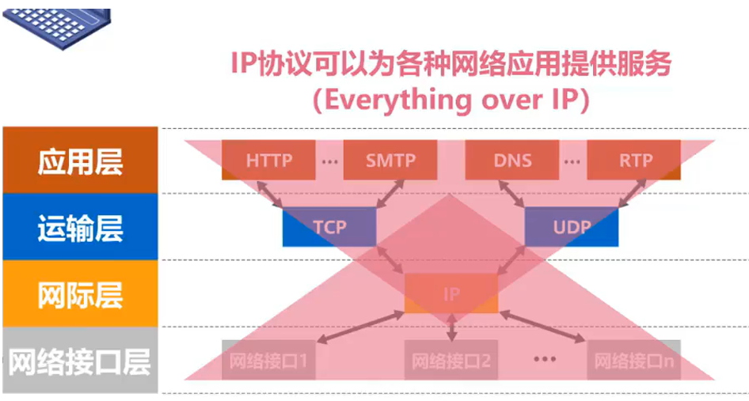

在数据的传输过程中，两方通信的客体需要经过路由器，而路由器的模型只包含了网络层和数据链路层。

### 1.2.4 TCP/IP 传输过程

如果两台主机之间要通信，那么需要经过以下几个步骤：

- **应用层**：应用层的数据交给传输层。包含了数据报文
- **传输层**：传输层给报文添加一个TCP头部，然后交给网络层。
- **网络层**：网络层给报文添加一个IP头部，然后交给数据链路层。
- **数据链路层**：数据链路层给报文添加一个以太网头部和尾部，使其变成一个以太网帧，然后交给物理层。
- **物理层**：物理层将帧转换为电信号，然后通过网线传输到目标主机。

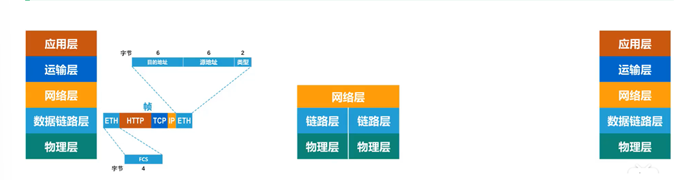


<br>
<br>

---

## 二、物理层

### 2.1 物理层概念

物理层是 OSI 模型的最底层，主要负责数据的传输，它的主要任务是确定传输的数据的传输媒体、接口的特性、接口的连接方式等。

- 机械特性：接口的几何形状、引脚数目、引脚位置等。
- 电气特性：规定了接口的电气特性，如电压、电流、传输速率等。
- 功能特性：规定了接口的功能特性，如数据的传输方向、同步异步传输、传输的方式等。
- 过程特性：规定了接口的工作过程，如建立连接、维持连接、释放连接等。

### 2.2 物理层的传输介质

- **引导型传输介质**：有线传输介质，如双绞线、同轴电缆、光纤等。
- **非引导型传输介质**：无线传输介质，如无线电波、微波、红外线等。

### 2.3 物理层的传输模式

#### 2.3.1 串行传输和并行传输

- **串行传输**：一位一位地传输数据，速度慢，但是传输距离远。
- **并行传输**：一次传输多位数据，速度快，但是传输距离短。

数据在传输线路上的传输采用是串行传输，计算机内部的数据传输常用并行传输

#### 2.3.2 同步传输和异步传输

- **同步传输**：发送端和接收端的时钟是同步的，数据是按照时钟信号的边沿传输的。
- **异步传输**：发送端和接收端的时钟是异步的，数据是按照起始位和停止位传输的。

### 2.3.3 单工通信、半双工通信和全双工通信

- **单工通信**：只能单向传输数据，不能双向传输数据。
- **半双工通信**：可以双向传输数据，但是不能同时双向传输数据。
- **全双工通信**：可以双向传输数据，而且可以同时双向传输数据。

### 2.4 物理层的编码和调制

为了在传输过程中提高数据的传输速率，需要对数据进行编码（以太网帧）和调制（模拟信号）。

* 常用的编码方式：
1. **不归零编码**：将高电平表示 1，低电平表示 0。
2. **曼彻斯特编码**：每个码元的中间有一个信号的跳变，下降表示 1，上升表示 0。传统的以太网使用的是曼彻斯特编码。
3. **差分曼彻斯特编码**：每个码元的中间有一个信号的跳变代表时钟，码元开始处如发生跳变则表示 0，否则表示 1。

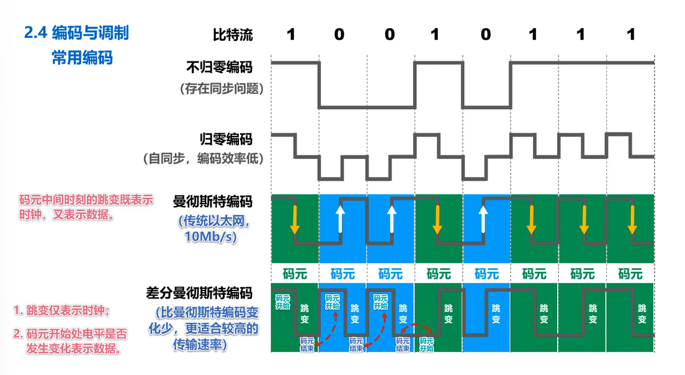

* 常用的调制方式：
1. **调幅(AM)**：调制信号的幅度。
2. **调频(FM)**：调制信号的频率。
3. **调相(PM)**：调制信号的相位。

* 调制与解调：将信号与载波信号（如正弦波）卷积，得到调制信号；再次卷积，并通过低通滤波器和功率放大器，得到原始信号。

* 混合调制：将调幅、调频、调相等调制方式混合使用。如正交振幅调制（QAM）：将调幅(到中心的距离)和调相（偏移角度）混合使用。相邻码元只有一个比特不同，可以提高传输速率。

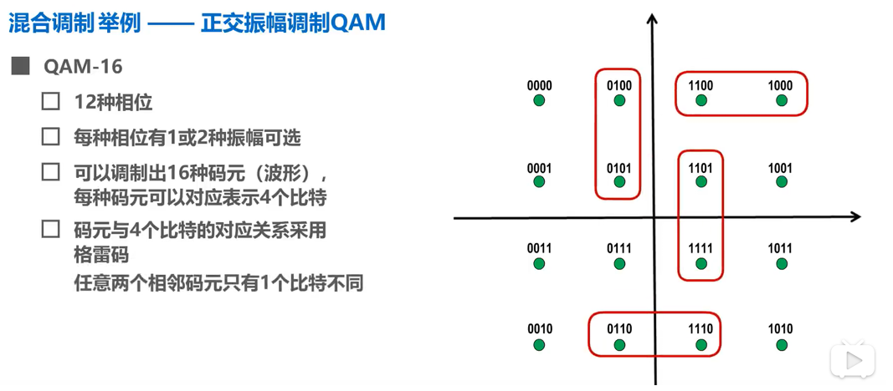


### 2.5 信道的极限容量

信道的极限容量是指在不产生错误的情况下，信道的最大传输速率。奈氏准则主要用于衡量信号传输质量。香农公式可以计算信道的极限容量。

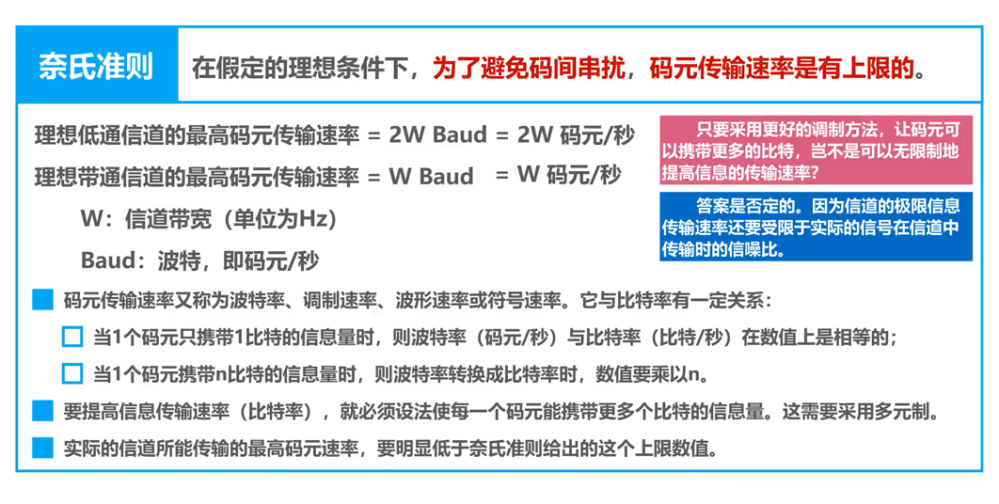

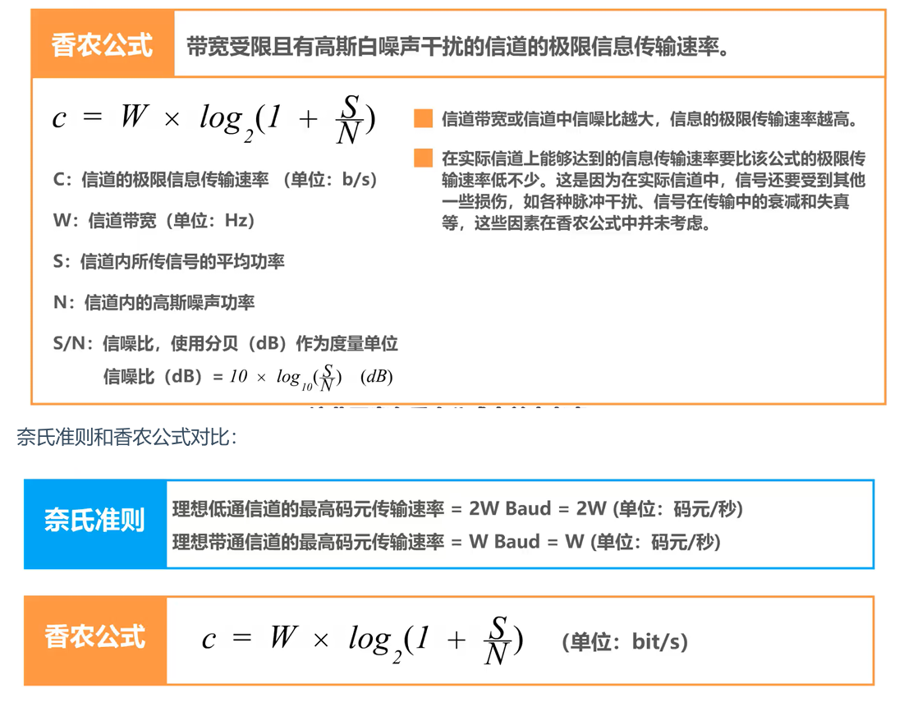


<br>
<br>

---

## 三、数据链路层

### 3.1 数据链路层概念

数据链路层是主要任务是将网络层传递下来的数据分成数据帧，然后在物理层上传输。

### 3.2 数据链路层的信道

- **点对点信道**：只有两个节点之间的通信。
- **广播信道**：一个节点发送的数据可以被所有节点接收。

>局域网属于数据链路层
>
>局域网虽然是个网络。但我们并不把局域网放在网络层中讨论。这是因为在网络层要讨论的是多个网络互连的问题，是讨论分组怎么从一个网络，通过路由器，转发到另一个网络。
>
>而在同一个局域网中，分组怎么从一台主机传送到另一台主机，但并不经过路由器转发。从整个互联网来看，局域网仍属于数据链路层的范围

### 3.3 数据链路层的封装

* ppp 协议
  
PPP（Point-to-Point Protocol）是一种广泛使用的点对点数据链路层协议，用于建立两个网络实体之间的直接连接，目前使用较少，pppoe 协议是一种衍生

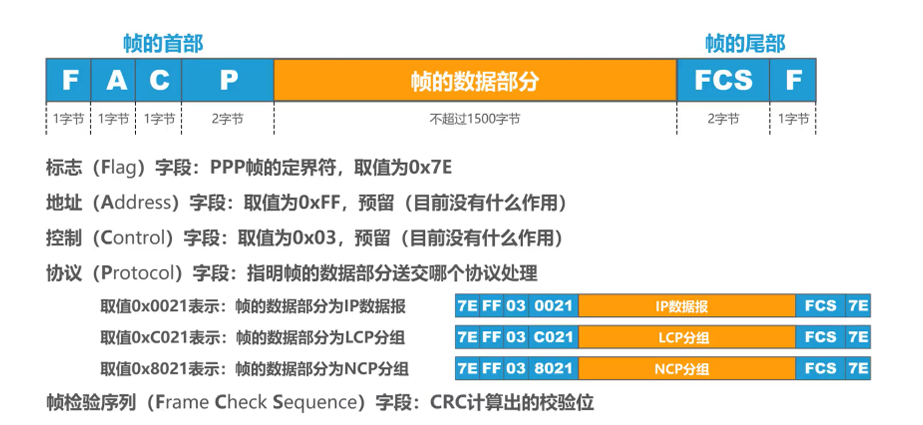


* 以太网帧

以太网帧是数据链路层的一种封装格式，它包含了目标地址、源地址、类型、数据和校验等字段。

帧头：包含了目标地址（6字节）、源地址（6字节）、类型（ARP协议等）（2字节）

帧尾：包含了校验字段（FCS）（4字节），用的是 CRC 校验

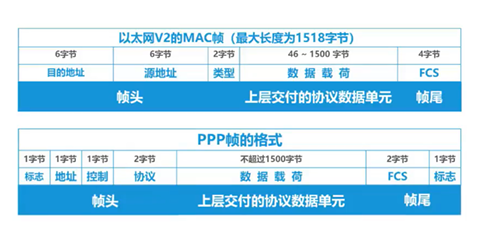

* 最大传输单元 MTU

MTU（Maximum Transmission Unit）是指数据链路层一次能够传输的最大数据量，以太网的 MTU 为 1500 字节。


### 3.4 数据链路层的可靠传输

为了实现数据链路层的可靠传输，需要使用以下几种技术：

- **差错检测**：通过 CRC 算法检测数据是否出错。

>CRC校验是一种循环冗余校验，先得到一个生成多项式，将数据后面补上多项式的长度个 0，然后将数据和多项式进行模 2 运算，得到的余数就是校验码。将校验码添加到数据后面，接收端再次进行模 2 运算，如果余数为 0，说明数据没有出错。

- **可靠协议**：

1. **停止等待协议（SW）**：发送方发送数据后等待接收方的确认，如果超时没有收到确认，就重发数据。
2. **回退N帧协议（GBN）**：
通过滑动窗口实现多帧的发送，接收方只接收有序的帧
如果接收到的帧不是有序的，就丢弃，并返回最后一个有序的帧的确认。
当收到重复的帧时，就知道之前所发送的数据分组出现了差错，于是可以不等超时计时器超时就立刻开始重传，具体收到几个重复确认就立刻重传，根据具体实现决定

3. **选择重传协议（SR）**：GBN的接收窗口为1，SR的接收窗口大于1。接收方需要对接收到的帧进行确认，如果接收到的帧不是窗口或错误的就丢弃，并返回接收到的所有帧
发送方在收到确认后，就移动窗口到最后接收到的帧序号的下一个帧（如果1没接收，接收了0234，就只能将窗口移动到1）

- **透明传输**：如果数据中包含了帧头的标志，可能会造成误判。需要进行透明传输，即在数据中添加转义字符。（如添加ESC等）

### 3.5 数据链路层的媒体接入控制

当多个主机共享一个信道时，如果同时发生数据可能会造成干扰，需要使用媒体接入控制（MAC）协议来协调多个主机的数据传输。这里主要介绍随机接入协议。

#### 3.5.1 载波监听多址接入/碰撞检测（CSMA/CD）

- **多址接入**：多个主机共享一个信道。
- **载波监听**：
发送数据前先监听信道是否有数据。
若检测总线空闲96比特就发送，如检测总线忙则等待总线转为空闲96比特后再发送
- **碰撞检测**：
发送数据的同时监听信道是否有碰撞。
若有碰撞则停止发送，停止一段时间后再发送。

如今的以太网是基于交换机和全双工通信，不再使用 CSMA/CD 协议。

#### 3.5.2 载波监听多址接入/碰撞避免（CSMA/CA）

- **多址接入**：多个主机共享一个信道。
- **载波监听**：
发送数据前先监听信道是否有数据。
若检测总线空闲96比特就发送，如检测总线忙则等待总线转为空闲96比特后再发送
- **碰撞避免**：
如果信道空闲，等待一个DIFS后再发送数据，目标接收到数据并经过SIFS后发送ACK。
如果信道忙，则退避一段时间+DIFS后再发送数据。

>退避算法：
在退避时会随机选择一个退避时间，如果在退避时间+DIFS后空闲，就发送数据。如果在退避时间后仍然忙，则冻结剩余的退避时间，等待下一次退避。

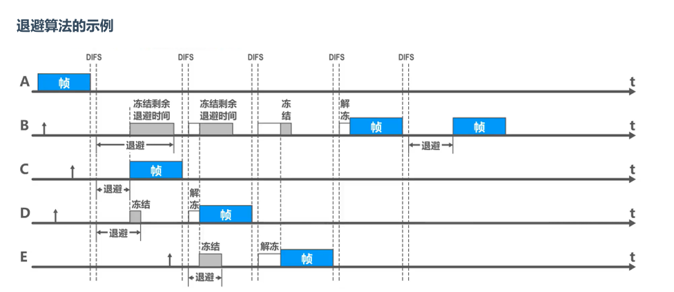

如今的无线局域网（WLAN）使用的是 CSMA/CA 协议。

### 3.6 数据链路层地址

数据链路层的地址是 MAC 地址表示，IP 地址是网络层的地址，可以通过 ARP 协议将 IP 地址转换为 MAC 地址。

#### 3.6.1 MAC 地址

##### 3.6.1.1 MAC地址存储

MAC地址一般存储在网卡的EEPROM中，

一个主机有多个网卡，每个网卡都有一个唯一的 MAC 地址。

##### 3.6.1.2 MAC地址格式

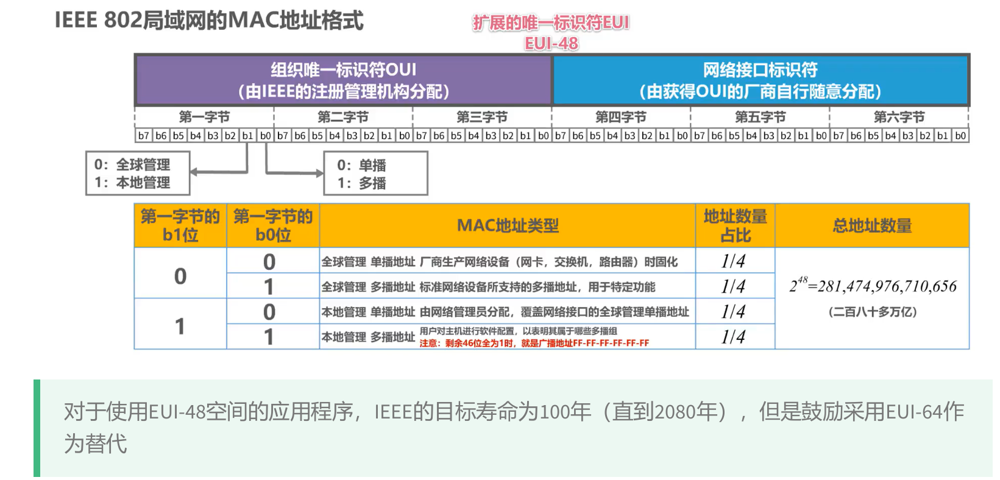

* 单播地址：表示发送给一个主机。（单播地址开头一般是偶数）
* 多播地址：每个主机都有一个多播地址表，多播地址会发送给多个主机，每个主机根据多播地址表判断是否接收数据。（多播地址开头一般是奇数）
* 广播地址：发送给所有主机。（地址为FFFFFFFFFFFF）

##### 3.6.1.3 数据包转发过程中IP地址和MAC地址的变化

发送端发送数据包时，数据包中包含了目标IP地址是不变的，但是如果传输中有路由器，则目标MAC地址是会改变的，因为数据包要经过路由器转发，MAC无法直接获取目标MAC地址。

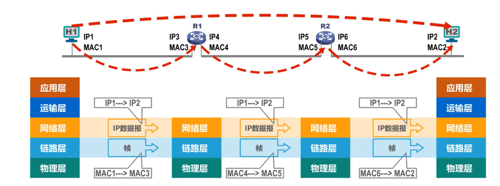

#### 3.6.2 ARP 协议

ARP（Address Resolution Protocol）协议是一种将 IP 地址转换为 MAC 地址的协议。在IP以太网中，当一个上层协议要发包时，有了该节点的IP地址，ARP就能提供该节点的MAC地址。

##### 3.6.2.1 ARP协议的工作原理

1. 源主机在自己的ARP缓存中查找目标主机的MAC地址，如果找到则直接发送数据包。如果没找到则进行下一步。
2. 如果主机发现目标IP在同一个局域网。源主机发送一个ARP请求广播包，请求目标主机的MAC地址。如果主机发现目标IP不在同一个局域网中，则发送ARP请求到默认网关。
3. 收到ARP请求的目标返回一个ARP应答包，包含了自己的MAC地址。
4. 源主机收到ARP应答包后，将目标主机的MAC地址存入ARP缓存中，然后发送数据包。

>ARP表是动态的，会根据数据包的发送和接收动态更新。
ARP没有安全机制，容易受到ARP欺骗攻击。

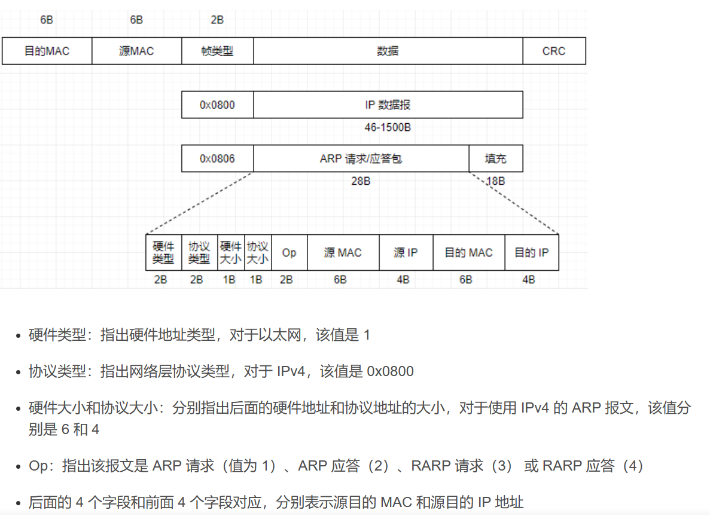

### 3.7 数据链路层的扩展

早期使用集线器（Hub）进行数据传输，现在使用交换机（Switch）进行数据传输。

交换机是一个多接口网桥，收到一个帧时，并不是向所有的接口转发此帧，而是先检查此帧的目的MAC地址，然后再确定将该帧转发到哪一个接口，或把它丢弃。

当接收当多个向同一个接口发送数据时，交换机会将数据放入缓存中，然后再发送。所以不会发生碰撞。

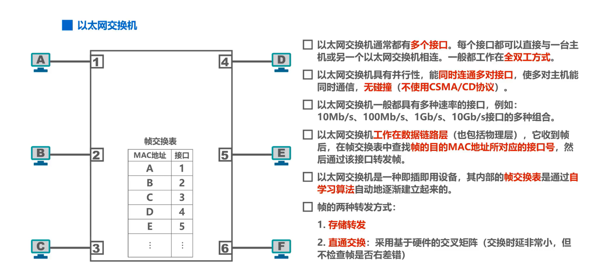

#### 3.7.1 交换机工作原理

* 初始化MAC地址表：当交换机启动时，它的MAC地址表是空的。随着交换机接收到数据帧，它会学习数据帧源地址和接收端口的关系，并将这些信息添加到MAC地址表中。
* 学习和转发：当交换机收到一个数据帧时，它会检查帧的目的MAC地址。如果地址在MAC地址表中，则交换机会将数据帧转发到表中指定的端口。如果目的MAC地址不在表中，交换机会将数据帧发送到除了接收端口之外的所有端口，这个过程称为泛洪。得到目的MAC地址的主机会返回一个应答帧，交换机会学习到目的MAC地址和接收端口的关系，并将这些信息添加到MAC地址表中。

#### 3.7.2 交换机生成树协议STP

交换机生成树协议（Spanning Tree Protocol，STP）是一种用于防止交换机环路的协议。交换机环路会导致广播风暴，影响网络的正常运行。

STP 协议的工作原理是通过选举一个根交换机，然后通过计算最短路径，将其他交换机的端口关闭，从而防止环路的产生。


#### 3.7.3 虚拟局域网VLAN

为了防止广播风暴，如果使用路由器成本太高，可以使用虚拟局域网（VLAN）技术。可将不同网段的主机划分到不同的 VLAN 中，从而减少广播风暴的影响。

##### 3.7.3.1 VLAN的实现

IEEE 802.1Q 协议是一种实现 VLAN 的协议，它在以太网MAC帧中添加了一个 VLAN 标签，用于区分不同的 VLAN。

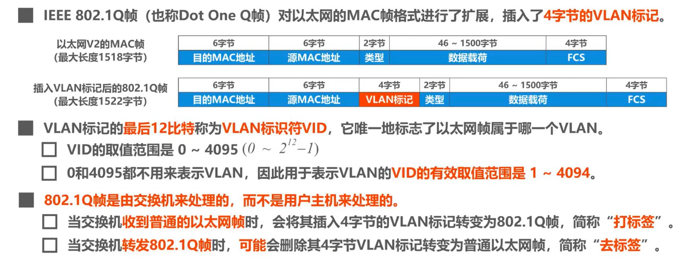


#### 3.7.4 交换机端口

为了实现VLAN，交换机需要将端口划分为不同的PVID，每个PVID对应一个VLAN。VID和PVID匹配时发送给端口。交换机的端口有以下几种类型：
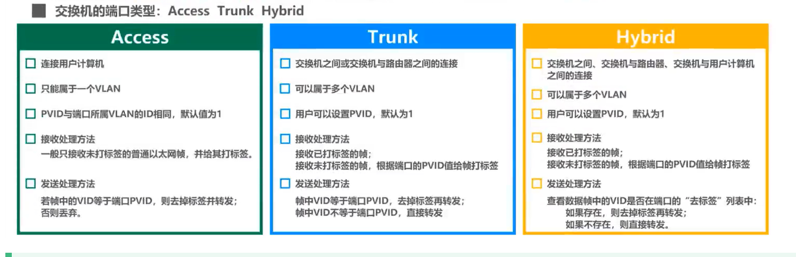


<br>
<br>

---

## 四、网络层

### 4.1 网络层概念

网络层是 OSI 模型的第三层，主要负责数据的传输和路由（路由器隔离广播）选择。

### 4.2 IPV4

#### 4.2.1 IPV4编址方式

IP地址32位，8位一组，分为网络地址和主机地址两部分。

**1. 分类编址：**
 
根据网络的规模将 IP 地址分为 A、B、C、D、E 五类。

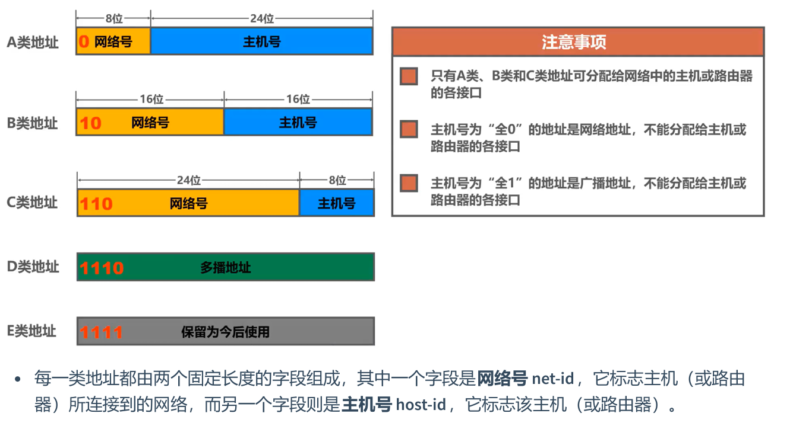

每类地址前面的位数是固定的，A 类地址前面是 0，B 类地址前面是 10，C 类地址前面是 110，D 类地址前面是 1110，E 类地址前面是 1111。

>网络号全为0保留（现在BCD已经开放），但是所有以127开头的IP地址都是回环地址，用于本地测试。
>主机号为0保留，全为1作为广播地址。

>注：当主机或路由器属于多个网络时，需要配置多个 IP 地址。

**2. 划分子网：**

为了更好的利用 IP 地址，可以将网络地址再划分为子网。即将一个网络地址划分为多个子网，通过子网掩码来判断子网。

子网掩码：标志了网络号和子网号的范围，通过第一个8位分析网络号范围，再通过和子网掩码进行与运算，得到子网号。剩下的位数是主机号。

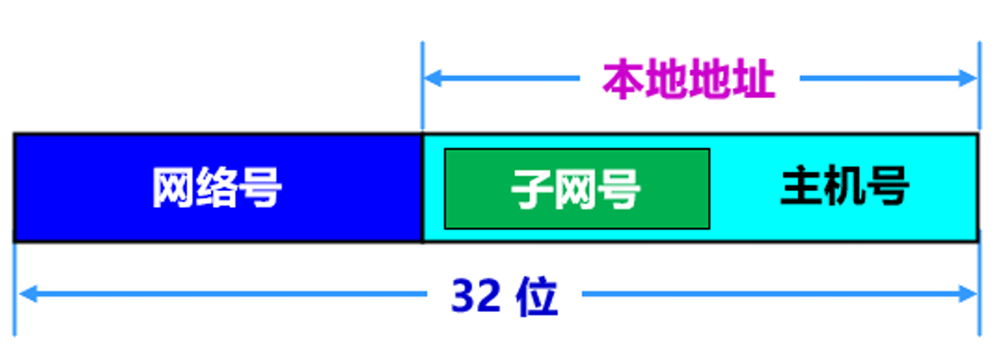

>如：ip号为`192.168.6.1`。子网掩码为`255.255.255.128`，192说明是C类地址，所以前三个字节是网络号，最后一个字节是主机号。子网掩码的最后一个字节是`10000000`，所以是将最后8位中的第一个位作为子网号，剩下的7位作为主机号。（这样可以创建两个子网）

**3. 无分类编址CIDR：**

通过在 IP 地址后面加上斜杠和子网掩码的位数，来表示网络地址和主机地址的划分。

>如：128.14.35.7/20 表示网络地址是前 20 位，主机地址是后 12 位。
>最小地址：128.14.32.0
>最大地址：128.14.47.255
>聚合C类网数量：2^(32-20)/2^8=
>地址掩码:255.255.240.0 (即前20位为1)

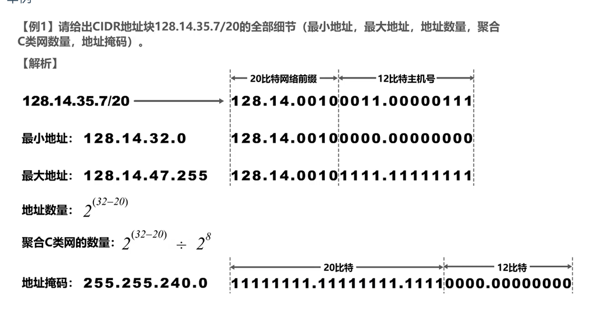

>网络聚合(超网)：将多个网络地址合并为一个网络地址，减少路由表的数量。即连接多个网络的路由器会找这些网络的公共前缀，然后将这些网络合并为一个网络。

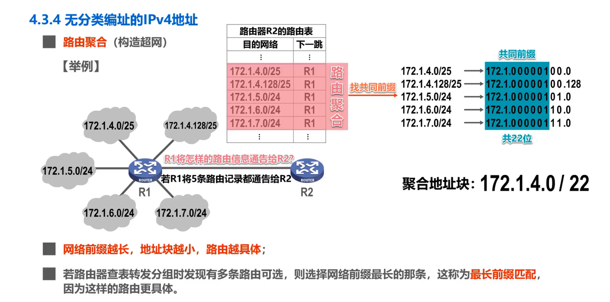

#### 4.2.2 IPV4地址规划

有了子网掩码可以划分出子网，但是如何规划子网的 IP 地址从而不会浪费 IP 地址呢？

**1. 定长的子网掩码（FLSM）**

用同一子网掩码划分子网，但会造成浪费 IP 地址。

**2. 变长的子网掩码（VLSM）**

在申请到的地址块的子网掩码的范围内，使用不同长度的子网掩码。（如该网络需要3个地址，则主机只需要2位，则子网掩码30位）。获取时由范围大到范围小获取。

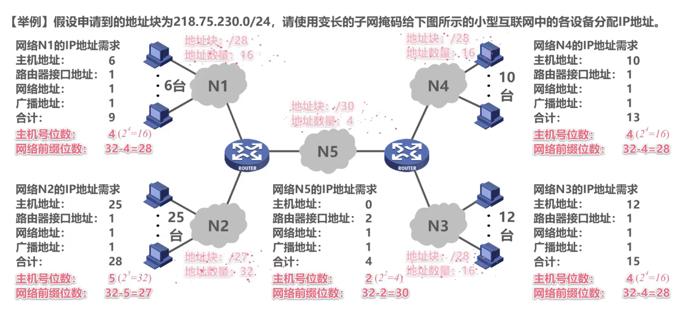

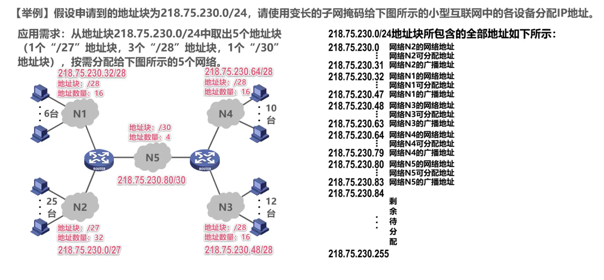

#### 4.2.3 IP数据报的收发

##### 4.2.3.1 IP数据报发送基本流程

1. 主机将目的IP和本IP两方和源地址的子网掩码进行与运算，如果结果相同则在同一子网，否则在不同子网，需要通过默认网关发送。
2. 如果需要路由器，路由器会根据路由表（路由表由**目的网络，地址掩码，下一跳**组成）查找下一跳的地址，即将目的地址和路由表中的子网掩码分别相与，如果结果和子网掩码对应的目的网络相同，则发送给对应的接口

##### 4.2.3.2 发送时可能遇到的问题

**1. 路由器不知道下一跳地址**

路由器中通常会有一个默认路由，当路由器不知道下一跳地址时，会将数据包发送到默认路由。

路由器也可以人工配备待定主机路由（很具体），来解决特殊地址的处理。

**2. 路由器环路问题**

路由器环路问题是指数据包在路由器之间循环转发，导致数据包无法到达目的地。

* 给报文添加生存时间（TTL）字段，每经过一个路由器，TTL 减 1，当 TTL 为 0 时，丢弃数据包。
* 使用路由器生成树协议（STP）来防止路由器环路。
* 使用路由器聚合（超网）来减少路由表的数量。对于聚合时不存在的路由，可设置为黑洞路由（即将聚合路由中不包含的路由的下一跳设置为null）。
* 对于网络故障，可以将故障的网络的下一跳设置为黑洞路由

##### 4.2.3.3 路由器选择协议

上面在配置路由器表时是手动配置的，只适用与小型网络，但是在实际中，路由器表是通过路由器选择协议来自动配置的。

当有信号到来后，路由器会先将其分别处理成比特流（物理层），帧（链路层），数据包（网络层），然后根据数据包的目的地址，查找路由表，找到下一跳地址，然后将数据包在打包成帧，比特流发送信号。

英特网采用分层的路由选择协议，自治系统内部是域内路由选择协议（IGP），自治系统之间是域间路由选择协议（EGP）。

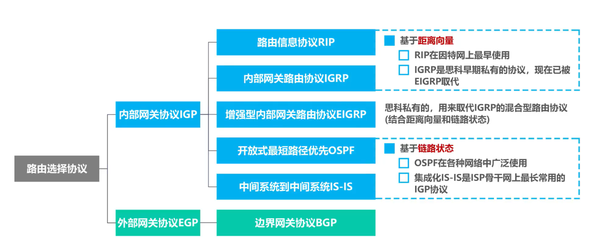

**1. 路由信息协议RIP**

>注：RIP现已被淘汰，但是还有教学和考证意义

RIP（Routing Information Protocol）是一种基于距离向量的路由选择协议，它使用跳数作为路由选择的度量标准。

* RIP使用跳数作为路由选择的度量标准，最大跳数为15，超过15跳的路由会被丢弃。
* RIP认为跳数越少越好，有多条路径相等的情况下，进行等价负载均衡
* RIP每30秒和相邻路由器交换路由表，根据跳数越少越好的原则更新路由表

>RIP基本工作流程：
>1. 路由器开始工作时，只知道直接连接的网络，距离为1
>2. 路由器每30秒向相邻路由器发送路由表，如果180秒未接收到则丢弃
>3. 如果某条路由信息发送变化，立刻发送更新信息

RIP使用规模小，开销大，收敛慢，不适合大型网络。

**2. 开放最短路径优先OSPF**

OSPF（Open Shortest Path First）是一种基于链路状态的路由选择协议，它使用链路代价作为路由选择的度量标准。链路代价是根据链路的带宽，费用，延迟等因素计算出来的。

* OSPF使用链路代价作为路由选择的度量标准，链路代价越小越好。
* 每个路由器都有一个链路状态数据库（LSDB），里面存储了网络中所有的链路状态。每个状态包含了邻居和其线路对应的代价
* 路由器之间会定期和邻居交换链路状态信息，先建立邻居关系，然后再同步链路状态信息。
* 为了防止广播风暴，OSPF使用了DR（Designated Router）和BDR（Backup Designated Router）来减少路由器之间的交换。

>OSPF基本工作流程：
>1. 路由器双方分别发送问候分组（定期发送）
>2. 分别发送数据库描述分组，该分组包含了自己的链路状态信息摘要
>3. 如果发现链路状态信息有变化，立刻发送链路状态请求分组，请求对方发送链路状态信息
>4. 对方收到请求后，立刻发送链路状态更新分组（LSU），包含了链路状态信息
>5. 收到链路状态更新分组后，更新链路状态数据库，然后发送链路状态确认分组
>6. 如果路由器检测到链路状态信息有变化，立刻发送链路状态更新分组，对应的路由器会发送链路状态确认分组


>OSPF路由器邻居的建立：
>1. 小范围：因为链路状态更新分组LSU是通过泛洪的方式发送的，所以可能会导致广播风暴，为了减少广播风暴，OSPF使用了选举指定路由器DR和备用的指定路由器BDR，所有的非指定路由器只能和DR和BDR建立邻居关系，通过DR和BDR来传递链路状态信息。如果DR出现问题，BDR会接替DR的工作。
>2. 大范围：OSPF使用了区域的概念，将网络划分为多个区域，每个区域内部使用链路状态路由选择协议，用区域边界路由器来连接不同区域，自治边界路由器连接不同的自治系统。

**3. 边界网关协议BGP**

BGP（Border Gateway Protocol）是一种自治系统之间的路由选择协议，但是 BGP 的路径需要考虑各种相关策略，如政治，经济，安全等。

* BGP配置时，BGP发言人会通过TCP建立BGP会话，然后交换路由信息。
* 除了类似于国与国这样的分层，BGP也适用于多级结构（主干AS--地区AS--本地AS），地区AS需要通过主干AS来和其它地区AS通信。

> BGP基本工作流程：
> 1. BGP发言人通过TCP发送打开报文（OPEN）建立BGP会话
> 2. 发言人通过TCP发送更新报文（UPDATE）交换路由信息
> 3. 发言人通过TCP发送保持报文（KEEPALIVE）保持BGP会话
> 4. 发言人通过TCP发送通知报文（NOTIFICATION）来发送检测到的差错

#### 4.2.4 IP数据报的首部格式

IP数据报的首部格式固定大小为20字节，包含了版本、首部长度、服务类型、总长度、标识、标志、片偏移、生存时间、协议、首部校验和、源地址和目的地址等字段。可变大小40字节，包含了可选字段（用来支持排错、测量等安全措施）和填充（让首部长度是4字节的倍数，用0填充）

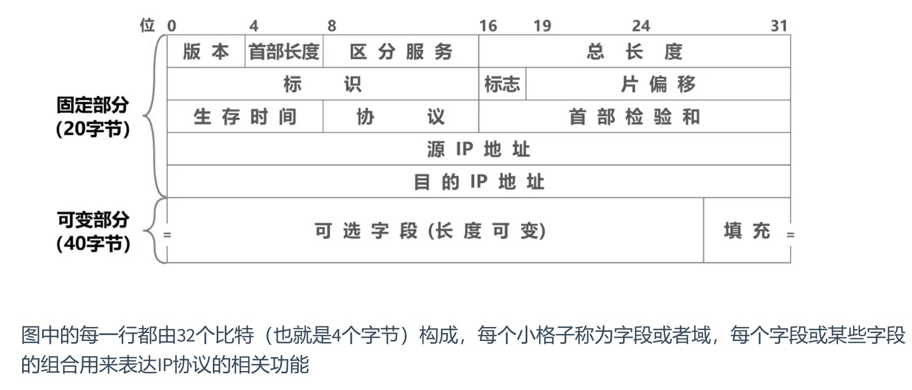

* 版本

IP数据报的版本号，IPv4的版本号是4，IPv6的版本号是6。

* 首部长度

IP数据报的首部长度，单位是4字节，最小值是5（只有20字节的固定部分），最大值是15（包含20字节固定部分和40字节可变部分）。

* 服务类型

IP数据报的服务类型，用于区分不同的服务质量。（很少使用）

* 总长度

IP数据报的总长度，包括首部和数据部分。最大值是65535字节。


<br>

**当IPV4数据报长度超过MTU时（1500字节）需要分片,其中标识、标志、片偏移与其相关**

* 标识

属于同一个数据报的分片的标识相同。由软件生成。

* 标志

标志字段有三个比特：
DF为1表示不分片，0表示可以分片。
MF为1表示还有分片，0表示最后一个分片。
保留位必须为0。

* 片偏移

片偏移字段表示当前分片在原始数据报中的偏移量，单位是8字节。即当前分片数据起始是原数据报的第几个字节。**片偏移是8个字节为一个单位，所以 片偏移=（起始位置对应源数据的字节偏移量）/8**

* 生存时间

生存时间字段（TTL）表示数据报在网络中的生存时间，每经过一个路由器，生存时间减1，当生存时间为0时，数据报会被丢弃。

* 协议

协议字段表示数据报的上层协议，如TCP协议是6，UDP协议是17，ICMP协议是1，OSPF协议是89等。

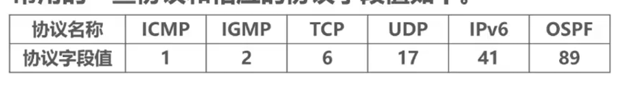

* 首部校验和

首部校验和是对首部的校验和，用于检测首部是否出错。（不是CRC）

* 源地址和目的地址

源地址和目的地址分别是发送端和接收端的IP地址。

* 可选字段

可选字段是可变长度的，用于支持排错、测量等安全措施。（少用）

* 填充

填充字段是用0填充，使首部长度是4字节的倍数。


### 4.3 网际控制报文协议ICMP

ICMP（Internet Control Message Protocol）是一种网络层的协议，用于在网络中传递控制信息。主要是确认IP数据报是否到达目的地，如果被丢弃，返回错误信息。

主机或路由器使用ICMP来发送差错报文和询问报文，ICMP报文是封装在IP数据报中的。

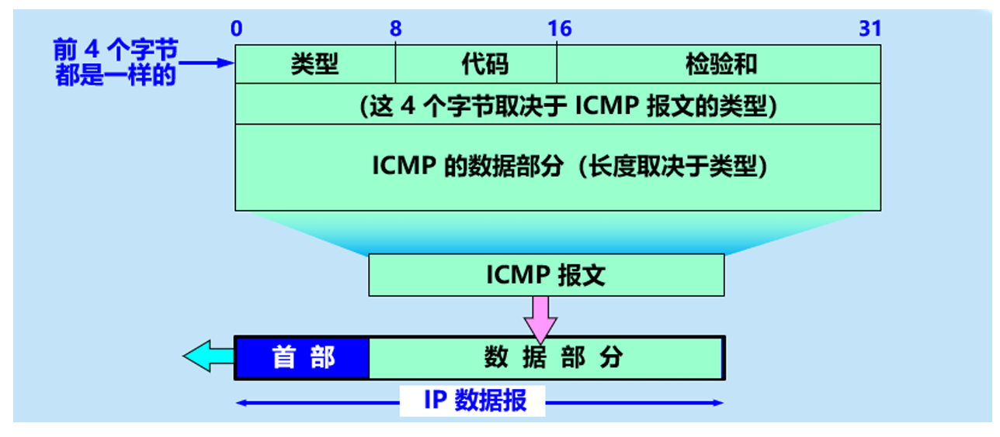

| 类型 | 代码 | 描述 | 报文类型 |
|------|------|------|---------|
| 0    | 0    | Echo Reply（回显应答） | 查询报文 |
| 8    | 0    | Echo Request（回显请求）| 查询报文 |
| 13   | 0    | Timestamp（时间戳请求） | 查询报文 |
| 14   | 0    | Timestamp Reply（时间戳应答） | 查询报文 |
| 15   | 0    | Information Request（信息请求） | 查询报文 |
| 16   | 0    | Information Reply（信息应答） | 查询报文 |
| 17   | 0    | Address Mask Request（地址掩码请求） | 查询报文 |
| 18   | 0    | Address Mask Reply（地址掩码应答） | 查询报文 |
| 3    | 0    | Destination Network Unreachable（目的网络不可达）| 目的地不可达 |
| 3    | 1    | Destination Host Unreachable（目的主机不可达） | 目的地不可达 |
| 3    | 2    | Destination Protocol Unreachable（目的协议不可达）| 目的地不可达 |
| 3    | 3    | Destination Port Unreachable（目的端口不可达）  | 目的地不可达 |
| 3    | 4    | Fragmentation Required, and DF Flag Set（需要进行分片，但设置了“不分段”标志位）| 目的地不可达 |
| 3    | 5    | Source Route Failed（源站选路失败）             | 目的地不可达 |
| 3    | 6    | Destination Network Unknown（目的网络未知）      | 目的地不可达 |
| 3    | 7    | Destination Host Unknown（目的主机未知）        | 目的地不可达 |
| 3    | 8    | Source Host Isolated（源主机被隔离）           | 目的地不可达 |
| 3    | 9    | Network Administratively Prohibited（被网络管理员禁止）| 目的地不可达 |
| 3    | 10   | Host Administratively Prohibited（被主机管理员禁止）| 目的地不可达 |
| 3    | 11   | Network Unreachable for TOS（由于服务类型TOS，网络不可达）| 目的地不可达 |
| 3    | 12   | Host Unreachable for TOS（由于服务类型TOS，主机不可达）| 目的地不可达 |
| 3    | 13   | Communication Administratively Prohibited（由于过滤，通信被禁止）| 目的地不可达 |
| 3    | 14   | Host Precedence Violation（主机优先级越界）    | 目的地不可达 |
| 3    | 15   | Precedence cutoff in effect（优先级截止）      | 目的地不可达 |
| 4    | 0    | Source Quench（源端被关闭）| 源端关闭 |
| 5    | 0    | Redirect for Network（对网络重定向） | 重定向 |
| 5    | 1    | Redirect for Host（对主机重定向） | 重定向 |
| 5    | 2    | Redirect for TOS and Network（对服务类型和网络重定向）| 重定向 |
| 5    | 3    | Redirect for TOS and Host（对服务类型和主机重定向）| 重定向 |
| 11   | 0    | TTL Expired in Transit（传输期间生存时间TTL超时）| 生存时间超时 |
| 11   | 1    | Fragment Reassembly Time Exceeded（片段重组时间超时）| 生存时间超时 |
| 12   | 0    | IP Header Bad (RFC 1122（IP首部差错）| IP首部差错 |
| 12   | 1    | Required Option Missing（缺少必要选项）| IP首部差错 |


#### 4.3.1 ICMP询问报文

**1. 回送请求和回答**
主机或路由器向一个特定的目的主机发送回送请求报文，目的主机接收到回送请求报文后，返回回送应答报文。

这种报文用来测试目的主机是否可达。（Ping命令）

**2. 时间戳请求和回答**

主机或路由器向一个特定的目的主机发送时间戳请求报文，目的主机接收到时间戳请求报文后，返回时间戳应答报文。

这种报文用来测试或同步目的主机的时间。

#### 4.3.2 ICMP差错报文

**1. 目的地不可达**

当主机或路由器接收到一个数据报，发现无法交付数据报时，会返回一个目的地不可达的差错报文。

**2. 源端关闭**

当主机或路由器接收到一个数据报，发现数据报超过了主机的处理能力时，会返回一个源端关闭的差错报文。

**3. 时间超时**

当主机或路由器接收到一个数据报，发现数据报的生存时间（TTL）为0超时时，会返回一个时间超时的差错报文。如果在预定时间内收不到所有分片，也会返回时间超时的差错报文。

**4. 重定向**

当主机或路由器接收到一个数据报，发现数据报的下一跳地址不是最佳地址时，会返回一个重定向的差错报文。

**5. IP首部差错**

当主机或路由器接收到一个数据报，发现数据报的IP首部出错（即校验和出错）时，会返回一个IP首部差错的差错报文。


#### 4.3.3 ICMP应用

ICMP主要用于网络故障的排查和网络性能的测试。

* Ping命令：用于测试目的主机是否可达。使用了回送请求和回答报文。
* Tracert命令：用于测试数据包从源主机到目的主机的路径。windows下使用ICMP回送请求和回答报文以及差错报文，Linux下使用UDP数据报，仅使用了差错报文。


### 4.4 虚拟专用网VPN

VPN（Virtual Private Network）是一种通过公共网络建立专用网络的技术。VPN可以通过加密技术和隧道技术，将公共网络变成私有网络，保证数据的安全性。

**VPN工作原理**

VPN通过加密技术和隧道技术，将公共网络变成私有网络。

* 加密技术：将数据加密，保证数据的安全性。如AES加密算法。

* 隧道技术：将原数据的IP首部封装在新的IP首部中，然后通过公共网络传输，到达目的地是，再将新的IP首部去掉，还原成原IP。如IPSec协议。隧道技术通常需要特殊的VPN设备来实现，如VPN集线器或VPN路由器来实现数据的封装和解封装。


### 4.5 网络地址转换NAT

因为IP还是有限的，所以会出现IP地址不够用的情况，NAT（Network Address Translation）技术可以将私有IP地址转换为公有IP地址，这样从而解决IP地址不够用的问题。

比如在不同的网络中都有可能有相同的IP地址(192.168.6.5)，但是通过NAT技术，可以将私有IP地址转换为公有IP地址(公网唯一)，这样就可以解决IP地址冲突的问题。

**NAT类型**

* 静态NAT（Static NAT）：一对一映射，将私有IP地址映射到固定的公共IP地址。静态NAT通常用于将服务器或特定设备暴露在公共网络上。
* 动态NAT（Dynamic NAT）：多对多映射，将私有IP地址动态地映射到一个由NAT设备维护的公共IP地址池中的某个地址。动态NAT允许多个设备共享有限的公共IP地址。
* PAT（Port Address Translation，端口地址转换）：也称为NAPT。PAT是一种特殊的动态NAT，不仅将私有IP地址映射到公共IP地址，还会使用不同的端口号来区分不同的私有IP地址。这样，多个私有IP地址可以共享同一个公共IP地址（不同私有IP对应一个公有IP的不同端口号），只要它们的通信不重叠在同一个端口上。（常用）

**NAPT工作原理**

NAPT通过修改数据报的源IP地址和端口号，将私有IP地址转换为公共IP地址，然后再将数据报发送到公共网络中。NAPT还会维护一个转换表，用于记录私有IP地址和端口号与公共IP地址和端口号的映射关系。

**NAT缺点**

外网无法直接访问内网，所以如果要实现P2P通信，需要实现虚拟局域网，NAT内网穿透技术等

### 4.6 内网穿透技术

内网穿透是指在使用了NAT技术的网络中，通过一系列技术手段实现在内部网络和外部网络之间建立直接通信连接的过程。其原理涉及到了多种技术和协议，主要包括了以下几个步骤：

1. NAT类型检测：在进行内网穿透之前，首先需要确定NAT设备的类型，以了解它对传入和传出的数据包进行转换的方式。通常，NAT设备可以分为对称型NAT、全锥型NAT、受限锥型NAT和端口限制型NAT等不同类型。
2. 获取公网IP地址：内网中的设备需要获取自己的公网IP地址和端口号，以便外部设备能够直接连接到它。这一步通常使用STUN协议来实现，STUN服务器可以帮助内网设备发现自己的公网IP地址。
3. 端口映射：如果使用了受限或对称型NAT，STUN可能无法直接获取公网IP地址。在这种情况下，可以尝试使用端口映射来解决问题。UPnP（Universal Plug and Play）协议是一种常用的动态端口映射协议，它允许设备向NAT路由器请求动态分配端口并建立映射。

4. （其它方法）中继服务器：如果直接的P2P连接无法建立，可以借助中继服务器来进行通信。两个设备都连接到中继服务器，然后通过中继服务器进行通信。这种方式虽然效率较低，但是能够确保通信的可靠性。
5. （其它方法）UDP Hole Punching：是一种基于UDP协议的穿透技术，通过同时向NAT设备发送UDP包，以建立直接的P2P连接。这种方法通常需要两个设备都能够接收UDP包，并且具有一定的时间窗口来实现。


<br>
<br>

---

## 五、传输层

### 5.1 传输层概念

传输层是 OSI 模型的第四层，主要负责数据的传输和端到端的通信。网络层只实现了主机到主机的通信，传输层是实现了进程到进程的通信。

**1. 端口号**

端口号是传输层的一个重要概念，用于标识主机上的不同进程（进程标识符PID）。端口号分为系统端口号（重要协议使用）（0-1023）、用户端口号（注册使用）（1024-49151）和动态端口号（用户使用）（49152-65535）。

**2. 传输层协议**

传输层主要有两种协议：TCP（Transmission Control Protocol，传输控制协议）和UDP（User Datagram Protocol，用户数据报协议）。

* TCP：面向连接的、可靠的、基于字节流的传输协议。TCP提供了可靠的数据传输，通过序号、确认号、校验和、重传机制、流量控制和拥塞控制等机制，保证数据的可靠传输。
* UDP：无连接的、不可靠的、基于数据报的传输协议。UDP提供了简单的数据传输，不保证数据的可靠传输，但是传输速度快。

**3.TCP和UDP的区别**
| 特点           | TCP                                           | UDP                                      |
|----------------|-----------------------------------------------|------------------------------------------|
| 连接性         | 面向连接(一对一)                                      | 无连接（一对一，一对多，多对一、多对多） |
| 可靠性         | 可靠传输，提供数据的可靠交付                  | 不可靠传输，不保证数据的可靠交付         |
| 顺序性         | 保证数据包的顺序性传输                        | 不保证数据包的顺序性传输                 |
| 数据发送         | 将应用层交付的报文直接打包                        | 通过字节流传输（发送的数据块数量和接收的数据块数量不一致） |
| 首部大小       | 8字节                        | 20~60字节 |
| 流量控制       | 有流量控制机制，避免发送速率过快导致拥塞     | 没有流量控制机制，可能导致拥塞          |
| 拥塞控制       | 有拥塞控制机制，避免网络拥塞                 | 没有拥塞控制机制，可能导致网络拥塞      |
| 适用场景       | 适用于需要可靠传输、顺序传输、流量控制、拥塞控制等场景 | 适用于实时性要求高、数据量小、可容忍少量丢失的场景 |
| 应用举例       | 网页浏览、文件传输、电子邮件等               | 实时视频、音频传输、在线游戏等         |


### 5.2 UDP协议

UDP（User Datagram Protocol）是一种无连接的、不可靠的、基于数据报的传输协议。UDP提供了简单的数据传输，不保证数据的可靠传输，但是传输速度快。

* UDP是面向报文的，发送的数据报是不可分割的数据包。所以在进行UDP的发送和接收时，发送的数据报和接收的数据报大小必须一致。

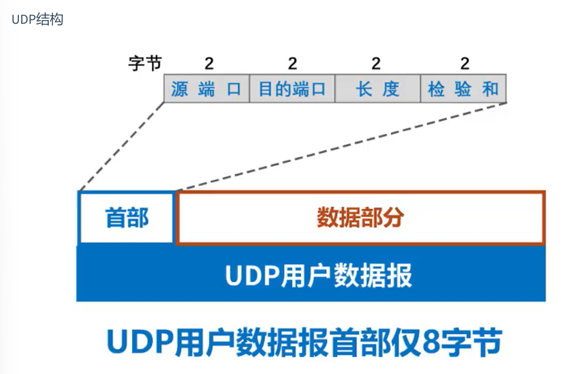

#### 5.2.1 UDP传输经常遇到的问题

**1. 丢包**

UDP是不可靠的传输协议，所以在传输过程中可能会出现丢包的情况。丢包的原因可能有很多，如网络拥塞、网络故障、传输错误等。

对策：可以向TCP一样设置对接收到的数据包进行确认，如果没有收到确认，就超时重传数据包（可以通过序号来标记该包是否是重复接收）。

**2. 乱序**

UDP是面向报文的传输协议，所以在传输过程中可能会出现乱序的情况。乱序的原因可能有很多，如网络拥塞、网络故障、传输错误等。

对策：可以向TCP一样设置对接收到的数据包进行排序，如果乱序，就将数据包缓存，等待后续数据包的到来。

**3. 缓冲区溢出**

UDP是无流量控制，所以在传输过程中可能会出现缓冲区溢出的情况。缓冲区溢出的原因可能有很多，如发送数据包过快、接收数据包过慢等。

对策：解决UDP接收缓冲区溢出的现象需要根据实际情况确定， 一般可以用增大接收数据缓冲区和接收方接收单独处理的方法来解决局部的UDP 数据接收缓冲区溢出问题

**4. 数据报文截断**

UDP是面向报文的传输协议，所以在传输过程中可能会出现数据报文截断的情况。数据报文截断的原因可能有很多，如发送数据包过大、接收缓冲区过小等。

对策：可以通过设置数据报文的大小，来避免数据报文截断的情况。

#### 5.2.2 使用UDP实现可靠传输例子QUIC

QUIC（Quick UDP Internet Connections）是一种基于UDP的传输协议，它结合了TCP和UDP的优点，提供了可靠的数据传输和低延迟的特性。（QUIC是应用层协议，不是传输层协议，即通过应用层对UDP进行封装）

### 5.3 TCP协议

TCP（Transmission Control Protocol）是一种面向连接的、可靠的、基于字节流的传输协议。TCP提供了可靠的数据传输，通过序号、确认号、校验和、重传机制、流量控制和拥塞控制等机制，保证数据的可靠传输。

#### 5.3.1 TCP结构

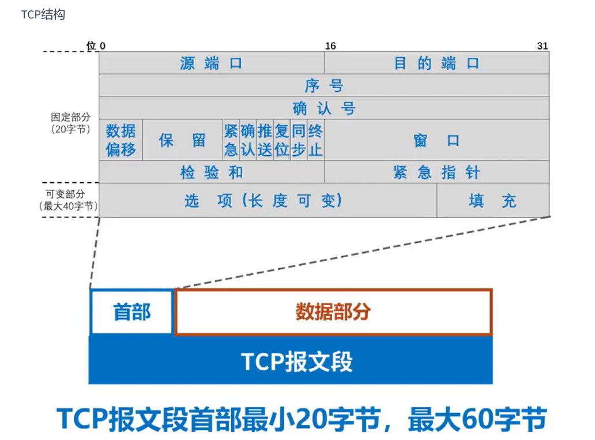

TCP数据报的首部格式固定大小为20字节，包含了源端口、目的端口、序号、确认号、数据偏移、保留、标志、窗口大小、校验和、紧急指针等字段。可变大小40字节，包含了选项字段（用来支持排错、测量等安全措施）和填充（让首部长度是4字节的倍数，用0填充）

* 源端口和目的端口：分别16位源端口是发送进程的端口号，目的端口是接收进程的端口号。
* 序号：32位序号，用于指出本报文段的第一个数据字节在数据流中的序号。当序号达到最大值时，会从0开始。
* 确认号：32位确认号，用于指出期望收到的下一个数据字节的序号。确认号是对方发送的序号加1。（当ACK=1时，确认号有效，同时TCP规定在建立连接后所有的报文段都必把ACK置为1）
* 数据偏移：4位数据偏移，表示TCP首部的长度，单位是4字节。
* 保留：6位保留字段，保留供将来使用，默认0。
* 标志：6位标志字段，包括URG、ACK、PSH、RST、SYN、FIN等标志。

>URG：置1紧急指针有效（即发送优先级最高）
>ACK：置1确认号有效
>PSH：置1接收方应该尽快将数据交给应用层，不必等到缓冲区满了再交付
>RST：置1重置连接
>SYN：在建立连接时用来同步序号
>FIN：置1释放一个连接

* 窗口大小：16位窗口大小，用于指出发送方的接收窗口大小，用于流量控制。
* 校验和：16位校验和，用于检测TCP首部和数据的校验和。在计算校验和时会在TCP首部和数据后面添加12个字节的伪首部。（UDP也一样）
* 紧急指针：16位紧急指针，用于指出紧急数据的长度。
* 选项字段：可变长度的选项字段，有最大报文段长度MSS、窗口扩大因子、时间戳、SACK等选项。
* 填充：填充字段是用0填充，使首部长度是4字节的倍数。

#### 5.3.2 TCP的建立

TCP的链接过程为三次握手和四次挥手。

**三次握手**

在三次握手后双方可以通知对方的存在，能协调一下参数（如窗口最大值，服务质量等），并且可以对运输实体资源进行分配。

1. 客户端向服务端发送请求报文段（SYN=1代表请求，seq=x代表初始序号），并进入SYN_SENT（同步已发送）状态。该报文段不能携带数据。但是会消耗一个序号。
2. 服务端收到请求报文段后，向客户端发送确认报文段（ACK=1代表确认，SYN=1代表请求同步，seq=y代表服务器的初始序号，ack=x+1代表对客户端序号的确认），并进入SYN_RCVD（同步已接收）状态。该报文段不能携带数据。但是会消耗一个序号。
3. 客户端收到确认报文段后，向服务端发送确认报文段（ACK=1代表确认，seq=x+1代表客户端的下一个序号，ack=y+1代表对服务器序号的确认），并进入ESTABLISHED（已建立）状态。该报文段可以携带数据，如果不携带数据，则不消耗序号。
4. 服务端收到确认报文段后，进入ESTABLISHED（已建立）状态。

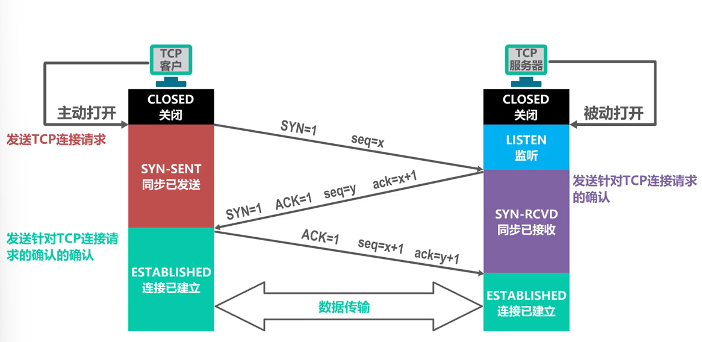

>问题：为什么需要三次握手？
>答：主要是为了防止已失效的连接请求报文段突然又传送到了服务端，因而产生错误。如果只有两次握手，(第一次的TCP连接请求并没有失败但是发送滞留)那么服务端会认为客户端要建立连接，但是客户端并没有这个意图，这样会导致资源的浪费。
>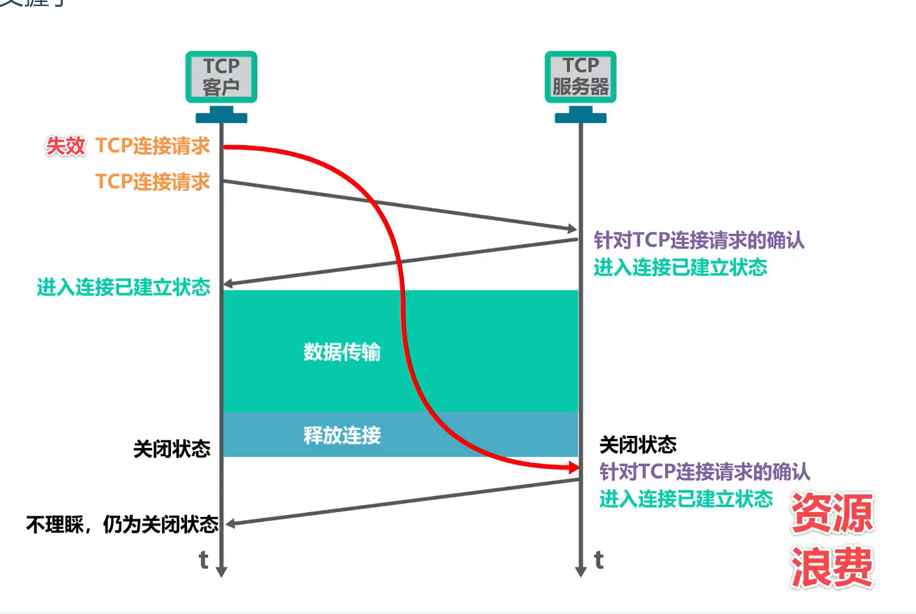

**四次挥手**

在四次挥手后双方可以通知对方关闭连接，释放资源。

1. 客户端向服务端发送请求报文段（FIN=1代表请求关闭，seq=u代表客户端的序号，ACK=1代表前一个数据已收到，ack=v代表前一个数据的序号+1），并进入FIN_WAIT_1（等待服务端关闭）状态。TCP规定终止位FIN等于1的报文段即使不携带数据，也要消耗掉一个序号.
2. 服务端收到请求报文段后，向客户端发送确认报文段（ACK=1代表确认，seq=v代表服务端最后一个数据序号+1(和第一步ack=v一样)，ack=u+1代表对客户端序号的确认），并进入CLOSE_WAIT（等待关闭）状态。
3. 客户端收到确认报文段后，进入FIN_WAIT_2（等待服务端关闭）状态。此时TCP客户端到服务端的连接已经关闭，但是服务端到客户端的连接还没有关闭。（半关闭状态）
4. 服务器端数据发送完毕后，向客户端发送释放请求报文段（FIN=1代表请求关闭，seq=w代表服务端的序号（因为在半关闭时可能有数据发送给客户端），ACK=1代表前一个数据已收到，ack=u+1对第一次挥手报文的重复确认），并进入LAST_ACK（等待客户端关闭）状态。
5. 客户端收到释放请求报文段后，向服务端发送确认报文段（ACK=1代表确认，seq=u+1代表客户端第一次挥手序号+1，ack=w+1代表服务端的第三次挥手序号+1），并进入TIME_WAIT（等待时间）状态。此时TCP客户端到服务端的连接已经关闭，服务端到客户端的连接也关闭。

>问题1：为什么需要四次挥手？
>答：需要四次挥手的原因是，服务端在收到客户端断开连接的FIN报文后，并不会立即关闭连接，而是先发送一个ACK包告诉客户端收到了关闭连接的请求。只有当服务器的所有报文发送完毕之后，才发送FIN报文断开连接，因此需要四次挥手。


>问题2：TCP客户进程在发送完最后一个确认报文后，为什么不直接进入关闭状态？而是要进入时间等待状态？
>1. 确保最后一个确认报文能够到达：如果客户端的最后一个确认报文（ACK）在网络中丢失，那么服务端将不会收到这个确认，可能会重新发送FIN报文。客户端必须处于能够接收重传的FIN报文的状态，以便可以重新发送ACK报文。
>2. 等待足够的时间以确保服务端接收到最后一个确认报文：时间等待状态通常会持续2倍的最大报文生存时间（MSL），这样可以确保在这段时间内网络中存在的所有报文都会消失，从而避免在新的连接中出现旧连接的报文。
>3. 防止“旧”连接的报文干扰“新”连接：在网络中，可能会有延迟的报文在传输。如果客户端立即关闭并重新开启一个新的连接，那么这些延迟的报文可能会被误认为是新连接的一部分，从而导致数据混乱。时间等待状态可以防止这种情况的发生
>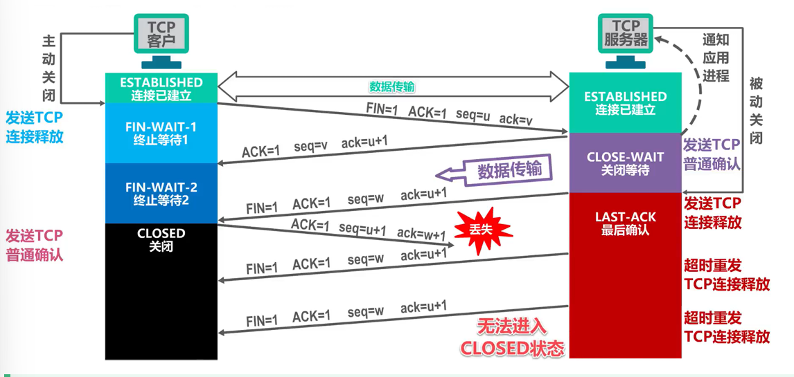

#### 5.3.2 TCP的网络利用

TCP的网络利用主要有两个方面：流量控制、拥塞控制。

**1. 流量控制**

流量控制是指发送方根据接收方的接收能力来控制发送数据的速率，以避免发送方发送数据过快导致接收方缓冲区溢出。利用滑动窗口机制来实现流量控制。

* 接收方利用自己的接收窗口大小来限制发送方的窗口大小（确认时会发送带有窗口大小的报文）
* TCP发送方接收到零窗口大小的确认报文时，会停止发送数据，并启动持续定时器，定时器超时后会发送零窗口探测报文（带1字节数据）（避免死锁）

**2. 拥塞控制**

若对网络中某一资源的要求超过了该资源所能提供的服务能力，就会发生网络拥塞。

TCP的拥塞控制主要有四种算法：慢开始、拥塞避免、快重传、快恢复。主要是通过拥塞窗口大小来控制发送数据的速率。

* 慢开始：发送方刚开始发送数据时，先以一个报文段的大小发送数据，然后每收到一个确认报文段，发送方的窗口大小就会变成2的次方（1，2，4，8...），直到达到一个阈值（慢开始阈值）。
* 拥塞避免：当发送方的窗口大小达到慢开始阈值时，发送方的窗口大小就会变成线性增长（1，2，3，4...），当重传计数器超时时，可能是发生了拥塞。于是将慢开始阈值设为当前窗口一半，窗口大小变为1，重新开始慢开始算法。
* 快重传：快重传是为了防止个别报文的丢失被误判为拥塞。当发送方连续收到三个重复的确认报文时，就会认为发生了个别报文丢失，立即重传丢失的报文段（这样不会触发超时，就不会重新慢开始了）。（例如发送方发了M1,M2,M3.接收方收到了M!,M2,发送方无论再发什么接收方都会发送M2，当接收到3次M2时，发送方知道M3没有收到，于是立刻重新发送M3）
* 快恢复：当发送方收到三个重复的确认报文时，就会将慢开始阈值设为当前窗口的一半，窗口大小变为和阈值一样，然后进入拥塞避免状态。

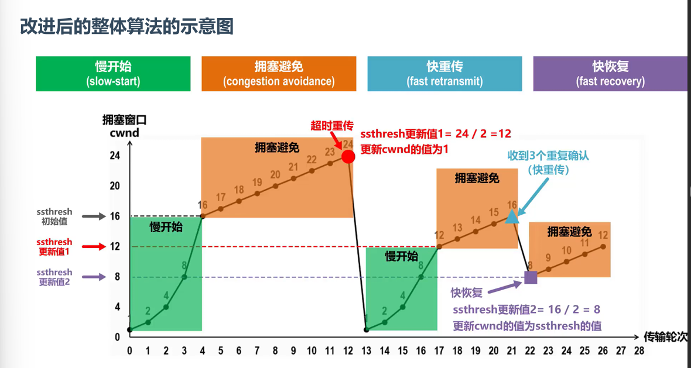


#### 5.3.2 TCP的可靠传输

TCP的可靠传输主要是通过滑动窗口机制、序号、确认号、快重传、超时重传、流量控制、拥塞控制等机制来保证数据的可靠传输。在讨论可靠传输时默认没有流量控制和拥塞控制（包含超时重传）问题。

* 滑动窗口机制：发送方和接收方都有一个窗口，该窗口是有三指针来控制的，（已发送的序号，已确认的序号，可发送的序号），接收方的确认报文可以控制发送方的窗口大小，但会有一些延迟。当接收到有序的数据报文时，会调整窗口位置，也需要通过报文的内容改变窗口大小。
* 序号和确认号：序号用来标识数据报文的顺序，确认号用来确认数据报文的接收情况。
* 快重传：当有数据报文丢失时，**接收方会重复发送已接收的有序的最高序号的确认报文**，发送方收到三个重复的确认报文时，就会立即重传丢失的数据报文。对于没有按序到达的数据报文，接收方会缓存，等待后续数据报文的到来。

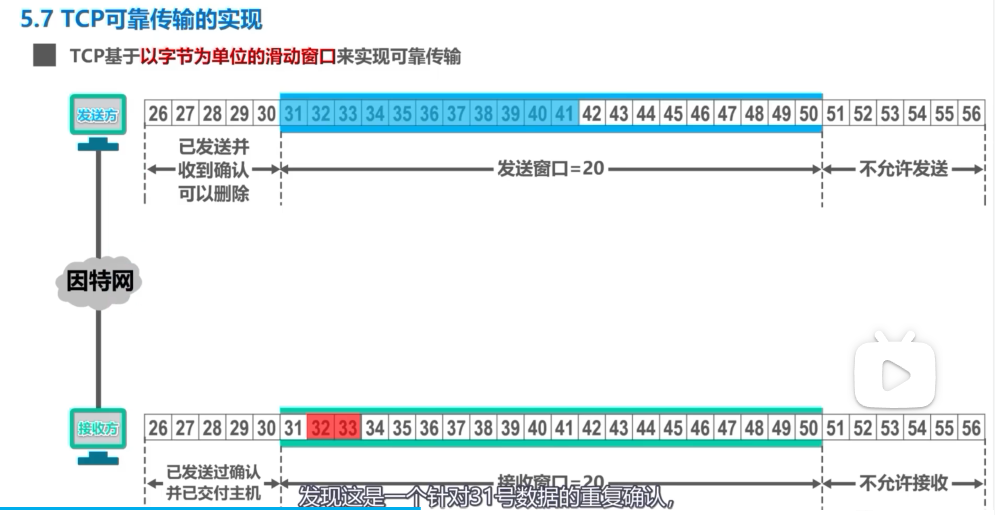

#### 5.3.2 TCP的各种问题

##### 5.3.2.1 TCP一方关闭连接

**1.正常close**

当一方调用close()关闭连接时，会发送FIN报文，对方收到后会回复ACK报文，然后进入半关闭状态，

如果是因为进程异常退出，那么关闭过程由内核执行，且收到的数据会被丢弃。

半关闭：一方关闭连接，另一方还可以发送数据，但是不能再接收数据

**2.断网时有传输数据**

如果在传输数据时断网，由于收不到ACK会重传数据，达到一定次数后如果还是没有收到ACK，会认为对方已经关闭连接，此时是直接关闭连接。一般最小重传时间是200ms 最大重传时间是120s 重传次数为15


**3.断网时没有传输数据**

如果在没有传输数据时断网，那么可以通过保活定时器（KeepAlive）来检测对方是否还活着，如果对方没有响应，那么会认为对方已经关闭连接，此时是直接关闭连接。

>linux下可以通过`cat /proc/sys/net/ipv4/tcp_keepalive_time`查看保活定时器的时间，`cat /proc/sys/net/ipv4/tcp_keepalive_intvl`查看保活定时器的间隔，`cat /proc/sys/net/ipv4/tcp_keepalive_probes`查看保活定时器的次数

##### 5.3.2.1 TCP粘包问题

- 粘包：当发送方连续发送多个数据包时，如果接收方的接收速度不够快，或者TCP协议为了效率将多个小的数据包合并成一个大的数据包，接收方可能一次性接收到多个数据包粘在一起的情况。
- 拆包：当发送方发送的数据包很大时，超过了TCP协议的缓冲区大小，TCP协议会将这个大的数据包拆分成多个小的数据包进行发送。

常见的解决方法：

1. 消息定长：编程时双方规定一个数据长度，发送方将消息按照固定的长度进行发送，接收方按照固定的长度进行接收。
2. 消息分隔符：在消息的末尾加上一个特殊的字符作为消息的分隔符，接收方根据分隔符来判断消息的结束。
3. 消息头部：在消息发送前先发一个固定长度的头部，头部中包含消息的长度，接收方先接收头部，然后根据头部中的长度来接收消息。

>还需要考虑到缓冲区大小问题，如果接收的大小超过了缓冲区大小，那么会出现返回的数据不完整的情况。需要循环接收数据，直到接收到完整的数据。


<br>
<br>

---

## 六、应用层

### 6.1 DHCP

DHCP（Dynamic Host Configuration Protocol）是一种动态主机配置协议，用于自动分配IP地址、子网掩码、网关、DNS服务器等网络配置信息。DHCP报文通过UDP协议传输，使用端口号67（服务器）和68（客户端）。

DHCP的工作原理主要包括四个阶段：发现阶段、提供阶段、请求阶段、确认阶段。
- 发现阶段：当一台设备连接到网络时，它会发送一个DHCP发现报文（DHCP Discover），通常是一个广播消息，寻找可用的DHCP服务器。
- 提供阶段：DHCP服务器接收到发现报文后，会从其地址池中选择一个IP地址，并通过DHCP提供报文（DHCP Offer）向客户端提供这个IP地址和其他配置信息，如子网掩码、默认网关等。
- 请求阶段：客户端从一个或多个DHCP服务器收到提供报文后，会选择一个并通过DHCP请求报文（DHCP Request）请求这些网络参数。
- 确认阶段：DHCP服务器接收到请求报文后，会发送一个DHCP确认报文（DHCP Acknowledgement），确认IP地址和网络配置信息的分配。此时，客户端可以开始使用分配到的IP地址。
租约：分配给客户端的IP地址有一个租约期限。在租约快到期时，客户端会发送一个新的请求报文来续租IP地址。在使用前还会进行ARP检测。

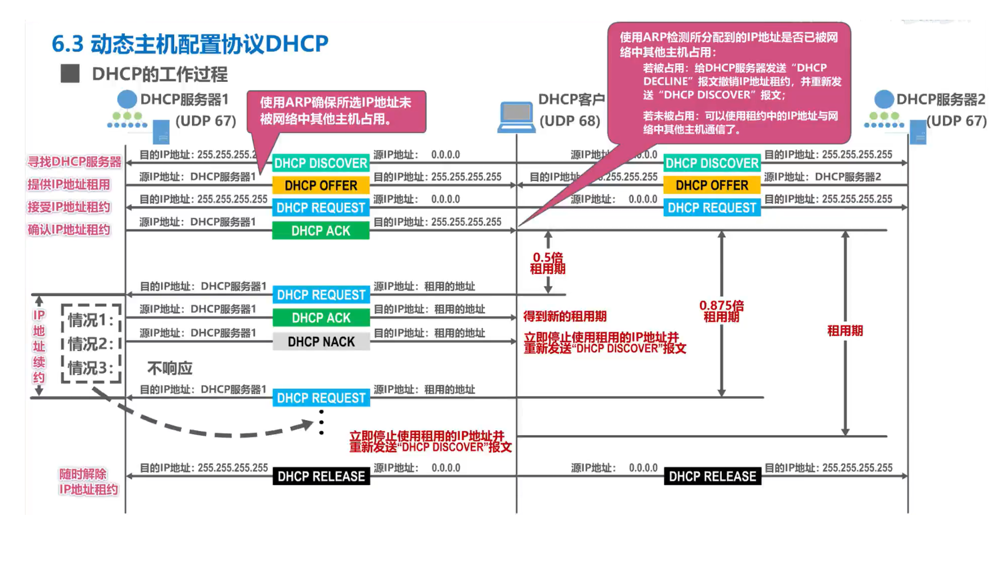

>为了减少DHCP服务器，会给一些路由器分配一个DHCP中继代理，当路由器收到DHCP发现报文时，会将其转发给DHCP服务器，然后将DHCP提供报文转发给客户端。

### 6.2 DNS

DNS（Domain Name System）是一种用于将域名解析为IP地址的分布式数据库系统。DNS主要包括域名空间、域名服务器、域名解析器等组成部分。

缓存：客户端本地有一个DNS缓存即hosts文件，DNS服务器也有一个DNS缓存，没有时会向根域名服务器查询，查询到后会缓存到本地。

域名：域名是由多个标签组成的，每个标签之间用点号（.）分隔。域名分为顶级域名（TLD）、二级域名、三级域名等。（从右到左）

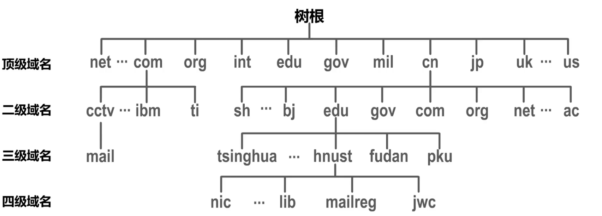

工作流程：

1. 客户端先查找本地hosts文件，如果没有找到，就会向本地DNS服务器发送一个DNS请求报文。
2. 本地DNS服务器收到请求报文后，会先查找自己的DNS缓存，如果没有找到，就会向根域名服务器发送一个DNS请求报文。
3. 根域名服务器收到请求报文后，会返回对应的顶级域名服务器的IP地址。
4. 本地DNS服务器收到顶级域名服务器的IP地址后，会向顶级域名服务器发送一个DNS请求报文。
5. 顶级域名服务器收到请求报文后，会返回对应的权威域名服务器的IP地址。
6. 本地DNS服务器收到权威域名服务器的IP地址后，会向权威域名服务器发送一个DNS请求报文。
7. 如此往复，直到找到对应的IP地址，然后将IP地址返回给DNS服务器，DNS服务器再将IP地址返回给客户端并记录到DNS缓存中。
8. 客户端收到IP地址后，就可以向对应的服务器发送请求报文。


### 6.3 FTP

FTP（File Transfer Protocol，文件传输协议）是一种在网络上进行文件传输的应用层协议。它允许用户在客户端和服务器之间传输文件，无论是上传还是下载。FTP协议运行在TCP连接之上，确保了文件传输的可靠性。（活化石）

FTP建立后会有两个连接：控制连接和数据连接。控制连接用于发送命令和接收响应，数据连接用于传输文件。


工作原理：
1. **建立连接**：FTP客户端使用端口21与FTP服务器建立控制连接，用于发送控制信息，如登录凭据和命令。
2. **登录过程**：用户通过提供用户名和密码来登录FTP服务器。某些服务器可能允许匿名登录。
3. **传输文件**：一旦控制连接建立，客户端可以发送命令来上传或下载文件。这些文件传输通过端口20上的数据连接进行。
4. **传输模式**：FTP支持ASCII和二进制两种文件传输模式，适用于不同类型的文件。
5. **传输控制**：FTP使用两种传输控制模式：主动模式和被动模式。主动模式下，服务器连接到客户端指定的端口进行数据传输。被动模式下，客户端连接到服务器指定的端口。


### 6.4 HTTP

HTTP（HyperText Transfer Protocol，超文本传输协议）是一种用于传输超文本的应用层协议。HTTP是基于TCP协议的，主要用于Web浏览器和Web服务器之间的通信。

#### 6.4.1 HTTP报文格式

HTTP报文主要分为请求报文和响应报文。

**请求报文格式**

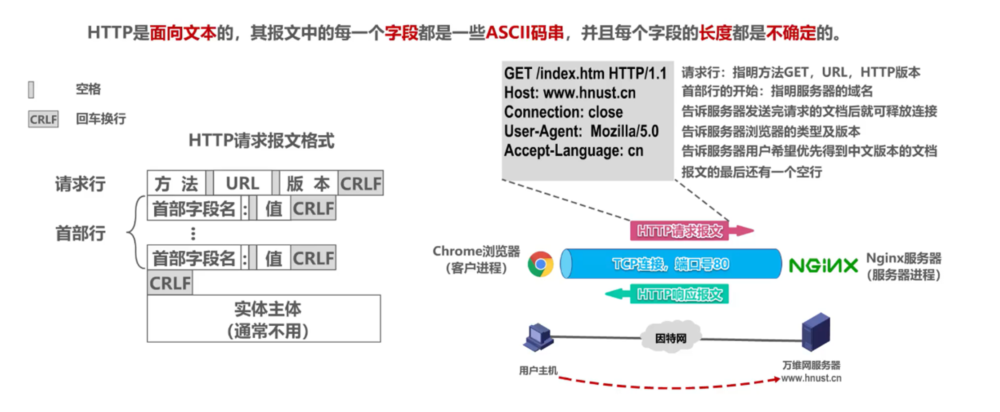

1. 方法：请求的方法，如GET、POST、PUT、DELETE等。

| 方法    | 描述                                                         |
| ------- | ------------------------------------------------------------ |
| GET     | 请求指定的页面信息，并返回实体主体。                         |
| HEAD    | 类似于GET请求，但返回的响应中没有具体的内容，用于获取报头。   |
| POST    | 向指定资源提交数据进行处理请求（例如提交表单或上传文件）。数据被包含在请求体中。POST请求可能会导致新的资源的建立和/或已有资源的修改。 |
| PUT     | 从客户端向服务器传送的数据取代指定的文档的内容。             |
| DELETE  | 请求服务器删除指定的页面。                                   |
| CONNECT | HTTP/1.1协议中预留给能够将连接改为管道方式的代理服务器。     |
| OPTIONS | 允许客户端查看服务器的性能。                                 |
| TRACE   | 回显服务器收到的请求，主要用于测试或诊断。                   |
| PATCH   | 实体中包含一个表，表中说明与该URI所表示的原内容的区别。       |


1. URL：请求的资源路径，如
2. 版本：HTTP协议的版本，如HTTP/1.1
3. 头部：请求报文的头部，包含了请求的一些信息，如Host、User-Agent、Content-Type等。

>常见头部：
GET /index.html HTTP/1.1
Host: www.example.com           # 请求的目标服务器
User-Agent: Mozilla/5.0         # 客户端的用户代理，标识发出请求的浏览器类型
Accept: text/html               # 客户端可接受的响应内容类型
Accept-Language: en-US          # 客户端可接受的自然语言
Accept-Encoding: gzip, deflate  # 客户端可接受的内容编码
Connection: keep-alive          # 控制当前的连接持续状态
Cache-Control: max-age=0        # 控制缓存的行为

**响应报文格式**

```txt
版本 状态码 短语 CRLF
响应头字段名: 响应头字段值 CRLF
...
CRLF
响应体
```

* 短语：响应的状态码对应的短语，如200 OK、404 Not Found、500 Internal Server Error等。
* 头部：响应报文的头部，包含了响应的一些信息，如Content-Type、Content-Length等。

| 状态码 | 描述                                                         |
| ------ | ------------------------------------------------------------ |
| 200    | 请求成功。一般用于GET与POST请求。                             |
| 201    | 已创建。成功请求并创建了新的资源。                             |
| 202    | 已接受。已经接受请求，但未处理完成。                           |
| 204    | 无内容。服务器成功处理，但未返回内容。                         |
| 301    | 永久移动。请求的网页已永久移动到新位置。                       |
| 302    | 临时移动。服务器目前从不同位置的网页响应请求，但请求者应继续使用原有位置来进行以后的请求。 |
| 400    | 错误请求。服务器不理解请求的语法。                             |
| 401    | 未授权。请求要求身份验证。对于需要登录的网页，服务器可能返回此响应。 |
| 403    | 禁止。服务器拒绝请求。                                         |
| 404    | 未找到。服务器找不到请求的网页。                               |
| 500    | 服务器内部错误。服务器遇到错误，无法完成请求。                 |
| 503    | 服务不可用。服务器目前无法使用（由于超载或停机维护）。通常，这只是暂时状态。 |

#### 6.4.1 cookie

cookie是一种存储在客户端的数据，用于跟踪用户的会话信息，即让服务器记住用户。cookie通常包含了一个名字、一个值、一个过期时间、一个路径和一个域名。

cookie的工作原理：

1. 客户端发送HTTP请求到服务器。
2. 服务器在响应头中设置cookie。
3. 客户端收到响应后，将cookie保存到本地。
4. 客户端再次发送HTTP请求时，会将cookie发送到服务器。
5. 服务器收到cookie后，根据cookie中的信息来判断用户的身份。
6. 服务器根据用户的身份来返回相应的响应。
7. 客户端收到响应后，根据响应的内容来显示页面。

#### 6.4.1 https

HTTPS（HyperText Transfer Protocol Secure）是一种通过加密和认证保护数据传输的HTTP协议。HTTPS使用SSL/TLS协议来加密HTTP通信，确保数据的安全性。

HTTPS的工作原理：

1. 客户端向服务器发送加密通信请求。在此过程中，客户端会发送随机数用于稍后生成对话密钥。
2. 服务器向客户端发送证书。证书包含了服务器的公钥和证书的签名。在此过程中，服务器也会发送一个随机数用于稍后生成对话密钥。
3. 客户端验证证书。客户端会检查证书的有效性，如证书的签名是否有效、证书是否过期等。
4. 客户端生成一个随机数然后用服务器的公钥加密这个随机数，然后发送给服务器。
5. 服务器收到加密的随机数后，使用自己的私钥解密这个随机数。之后会将其与第一次随机数，第二次随机数和解密的密钥一起使用加密算法生成对话密钥。客户端也会第一次随机数，第二次随机数和第三次随机数用加密算法生成对话密钥。
6. 双方使用对话密钥进行加密通信。


<br>
<br>

---

## 七、网络编程注意点

1. 发的数据太大时，指定发10000字节但是返回的可能不是10000字节，即没有发送完10000字节，最好加个循环
2. 循环发送视频流时，最好不要全速发，可以加一个延迟，让读取视频流的线程也能抢到锁。