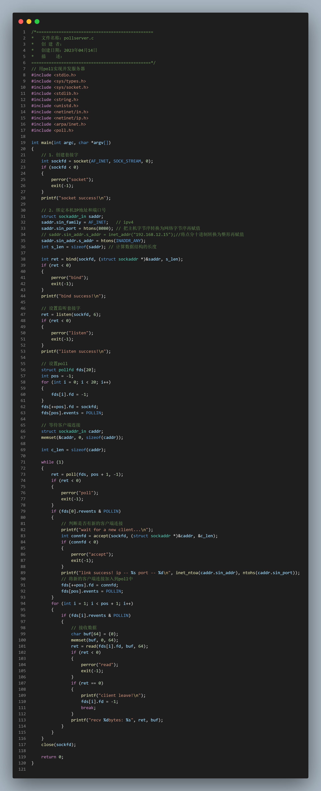

# [网络编程] 连接与 IO 模型
## 一、复习

### 1.1 网络协议模型：

​OSI七层协议模型：

>​应用层
​表示层
​会话层
​传输层
​网络层
​数据链路层
​物理层

​TCP/IP四层协议模型：
>应用层：
​传输层：TCP、UDP
​网络层：IP
​物理与网络接口层	
### 1.2 ip，端口,套接字
IP：
>IP：在网络中唯一标识一台主机
​IPV4: 4字节  32bit
点分十进制：  "192.168.1.45"
二进制形式：11000000 10101000 00000001 00101101

端口：
>PORT：端口号 unsigned short
1-1023：系统端口
1024-5000：一般应用程序接口
5001-65535：系统预留用户自定义接口

​套接字：

>本质：是一种特殊的文件描述符
TCP通信流程：
服务器：
socket() --> bind() --> listen() --> accept() --> read()/write() --> close()
客户端：
socket() --> connect() --> read()/write() --> close()

<br>
<br>

---


## 二、网络编程相关接口函数

### 2.1创建套接字 -- socket
```tex
int socket(int domain, int type, int protocol);

功能：socket函数用于创建一个套接字（socket）

头文件：
#include <sys/socket.h>
#include <netinet/in.h>
#include <arpa/inet.h>

返回值：成功返回套接字的文件描述符.失败，将返回-1，并设置errno变量表示错误类型。

参数：
    domain：指定套接字的协议族（protocol family），常见的协议族包括AF_INET（IPv4协议）、AF_INET6（IPv6协议）和AF_UNIX（本地协议）等。
    type：指定套接字的类型（socket type），常见的套接字类型包括SOCK_STREAM（面向连接的流套接字）和SOCK_DGRAM（无连接的数据报套接字）等。
    protocol：指定套接字所使用的协议（protocol），常见的协议包括IPPROTO_TCP（TCP协议）、IPPROTO_UDP（UDP协议）和IPPROTO_SCTP（SCTP协议）等。默认选项填0。
    
```
### 2.2绑定本机IP地址和端口号
```tex
int bind(int sockfd, const struct sockaddr *addr, socklen_t addrlen);

功能：将一个套接字（socket）绑定到一个本地地址（IP地址和端口号）

头文件：
#include <sys/types.h>         
#include <sys/socket.h>
#include <netinet/in.h>
#include <netinet/ip.h>
#include <arpa/inet.h>

参数：
sockfd：通过socket创建得到的套接字
addr：服务器地址结构的首地址，结构体是sockaddr_in
addrlen：地址结构的大小  
返回值：
成功返回0，失败返回-1
       	
       	   	
struct sockaddr_in {
sa_family_t    sin_family; /* 一般使用AF_INET（IPv4协议族）或AF_INET6（IPv6协议族） */
in_port_t      sin_port;   /* 表示端口号，以网络字节序表示 */
struct in_addr sin_addr;   /* internet address */
};

struct in_addr {
uint32_t       s_addr;     /* IPv4地址，网络字节序 */
};
     
相关函数：
inet_addr("192.168.1.23");  //将点分十进制IP转换为整数形式（字节序）
char *inet_ntoa(struct in_addr address); //将整数形式的地址转换为点分十进制
    		
sin_addr.s_addr = htons(INADDR_ANY); //任意本地IP地址
       
sockaddr_in.sin_port = htons(6666); //用于将16位的主机字节序（little-endian）的整数转换为网络字节序（big-endian）的整数

```
### 2.3设置监听套接字 -- listen
```tex
int listen(int sockfd, int backlog);

功能：
用于将一个套接字转换为被动套接字，用于服务器端的网络编程。被动套接字可以接收来自客户端的连接请求。

头文件：
#include <sys/socket.h>
#include <netinet/in.h>
#include <arpa/inet.h>

返回值：
成功，将返回0。
失败，将返回-1，并设置errno变量表示错误类型。

参数：
    sockfd：需要转换为被动套接字的套接字的文件描述符。
    backlog：表示请求连接队列的最大长度，也就是可以同时接收的连接请求数量的上限。该参数的取值一般为5到128之间。
```
       


### 2.4等待客户端连接 -- accept
```tex
int accept(int sockfd, struct sockaddr *addr, socklen_t *addrlen);

功能：
accept函数用于从监听套接字中接收来自客户端的连接请求，创建一个新的套接字，并将其绑定到客户端的地址。该新的套接字可以用于与客户端进行通信。

头文件：    
#include <sys/socket.h>
#include <netinet/in.h>
#include <arpa/inet.h>

返回值：
如果accept函数调用成功，将返回一个非负整数，表示新创建的套接字的文件描述符。该文件描述符可以用于后续的套接字操作（如send、recv等）。
如果accept函数调用失败，将返回-1，并设置errno变量表示错误类型。  

参数：
    sockfd：需要接受连接请求的监听套接字的文件描述符（file descriptor）。

    addr：指向客户端地址的指针，是一个sockaddr结构体类型指针。在accept函数返回时，客户端的地址信息将被填充到该结构体中。记得要强转。
    int connfd = accept(sockfd, (struct sockaddr *)&caddr, &c_len);

    addrlen：指向addr结构体的大小的指针。在accept函数返回时，该指针将被设置为客户端地址结构体的大小。sizeof(caddr);

accept(sockfd, NULL, NULL);//意思是接受监听套接字上的连接请求，但不获取客户端的地址信息。
```
### 2.5向服务器发起连接 -- connect
```tex
int connect(int sockfd, const struct sockaddr *addr, socklen_t addrlen);

功能：将套接字连接到远程主机的地址。

头文件：
#include <sys/socket.h>
#include <netinet/in.h>
#include <arpa/inet.h>

返回值：
如果connect函数调用成功，将返回0。
如果connect函数调用失败，将返回-1，并设置errno变量表示错误类型。

参数：
    sockfd：需要连接到远程主机的套接字的文件描述符。
    addr：指向远程主机地址的指针，是一个sockaddr结构体类型指针。该结构体包含了远程主机的IP地址和端口号等信息。
    addrlen：指定addr结构体的大小。
```

### 2.6发送接收数据 -- send、recv
```tex
ssize_t send(int sockfd, const void *buf, size_t len, int flags);
ssize_t recv(int sockfd, void *buf, size_t len, int flags);


功能：用于向已连接的套接字发送/接收数据。

头文件：
#include <sys/types.h>
#include <sys/socket.h>

返回值：
成功将返回实际发送/接收的字节数。
失败将返回-1，并设置errno变量表示错误类型。

参数：
    sockfd：需要发送/接收数据的套接字的文件描述符。
    buf：指向待发送/接收数据的缓冲区的指针。
    len：待发送/接收数据的字节数。
    flags：用于控制数据发送/接收的方式的标志位，一般设置为0即可。

注意：
1.在发送数据时，可以通过设置flags参数的值来控制数据发送的方式，例如设置为MSG_DONTWAIT将数据设置为非阻塞模式。一般情况下，flags的取值应该为0。
2. 在发送数据时，应该确保buf指向的缓冲区中的数据已经准备好。如果缓冲区中的数据还没有完全准备好，可以使用select或poll等函数进行等待，以避免因缓冲区未就绪而导致的发送失败。
```

**<font color = red>在进行TCP协议传输的时候，要注意数据流传输的特点，recv和send不一定是一一对应的（一般情况下是一一对应），也就是说并不是send一次，就一定recv一次就接收完，有可能send一次，recv多次才接收完，也可能send多次，一次recv就接收完了。这和网络束调有关。</font>**

示例代码：

客户端向服务端发送图片：

* 服务端：
```c
#include <stdio.h>
#include <sys/types.h>          /* See NOTES */
#include <sys/socket.h>
#include <stdlib.h>
#include <string.h>
#include <unistd.h>
#include <netinet/in.h>
#include <netinet/ip.h>
#include <arpa/inet.h>
#include <sys/stat.h>
#include <fcntl.h>

int main(int argc, char *argv[])
{ 
    //1、创建套接字
    int sockfd = socket(AF_INET, SOCK_STREAM, 0);
    if(sockfd < 0)
    {
        perror("socket");
        exit(-1);
    }
    printf("socket success!\n");

    //2、绑定本机IP地址和端口号
    struct sockaddr_in saddr;
    saddr.sin_family = AF_INET; //ipv4
    saddr.sin_port = htons(6666); //把主机字节序转换为网络字节序再赋值
    //saddr.sin_addr.s_addr = inet_addr("192.168.12.15");//将点分十进制转换为整形再赋值
    saddr.sin_addr.s_addr = htons(INADDR_ANY);
    int s_len = sizeof(saddr);  //计算数据结构的长度

    int ret = bind(sockfd, (struct sockaddr *)&saddr, s_len);
    if(ret < 0)
    {
        perror("bind");
        exit(-1);
    }
    printf("bind success!\n");

    //3、设置监听套接字
    ret = listen(sockfd, 6);
    if(ret < 0)
    {
        perror("listen");
        exit(-1);
    }
    printf("listen success!\n");

    //4、等待客户端连接
    struct sockaddr_in caddr;
    memset(&caddr, 0, sizeof(caddr));

    int c_len = sizeof(caddr);
    
    printf("wait for a new client...\n");
    int connfd = accept(sockfd, (struct sockaddr *)&caddr, &c_len);
    if(connfd < 0)
    {
        perror("accept");
        exit(-1);
    }
    printf("link success! ip -- %s port -- %d\n", inet_ntoa(caddr.sin_addr), ntohs(caddr.sin_port));

    int fd = open("1.jpg", O_WRONLY | O_CREAT | O_TRUNC, 0664);
    if(fd < 0)
    {
        perror("open 1.jpg");
        exit(-1);
    }

    char buf[64] = {0};
    while( (ret = read(connfd, buf, 64)) > 0)
    {
        write(fd, buf, ret);
    }

    close(fd);
    close(connfd);
    close(sockfd);
    return 0;
} 

```

* 客户端：
```c
#include <stdio.h>
#include <sys/types.h>          /* See NOTES */
#include <sys/socket.h>
#include <stdlib.h>
#include <string.h>
#include <unistd.h>
#include <netinet/in.h>
#include <netinet/ip.h>
#include <arpa/inet.h>
#include <sys/stat.h>
#include <fcntl.h>

int main(int argc, char *argv[])
{ 
    //1、创建套接字
    int sockfd = socket(AF_INET, SOCK_STREAM, 0);
    if(sockfd < 0)
    {
        perror("socket");
        exit(-1);
    }
    printf("socket success!\n");
    
    //2、向服务器发起连接
    struct sockaddr_in saddr;
    saddr.sin_family = AF_INET;
    saddr.sin_port = htons(6666);
    saddr.sin_addr.s_addr = inet_addr("192.168.12.15");
    
    int s_len = sizeof(saddr);

    int ret = connect(sockfd, (struct sockaddr *)&saddr, s_len);
    if(ret < 0)
    {
        perror("connect");
        exit(-1);
    }
    printf("link success!\n");
    
    int fd = open("1.jpg", O_RDONLY);
    if(fd < 0)
    {
        perror("open 1.jpg");
        exit(-1);
    }
    
    char buf[64] = {0};

    while((ret = read(fd, buf, 64)) > 0)
    {
        write(sockfd, buf, ret);
    }
    
    close(fd);
    close(sockfd);
    return 0;
} 
```

<br>
<br>

---

## 三、服务器模型

### 3.1 循环服务器
>1. 服务器端从连接请求队列中提取请求，建立连接并返回新的已经连接套接字；
>2. 服务器端通过已经连接的套接字循环接受数据，处理并发送给客户端直到客户端关闭；
>3. 服务器关闭已连接套接字，返回步骤（1）处理下一个客户端；
>\------------------------------------------------------------------------
>4. 服务器端采用循环嵌套来实现：外层循环依次提取客户端的请求队列并建立TCP连接，内层循环接受处理连接客户端的所有数据，直到客户端关闭；
>5. 如果当前客户端没有处理结束，其他客户端必须一直等待；

### 3.2 并发服务器
>1. 服务器端父进程从连接请求队列中提取请求，建立连接并返回新的已创建套接字；
>2. 服务器端父进程创建子进程为客户端服务，客户端关闭连接时，子进程结束；
>3. 服务器端父进程关闭已连接套接字，返回步骤（1）；
>\----------------------------------------------------------------------
>4. 服务器端父进程一旦接收到客户端的连接请求，便建立好连接并创建新的子进程。这意味着每个客广端在服务器端有一个专门的子进程为其服务。
>5. 服务器端的多个子进程同时运行 （宏观上），处理多个容户端。
>6. 服务器端的父进程不具体处理每个客户端的数据请求。

#### 3.2.1多进程并发服务器
```tex
socket(...)
bind(...)
listen(...)
while(1)
{
    accept(...)
    if(fork(...)==0)
    {
        process(...);
        close(...);
        exit(...);
    }
    close(...);
}
```
具体代码：
```c
#include <stdio.h>
#include <sys/types.h>          /* See NOTES */
#include <sys/socket.h>
#include <stdlib.h>
#include <string.h>
#include <unistd.h>
#include <netinet/in.h>
#include <netinet/ip.h>
#include <arpa/inet.h>
#include <sys/wait.h>

void wait_handler(int arg){
    //循环回收僵尸进程
    while(waitpid(-1, NULL, WNOHANG) > 0);
}
    int connfd;
int main(int argc, char *argv[])
{
    pid_t pid;

    //1、创建套接字
    int sockfd = socket(AF_INET, SOCK_STREAM, 0);
    if(sockfd < 0)
    {
        perror("socket");
        exit(-1);
    }
    printf("socket success!\n");

    //2、绑定本机IP地址和端口号
    struct sockaddr_in saddr;
    saddr.sin_family = AF_INET; //ipv4
    saddr.sin_port = htons(6666); //把主机字节序转换为网络字节序再赋值
    //saddr.sin_addr.s_addr = inet_addr("192.168.12.15");//将点分十进制转换为整形再赋值
    saddr.sin_addr.s_addr = htons(INADDR_ANY);
    int s_len = sizeof(saddr);  //计算数据结构的长度

    int ret = bind(sockfd, (struct sockaddr *)&saddr, s_len);
    if(ret < 0)
    {
        perror("bind");
        exit(-1);
    }
    printf("bind success!\n");

    //3、设置监听套接字
    ret = listen(sockfd, 6);
    if(ret < 0)
    {
        perror("listen");
        exit(-1);
    }
    printf("listen success!\n");

    //4、等待客户端连接
    struct sockaddr_in caddr;
    memset(&caddr, 0, sizeof(caddr));

    int c_len = sizeof(caddr);


    char buf[64] = {0};
    signal(17, wait_handler);//17是SIGCHLD的信号值，是为了处理僵尸进程
    while(1)
    {
        printf("wait for a new client...\n");
        connfd = accept(sockfd, (struct sockaddr *)&caddr, &c_len);
        if(connfd < 0)
        {
            perror("accept");
            exit(-1);
        }
        printf("link success! ip -- %s port -- %d\n", inet_ntoa(caddr.sin_addr), ntohs(caddr.sin_port));

        pid = fork();
        if(pid < 0)
        {
            perror("fork");
            exit(-1);
        }
        if(pid == 0)
        {
            //close(sockfd);
            //5、接收数据
            while(1)
            {   
                memset(buf, 0, 64);
                ret = read(connfd, buf, 64);
                if(ret < 0)
                {
                    perror("read");
                    exit(-1);
                }
                if(ret == 0)
                {
                    printf("client leave!\n");
                    close(connfd);
                    exit(0);
                }
                printf("recv %dbytes: %s\n", ret, buf);
            }
            //close(connfd);
        }
    }
    close(sockfd);
    
    return 0;
}
```
#### 3.2.2多线程并发服务器
```tex
socket(...)
bind(...)
listen(...)
while(1)
{
    accept(...)
    if(pthread_create(...)== 0)
    {
        process(...);
        close(...);
        exit(...);
    }
    close(...);
}
```
具体代码：
```c

#include <stdio.h>
#include <sys/types.h>          /* See NOTES */
#include <sys/socket.h>
#include <stdlib.h>
#include <string.h>
#include <unistd.h>
#include <netinet/in.h>
#include <netinet/ip.h>
#include <arpa/inet.h>
#include <pthread.h>

typedef struct client_info
{
    int c_fd;
    struct sockaddr_in c_info;
}C;


void *func(void *arg);
int main(int argc, char *argv[])
{ 
    pthread_t thread;
    C c1;
    //1、创建套接字
    int sockfd = socket(AF_INET, SOCK_STREAM, 0);
    if(sockfd < 0)
    {
        perror("socket");
        exit(-1);
    }
    printf("socket success!\n");

    //2、绑定本机IP地址和端口号
    struct sockaddr_in saddr;
    saddr.sin_family = AF_INET; //ipv4
    saddr.sin_port = htons(6666); //把主机字节序转换为网络字节序再赋值
    //saddr.sin_addr.s_addr = inet_addr("192.168.12.15");//将点分十进制转换为整形再赋值
    saddr.sin_addr.s_addr = htons(INADDR_ANY);
    int s_len = sizeof(saddr);  //计算数据结构的长度

    int ret = bind(sockfd, (struct sockaddr *)&saddr, s_len);
    if(ret < 0)
    {
        perror("bind");
        exit(-1);
    }
    printf("bind success!\n");

    //3、设置监听套接字
    ret = listen(sockfd, 6);
    if(ret < 0)
    {
        perror("listen");
        exit(-1);
    }
    printf("listen success!\n");

    //4、等待客户端连接
    struct sockaddr_in caddr;
    memset(&caddr, 0, sizeof(caddr));

    int c_len = sizeof(caddr);

    while(1)
    {
        printf("wait for a new client...\n");
        int connfd = accept(sockfd, (struct sockaddr *)&caddr, &c_len);
        if(connfd < 0)
        {
            perror("accept");
            exit(-1);
        }

        c1.c_fd = connfd;
        c1.c_info = caddr;

        printf("link success! ip -- %s port -- %d\n", inet_ntoa(caddr.sin_addr), ntohs(caddr.sin_port));
    
        if(pthread_create(&thread, NULL, func, &c1) < 0)
        {
            perror("pthread_create");
            exit(-1);
        }
        
        pthread_detach(thread);

    }
    close(sockfd);
    
    return 0;
}

void *func(void *arg)
{
    int ret = -1;
    //int connfd = *(int *)arg;
    C c2 = *(C *)arg;

    //5、接收数据
    char buf[64] = {0};
    while(1)
    {   
        memset(buf, 0, 64);
        ret = read(c2.c_fd, buf, 64);
        if(ret < 0)
        {
            perror("read");
            exit(-1);
        }
        if(ret == 0)
        {
            printf("client leave!\n");
            break;
        }
        printf("recv %dbytes: %s  ip -- %s\n", ret, buf, inet_ntoa(c2.c_info.sin_addr));
    }

    close(c2.c_fd);


}

```

<br>
<br>

---


## 四、udp通信

### 4.1 基本概念
UDP（User Datagram Protocol，用户数据报协议）是一种无连接的、不可靠的网络传输协议。与TCP协议不同，UDP不会建立连接、不会保证数据传输的可靠性和完整性，也不会进行数据重传和流量控制等操作。UDP仅仅提供了最基本的数据传输服务，而且传输速度快，传输效率高，因此常用于实时性要求较高的网络通信，比如音视频通信、在线游戏等。

>UDP通信的基本流程如下：
>
>1. 服务器和客户端都需要创建UDP套接字，并指定通信协议和端口号。
>
>2. 客户端向服务器发送数据包，数据包中包含了目标地址和端口号、数据等信息。在UDP协议中，发送数据包不需要建立连接，因此可以直接发送。
>
>3. 服务器接收到客户端发送的数据包后，解析数据包中的目标地址和端口号，并根据这些信息将响应数据包发送回客户端。
>
>4. 客户端接收到服务器发送的响应数据包后，解析数据包中的数据并进行相应的处理。

### 4.2 相关函数

* sendto
```tex
ssize_t sendto(int sockfd, const void *buf, size_t len, int flags, const struct sockaddr *dest_addr, socklen_t addrlen);

功能：
sendto函数用于通过指定的socket向目标地址发送数据，支持发送UDP数据报和raw IP数据包。

头文件：
#include <sys/types.h>
#include <sys/socket.h>

返回值：
sendto函数返回发送的字节数，如果返回值为-1则表示发送失败，可通过errno变量获取错误码。

参数：
    sockfd：表示需要发送数据的socket文件描述符；
    buf：表示待发送的数据缓冲区；
    len：表示待发送的数据长度；
    flags：表示发送数据的可选项，例如是否启用MSG_DONTWAIT标志来设置非阻塞模式；
    dest_addr：表示目标地址信息；
    addrlen：表示目标地址信息的长度，通常为sizeof(struct sockaddr)。
```

* recvfrom

```tex
ssize_t recvfrom(int sockfd, void *buf, size_t len, int flags, struct sockaddr *src_addr, socklen_t *addrlen);

功能：
recvfrom函数用于从指定的socket接收数据，并将发送者的地址信息存储在src_addr中，支持接收UDP数据报和raw IP数据包。

头文件：
#include <sys/types.h>
#include <sys/socket.h>

返回值：
recvfrom函数返回接收到的字节数，如果返回值为-1则表示接收失败，可通过errno变量获取错误码。

参数：
    sockfd：表示需要接收数据的socket文件描述符；
    buf：表示接收数据的缓冲区；
    len：表示缓冲区的长度；
    flags：表示接收数据的可选项，例如是否启用MSG_DONTWAIT标志来设置非阻塞模式；
    src_addr：表示发送者的地址信息；
    addrlen：表示发送者地址信息的长度，应当初始化为sizeof(struct sockaddr)。

注意：src_addr和addrlen应当事先分配好内存，并在调用recvfrom函数时作为参数传入
```

示例代码：

服务器：
```c
#include <stdio.h>
#include <sys/types.h>
#include <sys/socket.h>
#include <unistd.h>
#include <string.h>
#include <stdlib.h>
#include <netinet/in.h>
#include <netinet/ip.h>
#include <arpa/inet.h>

int main(int argc, char *argv[])
{ 
    //1、创建套接字
    int sockfd = socket(AF_INET, SOCK_DGRAM, 0);
    if(sockfd < 0)
    {
        perror("socket");
        exit(-1);
    }

    //2、绑定本机IP地址和端口号
    struct sockaddr_in saddr;
    saddr.sin_family = AF_INET;
    saddr.sin_port = htons(8888);
    saddr.sin_addr.s_addr = INADDR_ANY;
    int s_len = sizeof(saddr);

    int ret = bind(sockfd, (struct sockaddr *)&saddr, s_len);
    if(ret < 0)
    {
        perror("bind");
        exit(-1);
    }


    //3、接收数据
    struct sockaddr_in caddr;
    memset(&caddr, 0, sizeof(caddr));
    int c_len = sizeof(caddr);

    char buf[64] = {0};
    while(1)
    {
        memset(buf, 0, 64);
        ret = recvfrom(sockfd, buf, 64, 0, (struct sockaddr *)&caddr, &c_len);
        if(ret < 0)
        {
            perror("recvform");
            exit(-1);
        }

        printf("ip:%s -- recv %dbytes: %s",inet_ntoa(caddr.sin_addr), ret, buf);
    }

    close(sockfd);
    return 0;
} 
```
>上面代码有两个注意点：
>1. 当需要取地址时(&),不能直接写~~&sizeof(caddr)~~,要先用一个变量接收sizeof(caddr),再对变量进行取地址。
>2. 注意换行符，因为终端输出是行缓冲，所以没有换行符的话很容易导致无法打印。

客服端：

```c
#include <stdio.h>
#include <sys/types.h>
#include <sys/socket.h>
#include <unistd.h>
#include <string.h>
#include <stdlib.h>
#include <netinet/in.h>
#include <netinet/ip.h>
#include <arpa/inet.h>

int main(int argc, char *argv[])
{ 
    //1、创建套接字
    int sockfd = socket(AF_INET, SOCK_DGRAM, 0);
    if(sockfd < 0)
    {
        perror("socket");
        exit(-1);
    }


    //2、发送数据
    struct sockaddr_in saddr;
    saddr.sin_family = AF_INET;
    saddr.sin_port = htons(8888);
    saddr.sin_addr.s_addr = inet_addr("192.168.12.15");

    int s_len = sizeof(saddr);

    char buf[64] = {0};
    fgets(buf, 64, stdin);
    int ret = sendto(sockfd, buf, strlen(buf), 0, (struct sockaddr *)&saddr, s_len);
    if(ret < 0)
    {
        perror("sendto");
        exit(-1);
    }
    close(sockfd);
    return 0;
} 
```
设置非阻塞相关函数 -- fcntl

```tex
int fcntl(int fd, int cmd, ... /* arg */ );

功能
fcntl函数是一个通用的文件控制函数，其功能非常广泛。该函数可以执行的命令包括：

    1. F_DUPFD： 复制文件描述符
当应用程序需要使用多个文件描述符来操作同一个文件时，可以使用F_DUPFD命令来复制文件描述符。该命令需要一个整数参数arg，表示要创建的新文件描述符的最小值。该函数将返回一个新的文件描述符，该文件描述符是不小于arg的最小整数。
    2. F_GETFD： 获取文件描述符标志
应用程序可以使用F_GETFD命令获取一个文件描述符的标志。该命令不需要arg参数，而是返回一个整数值，表示该文件描述符的标志。
    3. F_SETFD： 设置文件描述符标志
应用程序可以使用F_SETFD命令来设置一个文件描述符的标志。该命令需要一个整数参数arg，表示要设置的标志。该函数将返回0表示成功，-1表示失败。
    4. F_GETFL： 获取文件状态标志
应用程序可以使用F_GETFL命令获取一个文件的状态标志。该命令不需要arg参数，而是返回一个整数值，表示该文件的状态标志。
    5. F_SETFL： 设置文件状态标志
应用程序可以使用F_SETFL命令来设置一个文件的状态标志。该命令需要一个整数参数arg，表示要设置的状态标志。该函数将返回0表示成功，-1表示失败。
    6. F_GETLK： 获取文件锁定信息
应用程序可以使用F_GETLK命令获取一个文件的锁定信息。该命令需要一个指向flock结构体的指针arg。该结构体包含锁定类型、锁定起始位置和锁定长度等信息。如果文件未被锁定，则返回一个flock结构体，其中l_type字段被设置为F_UNLCK。如果文件已被锁定，则返回一个指定锁定信息的flock结构体。
    7. F_SETLK： 设置文件锁定信息（非阻塞）
应用程序可以使用F_SETLK命令来设置一个文件的锁定信息，该命令是非阻塞的，如果文件已经被其他进程锁定，该命令将立即返回EACCES错误。该命令需要一个指向flock结构体的指针arg，该结构体包含要设置的锁定类型、锁定起始位置和锁定定长等信息
    8. F_SETLKW： 设置文件锁定信息（阻塞）
应用程序可以使用F_SETLKW命令来设置一个文件的锁定信息，该命令是阻塞的，如果文件已经被其他进程锁定，则该命令将一直阻塞，直到获取锁为止。该命令需要一个指向flock结构体的指针arg，该结构体包含要设置的锁定类型、锁定起始位置和锁定定长等信息。

头文件：
#include <unistd.h>
#include <fcntl.h>
参数：
fd：文件描述符
cmd：
    F_GETFL:获取文件属性状态
    F_SETFL:设置文件属性状态

返回值：
    根据参数cmd的不同返回不同的值
    cmd -- F_GETFL:返回获取的文件属性状态

例：
1、获取文件描述符对应属性状态
    int flag = fcntl(fd, F_GETFL, 0);
2、将flag添加设置非阻塞方式
    flag = flag | O_NONBLOCK;
3、将新的状态属性设置到文件描述符中
    fcntl(fd, F_SETFL, flag);


flock结构体定义如下：
struct flock {
    short l_type;   /* 锁定类型，可以是F_RDLCK或F_WRLCK或F_UNLCK */
    short l_whence; /* 锁定起始位置，可以是SEEK_SET、SEEK_CUR或SEEK_END */
    off_t l_start;  /* 锁定起始位置相对于l_whence的偏移量 */
    off_t l_len;    /* 锁定定长，如果为0，则锁定到文件结束 */
    pid_t l_pid;    /* 加锁进程的PID，仅用于F_GETLK命令 */
};

```


<br>
<br>

---


## 五、IO多路复用

### 5.1 IP多路复用基本概念

IO多路复用是一种高效的IO处理模式，它可以让一个线程或进程同时监控多个文件描述符（通常是socket）的状态，从而实现并发的IO操作。IO多路复用的作用是提高系统的资源利用率，减少不必要的阻塞和上下文切换，提高程序的性能和响应速度。

为什么需要IO多路复用呢？我们先来看看常见的IO模型有哪些：

- 阻塞IO：当我们调用read或write函数时，如果没有数据可读或可写，那么程序就会被阻塞，直到数据到达或发送完成。这种模式下，每个文件描述符都需要一个线程或进程来处理，如果有大量的文件描述符，那么就会消耗大量的内存和CPU资源，而且大部分时间都在等待数据，效率很低。
- 非阻塞IO：当我们调用read或write函数时，如果没有数据可读或可写，那么程序就会立即返回一个错误码，表示操作不能进行。这种模式下，我们需要不断地轮询文件描述符的状态，来判断是否可以进行IO操作。这种模式虽然避免了阻塞，但是也浪费了大量的CPU资源在无效的轮询上，而且轮询的频率很难控制。
- 信号驱动IO：当我们调用sigaction函数时，可以让内核在文件描述符可读或可写时发送一个信号给我们，然后我们在信号处理函数中进行IO操作。这种模式下，我们不需要轮询文件描述符的状态，而是由内核主动通知我们。但是信号驱动IO也有一些缺点，比如信号处理函数的执行环境受到限制，不能进行一些可能阻塞的操作；信号可能丢失或合并；信号处理函数可能被中断等。
- 异步IO：当我们调用aio_read或aio_write函数时，可以让内核在文件描述符可读或可写时自动完成数据的拷贝，并在完成后通知我们。这种模式下，我们不需要关心文件描述符的状态，也不需要自己进行数据的拷贝，完全交给内核来处理。但是异步IO在Linux上并不完善，很多系统调用并不支持异步IO。

从上面可以看出，每种IO模型都有各自的优缺点，没有一种是完美的。那么有没有一种模式可以兼顾效率和简洁呢？答案就是IO多路复用。

IO多路复用的基本概念是，通过一个函数（如select，poll，epoll等）来监控多个文件描述符的状态，当有一个或多个文件描述符可读或可写时，函数返回，告诉我们哪些文件描述符可以进行IO操作。这样，我们就可以在一个线程或进程中处理多个文件描述符的IO事件，而不需要为每个文件描述符创建一个线程或进程，也不需要轮询或等待信号。

IO多路复用的作用是，提高系统的资源利用率，减少不必要的阻塞和上下文切换，提高程序的性能和响应速度。IO多路复用适合于以下场景：

- 文件描述符数量较多，但每个文件描述符的IO操作并不频繁，大部分时间都处于空闲状态。
- 文件描述符的IO操作都是非阻塞的，不会导致线程或进程挂起。
- 文件描述符的类型不同，可能是socket，也可能是文件，管道等。
- 需要同时处理多种类型的事件，比如读写事件，错误事件，超时事件等。

IO多路复用常用在网络编程中，比如实现高并发的服务器程序。通过IO多路复用，服务器可以在一个线程或进程中同时监听和处理多个客户端的连接请求和数据交互。这样可以节省系统资源，提高服务器的吞吐量和并发能力。

>流程：
>1. 创建表
>2. 向表中添加需要监测的文件描述符
>3. 循环监测表
>    (1)遍历表，判断是否有文件描述符有响应
>    (2)如果有响应，需要判断是哪一个文件描述符响应，然后实现对应IO操作

### 5.2 IO多路复用的相关函数

#### select函数
```tex

int select (int nfds, fd_set *restrict readfds, fd_set *restrict writefds, fd_set *restrict exceptfds, struct timeval *restrict timeout);

功能：
select函数可以指定一个超时时间，在这个时间内，如果指定的文件描述符集合中有任何一个文件描述符发生了可读，可写或异常事件，select函数就会返回，并告知哪些文件描述符已经就绪。如果在超时时间内没有任何事件发生，select函数就会返回0。如果发生了错误，select函数就会返回-1，并设置errno变量。

头文件：
#include <sys/select.h>

返回值：
select函数返回的是就绪的文件描述符的个数，如果超时则返回0，如果出错则返回-1。

参数：

    nfds：指定要监视的文件描述符的范围，一般是最大的文件描述符加1。

    readfds：指向一个fd_set类型的指针，表示要监视的可读文件描述符集合。如果为NULL，则表示不关心任何文件的可读事件。

    writefds：指向一个fd_set类型的指针，表示要监视的可写文件描述符集合。如果为NULL，则表示不关心任何文件的可写事件。

    exceptfds：指向一个fd_set类型的指针，表示要监视的异常文件描述符集合。如果为NULL，则表示不关心任何文件的异常事件。

    timeout：指向一个timeval结构体的指针，表示select函数的超时时间。如果为NULL，则表示无限等待。如果为0，则表示不等待，立即返回。如果为非零值，则表示等待指定的秒数和微秒数。

fd_set类型和timeval结构体：

fd_set类型是一个位图类型，每一位对应一个文件描述符。可以使用以下几个宏来操作fd_set类型：

    void FD_ZERO(fd_set *set)：清空一个fd_set类型变量的所有位。

    void FD_SET(int fd, fd_set *set)：将一个文件描述符fd加入到一个fd_set类型变量中。

    void FD_CLR(int fd, fd_set *set)：将一个文件描述符fd从一个fd_set类型变量中移除。

    int FD_ISSET(int fd, fd_set *set)：检查一个文件描述符fd是否在一个fd_set类型变量中。判断指定的文件描述符是否有响应，结果为真--有响应

timeval结构体定义如下：

struct timeval {
  long tv_sec;  /* 秒 */
  long tv_usec; /* 微秒 */
};

```
select机制流程：

```tex
1、定义监测表,清空表
   	fd_set rfds;
	FD_ZERO(&rfds);
2、向表中添加要监测的文件描述符0、3
    FD_SET(0, &rfds);
	FD_SET(3, &rfds);
	int maxfd = 3+1;
3、循环监测表
    int i = 0;
4、创建监测表的替代（检测表每次响应之后会变，所以每次都要更新）
    fd_set rfds_tmp = rfds;
    while(1)
    {
        rfds = rfds_tmp;
        select(maxfd, &rfds, NULL, NULL, NULL);
        for(i = 0; i < maxfd; i++)
        {
            if(FD_ISSET(i, &rfds))
            {
                if(i == 0)
                {
                   //实现对应IO操作 
                }
                else if(i == 3)
                {
                    //实现对应IO操作
                }   
            }           
        }
    }


```

#### poll函数

```tex
int poll(struct pollfd *fds, nfds_t nfds, int timeout);

功能：
poll函数用于监视一组文件描述符，以确定它们中是否有文件描述符准备好读取、写入或出现异常情况。该函数允许应用程序在一个地方等待多个事件，而不需要阻塞或使用轮询方式查询。在调用poll函数后，内核将扫描文件描述符集合，确定哪些文件描述符已经准备好读取、写入或出现异常情况，然后将事件报告给应用程序。移植性好。

头文件：
#include <poll.h>

返回值：
poll函数返回事件数量，即就绪的文件描述符数量。如果在超时时间内没有任何事件发生，poll函数将返回0。如果发生错误，则返回-1，并设置errno变量来指示错误类型。

参数：
    -fds参数是一个指向pollfd结构体数组的指针，poll函数是在内核中实现的，因此应用程序无法直接控制poll函数的执行方式。应用程序需要为每个要监视的文件描述符创建一个pollfd结构体，并将其放入一个pollfd数组中。，该结构体定义如下：

struct pollfd {
    int fd;        /* 文件描述符 */
    short events;  /* 需要监视的事件，可以是POLLIN、POLLOUT、POLLERR等 */
    short revents; /* 实际发生的事件，由内核填充 */
};

其中，fd字段表示需要监视的文件描述符，events字段表示需要监视的事件，可以是POLLIN（可读事件）、POLLOUT（可写事件）、POLLERR（错误事件）等，revents字段表示实际发生的事件，由内核填充。

    -nfds参数是fds数组中的文件描述符数量。
    -timeout参数指定等待时间，以毫秒为单位。如果timeout为-1，则表示永远等待，直到事件发生。如果timeout为0，则表示不等待，仅对fds数组中的文件描述符进行一次扫描。如果timeout大于0，则表示等待timeout毫秒后，如果还没有事件发生，则返回。
```
poll流程：
```c
//创建表：
int i = 0;
struct pollfd pfds[100];
for(i = 0; i < 100; i++)
{
    pfds[i].fd = -1;
}
//添加要监测的文件描述符
int pos = -1;
pfds[++pos].fd = 0;
pfds[pos].events = POLLIN;
pfds[++pos].fd = 3;
pfds[pos].events = POLLIN;	
		
//循环进行poll检测：
while(1)
{
    ret = poll();
    for(i = 0; i <= pos; i++)
    {
        if(pfds[i].revents & POLLIN)
        {
            if(pfds[i].fd == 0)
            {
                //对应IO操作                            
            }                        
        }
    }          
}
```

示例代码（poll实现并发服务器）


#### epoll函数

epoll函数是一种高效的I/O多路复用技术，Linux特有。用于监视多个文件描述符的可读可写状态。与select和poll函数相比，epoll函数的优势在于：

* 支持较大规模的文件描述符集合，可以监视成千上万个文件描述符；
* 采用内核回调机制，避免了轮询和阻塞等方式的低效问题；
* 支持多种事件触发方式，包括边沿触发和水平触发等；
* 可以通过epoll_ctl函数动态地添加、删除和修改文件描述符。

```tex
int epoll_create(int size);
int epoll_ctl(int epfd, int op, int fd, struct epoll_event *event);
int epoll_wait(int epfd, struct epoll_event *events, int maxevents, int timeout);

功能：
-epoll_create函数用于创建一个新的epoll实例，并返回一个代表该实例的文件描述符。这个文件描述符用于控制和访问该epoll实例，可以使用epoll_ctl函数向该实例中添加或删除文件描述符。
-epoll_ctl函数用于向epoll实例中添加、修改或删除文件描述符，并指定需要监视的事件类型。这个函数可以动态地添加、删除和修改文件描述符，以便动态地调整事件的监视方式。
-epoll_wait函数用于等待文件描述符的I/O事件，一旦有数据可读或可写，就会触发相应的回调函数进行处理。该函数将一直阻塞，直到有文件描述符的I/O事件发生或等待超时。函数返回发生事件的文件描述符数量，并将事件信息保存在events参数指定的结构体数组中。

头文件：
#include <sys/epoll.h>

返回值：
epoll_create函数返回一个新的epoll实例的文件描述符。这个文件描述符就是用于控制和访问该epoll实例的句柄，也就是所谓的“用于控制监测表的句柄”。如果发生错误，则返回-1，并设置errno变量来指示错误类型。
epoll_ctl和epoll_wait函数的返回值与select和poll函数类似，表示事件数量或执行结果。

参数：
epoll_create的参数：
    -size表示需要监视的文件描述符数量，该参数实际上是epoll实例的内部事件表大小，可以设置为任意值。
int epoll_ctl的参数：
    epfd：句柄
    op：控制选项
		EPOLL_CTL_ADD   添加
        EPOLL_CTL_MOD   修改
        EPOLL_CTL_DEL   删除
    fd：要控制的文件描述符的值
    event:监测表中某一个元素的地址，也就是要控制的文件描述符在epoll_event数组中的位置的地址
epoll_wait的参数：
    epfd：句柄
    events：监测表的首地址
    maxevents：监测文件描述符的个数
    timeout：设置超时的时间
```

epoll流程：
```c
int epfd = epoll_create(1);

struct epoll_event epfds[100];
for (i = 0; i < 100; i++)
{
    epfds[i].data.fd = -1;
}

int pos = -1;
epfds[++pos].data.fd = 0;
epfds[pos].events = EPOLLIN;
epoll_ctl(epfd, EPOLL_CTL_ADD, 0, &epfds[pos]);
epfds[++pos].data.fd = 3;
epfds[pos].events = EPOLLIN;
epoll_ctl(epfd, EPOLL_CTL_ADD, 3, &epfds[pos]);

while (1)
{
    int ret = epoll_wait(epfd, epfds, pos + 1, -1);
    for (i = 0; i < ret; i++)
    {
        if (epfds[i].events & EPOLLIN)
        {
            if (epfds[i].data.fd == 0)
            {
                // 对应IO操作
            }
        }
    }
}
```
<br>
<br>

---

## 六、设置套接字属性


```tex
int getsockopt(int sockfd, int level, int optname, void *optval, socklen_t *optlen);
int setsockopt(int sockfd, int level, int optname, const void *optval, socklen_t optlen);


功能：获取/设置套接字选项的值。

头文件：
#include <sys/types.h>         
#include <sys/socket.h>

返回值：
如果函数调用成功，返回值为0；如果函数调用失败，返回值为-1。

参数：
    sockfd：套接字
    level：
        SOL_SOCKET: 通用套接字层
      	IPPROTO_IP： IP层
      	IPPROTO_TCP： TCP层
    optname:
      			套接字属性设置对应的功能选项，一般填对应宏
    optval：
      			获取套接字属性对应的值的地址
    optlen：
      			optval值的长度/地址

```

设置属性表：level     
&emsp;&emsp;&emsp;&emsp;&emsp;&emsp;&emsp;&emsp;&emsp;&emsp;&emsp;&emsp;&emsp;&emsp;&emsp;&emsp;&emsp;&emsp;&emsp;&emsp;SOL_SOCKET

| 参数optname  |        宏的作用        | 对应参数optval的类型 |                            可能会填的值                            |
| :----------: | :--------------------: | :------------------: | :----------------------------------------------------------------: |
| SO_BROADCAST |    允许发送广播数据    |         int          |
|   SO_DEBUG   |        循序调试        |         int          |
| SO_DONTROUTE |       不查找路由       |         int          |
|   SO_ERROR   |     获的套接字错误     |         int          |       一个整型变量，用于存储套接字上最后一次操作的错误状态。       |
| SO_KEEPALIVE |        保持连接        |         int          | 一个整型变量，用于存储保持连接选项的值（0表示不支持，1表示支持）。 |
|  SO_LINGER   |      延迟关闭连接      |    struct linger     |  一个 struct linger 类型的结构体变量，用于存储延迟关闭选项的值。   |
| SO_OOBINLINE | 带外数据放入正常数据流 |         int          |
|  SO_RCVBUF   |     接收缓冲区大小     |         int          |              一个整型变量，用于存储接收缓冲区的大小。              |
|  SO_SNDBUF   |     发送缓冲区大小     |         int          |
| SO_RCVLOWAT  |     接收缓冲区下限     |         int          |
|  SO_SNDWAIT  |     发送缓冲区下限     |         int          |
| SO_RCVTIMEO  |        接收超时        |    struct timeval    |
| SO_SNDTIMEO  |        发送超时        |    struct timeval    |
| SO_REUSEADDR | 允许重用本机地址和端口 |         int          | 一个整型变量，用于存储地址重用选项的值（0表示不支持，1表示支持）。 |
|   SO_TYPE    |     获得套接字类型     |         int          |
| SO_BSDCOMPAT |     与BSD系统兼容      |         int          |
组播广播对应optname ：

							IPPROTO_IP
	------------------------------------------------------
	IP_ADD_MEMBERSHIP    加入到组播组中               struct ip_mreq 
	IP_MULTICAST_IF      允许开启组播报文的接口       struct ip_mreq	


示例代码：
```c
//允许重用本机地址和端口
int opt = 1;
int opt_len = sizeof(int);
if(setsockopt(sockfd, SOL_SOCKET, SO_REUSEADDR, &opt, opt_len) < 0)
{
    perror("setsockopt");
    exit(-1);
}

//超时检测
struct timeval mt = {5, 0};
    int len = sizeof(mt);
    ret = setsockopt(sockfd, SOL_SOCKET, SO_RCVTIMEO, &mt, len);
    printf("ret = %d\n", ret);

//获取缓冲区大小
int size;
        int val_len = sizeof(int);
        if(getsockopt(connfd, SOL_SOCKET, SO_RCVBUF, &size, &val_len) < 0)
        {
            perror("getsockopt");
            exit(-1);
        }
        printf("recv_buf = %d\n", size);
```

<br>
<br>

---

## 七、域套接字

​和tcp基本相同:

​		服务器：

​			socket () -->  bind() --> listen() --> accept() --> read()/write() --> close()

​		客户端：

​			socket () -->  connect() --> read()/write() --> close()

有两处改动：
1. socket
>tcp:socket(AF_UNIX, SOCK_STREAM, 0);
>udp:socket(AF_UNIX, SOCK_DGRAM, 0);
2. AF_UNIX对应的地址结构:struct sockaddr_un
```c
struct sockaddr_un {
   sa_family_t sun_family;        //AF_UNIX
   char        sun_path[108];     //套接字文件的名称(包含路径)
};
```

示例代码：
```c
//1、创建套接字
int sockfd = socket(AF_UNIX, SOCK_STREAM, 0);
if(sockfd < 0)
{
    perror("socket");
    exit(-1);
}
printf("socket success!\n");
//2、绑定本机IP地址和端口号
struct sockaddr_un saddr;
saddr.sun_family = AF_UNIX;
strcpy(saddr.sun_path, "mysocket");
int s_len = sizeof(saddr);  //计算数据结构的长度
int ret = bind(sockfd, (struct sockaddr *)&saddr, s_len);
if(ret < 0)
{
    perror("bind");
    exit(-1);
}
printf("bind success!\n");
```
<br>
<br>

---

## 八、广播和组播

### 8.1 IP分类
```tex
A类：美国高校、国内大型公司
   取值范围： 0.0.0.0 ~ 127.255.255.255
   以0开头

   网络号：第一个字节为网络号
   主机号：后三个字节为主机号   
    广播IP：主机号全为1
B类:私有IP
	以10开头
    取值范围：128.0.0.0 ~ 191.255.255.255
    网络号：前两个字节
    主机号：后两个字节

C类：私有IP
    以110开头
    取值范围：192.0.0.0 ~ 223.255.255.255
    网络号：前三个字节
    主机号：后一个字节
    
D类：组播
	以1110开头
    	224.0.0.0 ~ 239.255.255.255
    
    	239.10.0.1 -- 组播IP
```
### 8.2 广播

​发送方 向当前IP的广播地址发送数据，广播地址将接收的数据转发给当前网络号下的所有主机	

服务器流程：

```c
//1、创建套接字
socket();
//2、绑定IP地址和端口号 （绑定广播IP）
bind();//192.168.12.255
//3、收发数据
sendto()/recvfrom();
//4、关闭套接字
close();
```

客户端流程

```c
//1、创建套接字
socket();
//2、设置套接字属性，使其允许发送广播数据
setsockopt();   //SO_BROADCAST
//3、发送数据 -- 向广播地址发送
sendto();
//4、关闭套接字
close();
```

### 8.3 组播

​先将接收方的ip加入到指定的组播组中去，发送方向组播组中发送数据，组播ip负责将接收的内容转发给当前组播组中的所有ip

服务器流程：

```c
//1、创建套接字
socket();
//2、设置套接字属性，将当前IP加入到组播组中去
setsockopt();  //IP_ADD_MEMBERSHIP

//3、绑定IP地址和端口号 （绑定组播IP）
bind();

//4、接收数据
recvfrom();

//5、关闭套接字
close();


struct ip_mreq  {
     struct in_addr imr_multiaddr;   /* IP multicast address of group */
     struct in_addr imr_interface;   /* local IP address of interface */
};
用法：
    struct ip_mreq my_group;
	my_group.imr_multiaddr.s_addr = inet_addr("239.10.0.1"); //组播ip
    my_group.imr_interface.s_addr = inet_addr("192.168.12.15");  //当地ip

```

客户端流程：

```c
//1、创建套接字
socket();
//2、设置套接字属性，允许发送组播数据
setsockopt();  //IP_MULTICAST_IF

//4、发送数据
sendto();

//5、关闭套接字
close();
```

组播示例代码：
```c
#include <stdio.h>
#include <stdlib.h>
#include <unistd.h>
#include <string.h>
#include <sys/types.h>          /* See NOTES */
#include <sys/socket.h>
#include <netinet/in.h>
#include <netinet/ip.h>
#include <arpa/inet.h>

int main(int argc, char *argv[])
{ 
    int sockfd = socket(AF_INET, SOCK_DGRAM, 0);
    if(sockfd < 0)
    {
        perror("socket");
        exit(-1);
    }
    
    //将本机ip加入到组播组中去
    struct ip_mreq my_group;
    my_group.imr_multiaddr.s_addr = inet_addr("239.10.0.1");
    my_group.imr_interface.s_addr = inet_addr("192.168.12.15");
    int len = sizeof(my_group);
    setsockopt(sockfd, IPPROTO_IP, IP_ADD_MEMBERSHIP, &my_group, len);


    struct sockaddr_in saddr;
    saddr.sin_family = AF_INET;
    saddr.sin_port = htons(8888);
    //saddr.sin_addr.s_addr = INADDR_ANY;
    saddr.sin_addr.s_addr = inet_addr("239.10.0.1");
    
    int s_len = sizeof(saddr);

    int ret = bind(sockfd,(struct sockaddr *)&saddr, s_len);
    if(ret < 0)
    {
        perror("bind");
        exit(-1);
    }

    struct sockaddr_in caddr;
    memset(&caddr, 0 , sizeof(caddr));
    int c_len = sizeof(caddr);

    char buf[64] = {0};
    while(1)
    {
        memset(buf, 0, 64);
        recvfrom(sockfd, buf, 64, 0, (struct sockaddr*)&caddr, &c_len);
        printf("ip -- %s:%s", inet_ntoa(caddr.sin_addr), buf);
    }

    close(sockfd);
    return 0;
} 

```
<br>
<br>

---

## 九、sqlite3数据库
下载sqlite3:
>sudo apt install sqlite3
>
>sudo apt install libsqlite3-dev

### 9.1 sqlite3基础命令

```tex
.help:帮助手册，查看所有命令
.quit:退出
.exit:退出
.tables:查看表名
.schema:查看表
```

### 9.2 sql语句

(1)创建表

```c
create table <table_name> (info1 type1，info2 type2.....);
```

(2)删除表

```c
drop table <table_name>;
```

(3)插入表

```c
insert into <table_name> values(information1， information2...);
```

(4)查询表

```c
//查询所有数据
select * from <table_name>;
//查询指定信息
select * from <table_name> where info=information;
select * from <table_name> where info=information and info=information;
```

(5)删除表中的指定信息

```c
delete from <table_name> where info=information;
```

(6)修改表中指定信息

```c
update <table_name> set info=new_information where info=old_information;
```

### 9.3 sqlite3相关接口函数
使用了sqlite3相关函数后编译时要加库`-lsqlite3`

(1)创建或者打开数据库文件 -- sqlite3_open

```tex
int   sqlite3_open(char  *path,   sqlite3 **db)；

功能：打开数据库

头文件：#include <sqlite3.h>

返回值：
    	成功返回0，失败返回错误码

参数：
    	path：数据库文件名(包含路径)
    	db：控制数据库文件的句柄的地址

    
    
char *sqlite3_errmsg(sqlite3 *db) -- 打印错误信息

返回值：
    	错误信息

参数：
    	db：句柄

```

(2)关闭数据库文件 -- sqlite3_close()

```tex
int   sqlite3_close(sqlite3 *db);

功能：关闭数据库

头文件：#include <sqlite3.h>

返回值：
    成功返回0，失败返回错误码

参数：
    db：句柄

```

(3) 执行sql语句 -- sqlite3_exec()

```tex
typedef  int (*sqlite3_callback)(void *, int, char **, char **);

int   sqlite3_exec(sqlite3 *db, const  char  *sql,  sqlite3_callback callback, void *arg,  char **errmsg);

功能：在c中执行数据库命令，并用callback回调函数接收返回值
头文件：#include <sqlite3.h>

返回值：
    成功返回0，失败返回错误码

参数：
	db：句柄
    sql：sql语句的首地址(也就是存放sql指令的字符串的首地址)
    callback:回调函数，主要处理sql返回的信息
    arg：用于给回调函数传参数
    errmsg：错误信息的首地址

        
/*******************************************************************************/

typedef  int (*sqlite3_callback)(void *para, int f_num, char **f_value, char **f_name);

功能：每找到一条记录自动执行一次回调函数，没找到就不会执行
返回值：成功返回0，失败返回-1
para：传递给回调函数的参数，也就是上面的arg
f_num：记录中包含的字段数目
f_value：包含每个字段值的指针数组
f_name：包含每个字段名称的指针数组

        
```


