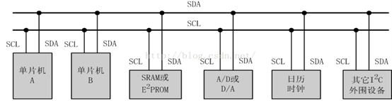
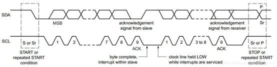
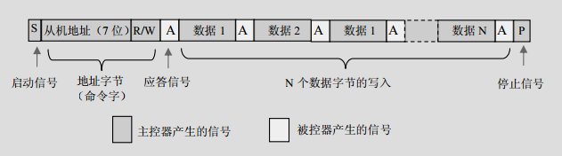
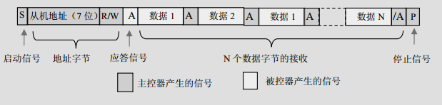
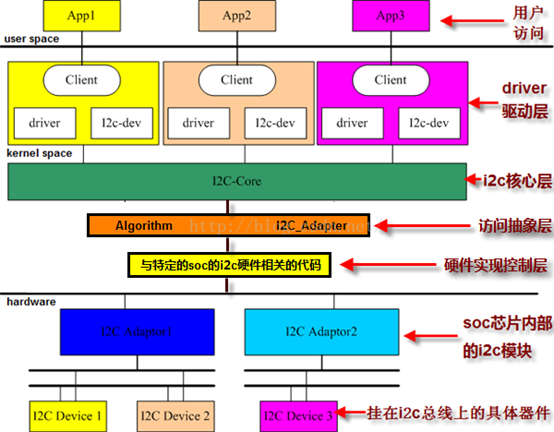
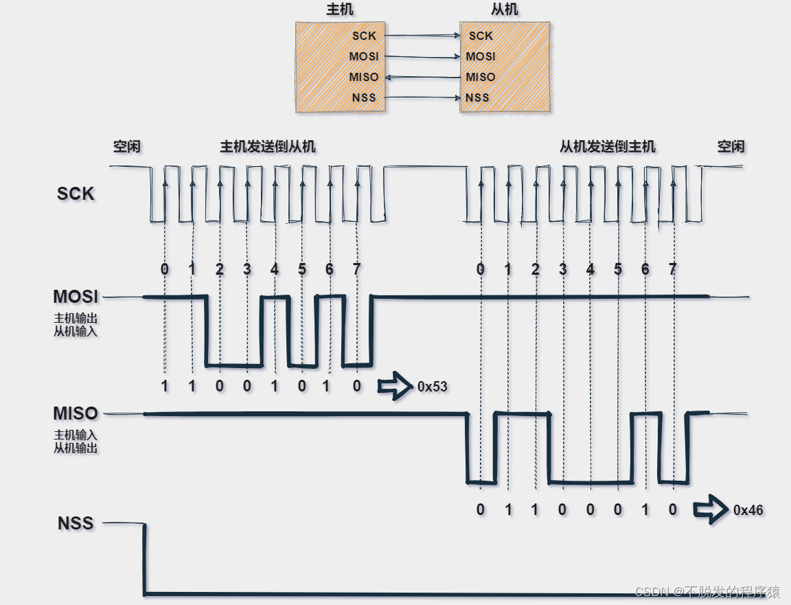
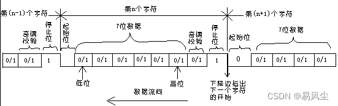

# [通信协议] I2C、SPI 与 UART
## 一、I2C

### 1.1 I2C总线

IIC总线是由数据线SDA和时钟SCL构成的串行总线，可发送和接收数据。SDA传输数据是大端传输，每次传输8bit，即一字节。总线上每个设备都有自己的一个addr，共7个bit，广播地址全0。

CPU发出的控制信号分为地址码（寄存器）和控制量（数据）两部分。



### 1.2 I2C信号

* 开始信号： SCL为高时，SDA下降沿，开始传送数据
* 结束信号： SCL为高时，SDA上升沿，结束传送数据
* 数据信号： 在开始后，SCL为高时，SDA的电平变化代表数据的传输。SCL为低时，SDA的数据才能改变。即一位数据一个时钟脉冲
* 应答信号： 发送数据后，接收方会返回一个应答信号，发送方发送完数据后，会释放SDA，接收方会拉低SDA，发送方会读取SDA的电平，如果为低，则表示接收方接收成功，如果为高，则表示接收方接收失败。



### 1.3 主机发送数据

（1）主机在检测到总线为“空闲状态”（即 SDA、SCL 线均为高电平）时，发送一个启动信号“S”（即开始信号，SCL为高时，SDA下降沿），开始一次通信的开始
（2）主机接着发送一个命令字节。该字节由 7 位的外围器件地址和 1 位读写控制位 R/W组成（此时 R/W=0，从主机写入从机）
（3）相对应的从机收到命令字节后向主机回馈应答信号 ACK（ACK=0）
（4）主机收到从机的应答信号后开始发送第一个字节的数据
（5）从机收到数据后返回一个应答信号 ACK
（6）主机收到应答信号后再发送下一个数据字节
（7）当主机发送最后一个数据字节并收到从机的 ACK 后，通过向从机发送一个停止信号P（即结束信号，SCL为高时，SDA上升沿）结束本次通信并释放总线。从机收到P信号后也退出与主机之间的通信


### 1.4 主机接收数据

（1）主机发送开始信号后，接着发送命令字节（其中 R/W=1，从从机读入主机）
（2）对应的从机收到地址字节后，返回一个应答信号并向主机发送数据
（3）主机收到数据后向从机反馈一个应答信号
（4）从机收到应答信号后再向主机发送下一个数据 
（5）当主机完成接收数据后，向从机发送一个“非应答信号（ACK=1）”，从机收到ACK=1 的非应答信号后便停止发送
（6）主机发送非应答信号后，再发送一个结束信号，释放总线结束通信



### 1.5 I2C驱动

Linux下IIC驱动架构简介

IIC（Inter-Integrated Circuit）是一种串行通信总线，用于连接低速外围设备，如传感器、EEPROM、RTC等。Linux内核提供了一套完整的IIC驱动架构，包括IIC核心层、IIC总线适配器层和IIC设备驱动层。本文将详细介绍这三层的作用和实现方法。

**IIC核心层**

IIC核心层是Linux内核中负责管理IIC总线和设备的模块，它提供了一些基本的数据结构和函数接口，用于注册、注销和访问IIC总线适配器和设备。IIC核心层的主要数据结构有：

- struct i2c_adapter：表示一个IIC总线适配器，即一个物理的IIC控制器，它可以连接多个IIC设备。该结构体中包含了一个名为algo的指针，指向一个struct i2c_algorithm结构体，该结构体定义了该适配器的具体通信方法，如读写数据、设置时钟频率等。每个IIC总线适配器都需要实现自己的算法，并在注册时传递给IIC核心层。
- struct i2c_client：表示一个IIC设备，由系统根据设备树生成,它有一个唯一的7位或10位地址。该结构体中包含了一个名为driver的指针，指向一个struct i2c_driver结构体，该结构体定义了该设备的驱动程序，如初始化、释放、读写寄存器等。每个IIC设备都需要有一个对应的驱动程序，并在注册时传递给IIC核心层。
```c
struct  i2c_client
{
	unsigned short  flags;            //标志位
	unsigned short  addr;　　　　　　 //设备的地址， 7位为读写位,[6:0]地址
	char name[I2C_NAME_SIZE];　　　　 //设备的名称，最大为20个字节
	struct  i2c_adapter *adapter;　　 //依附的适配器i2c_adapter，适配器指明所属的总线
	struct  i2c_driver *driver;　　　 //指向设备对应的驱动程序
	struct device  dev;　　　　　　　　//设备结构体
	int irq;　　　　　　　　　　　　　　//设备申请的中断号
	struct list_head  list;　　　　　　//连接到总线上的所有设备
	struct list_head 　　detected;　　//已经被发现的设备链表
	struct completion　　released;　　//是否已经释放的完成量
};

```
- struct i2c_msg：表示一个IIC消息，即一次IIC通信的操作，它包含了目标设备地址、读写标志、数据长度和数据缓冲区等信息。一次IIC通信可以由多个消息组成，例如先写入寄存器地址再读取寄存器数据，就需要两个消息。IIC核心层提供了一个名为i2c_transfer的函数接口，用于将一组消息发送给指定的适配器。
```c
struct i2c_msg {
	__u16 addr;					/* 从机地址			*/
	__u16 flags;				/* 标志位，指定进行的操作 */
#define I2C_M_TEN		0x0010	/* this is a ten bit chip address */
#define I2C_M_RD		0x0001	/* read data, from slave to master */
#define I2C_M_STOP		0x8000	/* if I2C_FUNC_PROTOCOL_MANGLING */
#define I2C_M_NOSTART		0x4000	/* if I2C_FUNC_NOSTART */
#define I2C_M_REV_DIR_ADDR	0x2000	/* if I2C_FUNC_PROTOCOL_MANGLING */
#define I2C_M_IGNORE_NAK	0x1000	/* if I2C_FUNC_PROTOCOL_MANGLING */
#define I2C_M_NO_RD_ACK		0x0800	/* if I2C_FUNC_PROTOCOL_MANGLING */
#define I2C_M_RECV_LEN		0x0400	/* length will be first received byte */
	__u16 len;		/* msg length（单位为字节，需要注意）				*/
	__u8 *buf;		/* pointer to msg data			*/
};

```

**IIC总线适配器层**

IIC总线适配器层是Linux内核中负责实现不同类型的IIC控制器驱动程序的模块，它根据不同的硬件平台和通信协议，提供了不同的算法来完成IIC通信。Linux内核支持多种常见的IIC控制器，如SMBus、GPIO模拟、PCI设备等。每种控制器都需要实现一个struct i2c_algorithm结构体，并在初始化时创建一个struct i2c_adapter结构体，并调用i2c_add_adapter函数将其注册到IIC核心层。

**IIC设备驱动层**

IIC设备驱动层是Linux内核中负责实现不同类型的IIC设备驱动程序的模块，它根据不同的硬件平台和通信协议，提供了不同的驱动程序来完成IIC设备的初始化、读写等操作。Linux内核支持多种常见的IIC设备，如EEPROM、RTC、传感器等。每种设备都需要实现一个struct i2c_driver结构体，并在初始化时调用i2c_add_driver函数将其注册到IIC核心层。




<br>
<br>

---

## 二、SPI

### 2.1 SPI总线
SPI通信原理很简单，需要至少4根线，单向传输时3根线，它们是MISO（主设备数据输入）、MOSI（主设备数据输出）、SCLK（时钟）和CS/SS（片选）：

- MISO（ Master Input Slave Output）：主设备数据输入，从设备数据输出；
- MOSI（Master Output Slave Input）：主设备数据输出，从设备数据输入；
- SCLK（Serial Clock）：时钟信号，由主设备产生；
- CS/SS（Chip Select/Slave Select）：从设备使能信号，由主设备控制，一主多从时，CS/SS是从芯片是否被主芯片选中的控制信号，只有片选信号为预先规定的使能信号时（高电位或低电位），主芯片对此从芯片的操作才有效。

### 2.2 SPI原理

SPI数据通信的流程可以分为以下几步：

>1、主设备发起信号，将CS/SS拉低，启动通信。
>2、主设备通过发送时钟信号，来告诉从设备进行写数据或者读数据操作（采集时机可能是时钟信号的上升沿（从低到高）或下降沿（从高到低），因为SPI有四种模式，后面会讲到），它将立即读取数据线上的信号，这样就得到了一位数据（1bit）。
>3、主机（Master）将要发送的数据写到发送数据缓存区（Menory），缓存区经过移位寄存器（缓存长度不一定，看单片机配置），串行移位寄存器通过MOSI信号线将字节一位一位的移出去传送给从机，同时MISO接口接收到的数据经过移位寄存器一位一位的移到接收缓存区。
>4、从机（Slave）也将自己的串行移位寄存器（缓存长度不一定，看单片机配置）中的内容通过MISO信号线返回给主机。同时通过MOSI信号线接收主机发送的数据，这样，两个移位寄存器中的内容就被交换。

例如，下图示例中简单模拟SPI通信流程，主机拉低NSS片选信号，启动通信，并且产生时钟信号，上升沿触发边沿信号，主机在MOSI线路一位一位发送数据0X53，在MISO线路一位一位接收数据0X46，如下图所示：


### 2.3 SPI时钟
SPI时钟特点主要包括：时钟速率、时钟极性和时钟相位三方面。

- 时钟速率
SPI总线上的主设备必须在通信开始时候配置并生成相应的时钟信号。从理论上讲，只要实际可行，时钟速率就可以是你想要的任何速率，当然这个速率受限于每个系统能提供多大的系统时钟频率，以及最大的SPI传输速率。

- 时钟极性
根据硬件制造商的命名规则不同，时钟极性通常写为CKP或CPOL。时钟极性和相位共同决定读取数据的方式，比如信号上升沿读取数据还是信号下降沿读取数据。

CKP可以配置为1或0。这意味着你可以根据需要将时钟的默认状态（IDLE）设置为高或低。极性反转可以通过简单的逻辑逆变器实现。你必须参考设备的数据手册才能正确设置CKP和CKE。

>CKP = 0：时钟空闲IDLE为低电平 0；
>CKP = 1：时钟空闲IDLE为高电平1。

- 时钟相位
根据硬件制造商的不同，时钟相位通常写为CKE或CPHA。顾名思义，时钟相位/边沿，也就是采集数据时是在时钟信号的具体相位或者边沿；

>CKE = 0：在时钟信号SCK的第一个跳变沿采样；
>CKE = 1：在时钟信号SCK的第二个跳变沿采样。


### 2.4 SPI模式

根据SPI的时钟极性和时钟相位特性可以设置4种不同的SPI通信操作模式，它们的区别是定义了在时钟脉冲的哪条边沿转换（toggles）输出信号，哪条边沿采样输入信号，还有时钟脉冲的稳定电平值（就是时钟信号无效时是高还是低），详情如下所示：

- Mode0：CKP=0，CKE =0：当空闲态时，SCK处于低电平，数据采样是在第1个边沿，也就是SCK由低电平到高电平的跳变，所以数据采样是在上升沿（准备数据），（发送数据）数据发送是在下降沿。
- Mode1：CKP=0，CKE=1：当空闲态时，SCK处于低电平，数据发送是在第2个边沿，也就是SCK由低电平到高电平的跳变，所以数据采样是在下降沿，数据发送是在上升沿。
- Mode2：CKP=1，CKE=0：当空闲态时，SCK处于高电平，数据采集是在第1个边沿，也就是SCK由高电平到低电平的跳变，所以数据采集是在下降沿，数据发送是在上升沿。
- Mode3：CKP=1，CKE=1：当空闲态时，SCK处于高电平，数据发送是在第2个边沿，也就是SCK由高电平到低电平的跳变，所以数据采集是在上升沿，数据发送是在下降沿。



不同的模式就是取决SCK的空闲状态和在哪种边沿进行采样。

### 2.5 SPI驱动

SPI驱动架构

SPI驱动架构和IIC驱动架构类似，也是由SPI核心层、SPI总线适配器层和SPI设备驱动层组成。SPI核心层提供了一些基本的数据结构和函数接口，用于注册、注销和访问SPI总线适配器和设备。SPI总线适配器层提供了不同类型的SPI控制器驱动程序，SPI设备驱动层提供了不同类型的SPI设备驱动程序。

#### SPI核心层

SPI核心层是Linux内核中负责管理SPI总线和设备的模块，它提供了一些基本的数据结构和函数接口，用于注册、注销和访问SPI总线适配器和设备。SPI核心层的主要数据结构有：

- struct spi_master：表示一个SPI总线适配器，即一个物理的SPI控制器，它可以连接多个SPI设备。该结构体中包含了一个名为bus的指针，指向一个struct spi_bus_type结构体，该结构体定义了该适配器的具体通信方法，如读写数据、设置时钟频率等。每个SPI总线适配器都需要实现自己的算法，并在注册时传递给SPI核心层。

- struct spi_device：表示一个SPI设备，由系统根据设备树生成，它有一个唯一的7位或10位地址。该结构体中包含了一个名为driver的指针，指向一个struct spi_driver结构体，该结构体定义了该设备的驱动程序，如初始化、释放、读写寄存器等。每个SPI设备都需要有一个对应的驱动程序，并在注册时传递给SPI核心层。

- struct spi_message：表示一个SPI消息，即一次SPI通信的操作，它包含了目标设备地址、读写标志、数据长度和数据缓冲区等信息。一次SPI通信可以由多个消息组成，例如先写入寄存器地址再读取寄存器数据，就需要两个消息。SPI核心层提供了一个名为spi_async函数接口，用于将一组消息发送给指定的适配器。

#### SPI总线适配器层

SPI总线适配器层是Linux内核中负责实现不同类型的SPI控制器驱动程序的模块，它根据不同的硬件平台和通信协议，提供了不同的算法来完成SPI通信。Linux内核支持多种常见的SPI控制器，如SMBus、GPIO模拟、PCI设备等。每种控制器都需要实现一个struct spi_algorithm结构体，并在初始化时创建一个struct spi_master结构体，并调用spi_register_master函数将其注册到SPI核心层。

#### SPI设备驱动层

SPI设备驱动层是Linux内核中负责实现不同类型的SPI设备驱动程序的模块，它根据不同的硬件平台和通信协议，提供了不同的驱动程序来完成SPI设备的初始化、读写等操作。Linux内核支持多种常见的SPI设备，如EEPROM、RTC、传感器等。每种设备都需要实现一个struct spi_driver结构体，并在初始化时调用spi_register_driver函数将其注册到SPI核心层。


<br>
<br>

---

## 三、UART

### 3.1 UART总线
&emsp;&emsp;在UART通信中，一般是两个UART直接进行信息交互，发送方的UART将来自CPU或其他控制单元的并行数据转化为串行数据并将其通过线缆传送到接收方的UART，接收方UART则将接收到的串行数据又重新转换为并行形式，因此一般情况下仅需两根电缆线即可实现全双工的UART通信。

&emsp;&emsp;UART采用异步方式传输数据，这就意味着不存在时钟信号来同步发送方的输出数据位与接收方的输入数据位。由于没有了时钟信号，UART采用在数据包中引入起始位与停止位的方法，以协助UART在合适的时刻进行数据的读取。

### 3.2 UART原理
&emsp;&emsp;UART的工作主要是发送数据至数据总线或者从数据总线上读取数据。通常数据都是由CPU，存储设备或者微控制器发送至数据总线，此后数据再从数据总线上由发送端UART发出。当发送端UART从数据总线上获取到并行的数据后，它将在数据中加入起始位、奇偶校验位与停止位以构成数据包，然后这个数据包经过UART的Tx引脚串行地发出。同理，接收端的UART通过其Rx引脚读取数据包，然后将数据包中的起始位、奇偶校验位和停止位移除并将串行数据转换为并行数据，最后这些数据传输到接收端的数据总线上。


UART采用数据包的形式进行数据收发，每一个数据包包含一个起始位，5-9个数据位(数据帧)，一个可选的奇偶校验位和1-2个停止位。数据包的格式如下图所示：


- 起始位(Start Bit)
UART的数据传输线在未发送数据是默认保持高电平状态。当数据准备发送时，UART将传输线的电平由高拉低并保持一个时钟周期。当接收端的UART检测到电平变化时(起始位)，它就开始按照既定的波特率接收数据。

- 数据帧(Data Frame)
数据帧部分包含真正的有效信息。如果使用奇偶校验位则数据帧可包含5-8个数据位，如果不使用奇偶校验位则可以包含9个数据位。一般情况下，数据从最低位开始发出。

- 奇偶校验(Parity)
奇偶校验位表征数据从发送端传输到接收端的过程中是否发生了变化。在传输过程中，数据位可能因为电磁干扰，波特率失配或长距离传输导致的电平降落而产生变化。当接收端UART读取数据帧时，它不断计数数据中比特值为1的数据位的个数并计算其个数总和是奇数或偶数。如果数据包中的奇偶校验位为0(偶校验)，则表示初始数据帧中的逻辑高电平1的数据位数为偶数，同理，如果奇偶校验位是1（奇校验），则表示初始数据帧中的逻辑高电平1的数据位数为奇数。如果接收端统计的数据帧中的逻辑高电平数据位的个数与奇偶校验位相符，则表示数据传输没有发生错误。如果奇偶校验位为0，而计数得到的1的个数为奇数，或者奇偶校验位为1，而计数得到的1的个数为偶数，那么接收端的UART则可以知道数据帧接收出现异常。

- 停止位(Stop Bit)
为了标记数据传输已经结束，发送端的UART需要将数据传输线从低电平拉高至高电平并至少维持2个Bit时长(2个时钟周期)。

### 3.3 UART步骤
UART传输步骤大致如下：

1. 发送UART从数据总线并行接收数据，并将其存储在内部缓冲区中。
2. 发送UART根据配置的数据位长度、奇偶校验位和停止位，将数据帧转换为串行数据，并在数据帧前后加上起始位和停止位，形成一个数据包。
3. 发送UART通过发送引脚（Tx）将数据包以串行方式发送到接收UART的接收引脚（Rx），两者之间需要使用相同的波特率来同步数据传输。
4. 接收UART根据起始位检测到数据包的开始，然后按照波特率对接收引脚（Rx）上的信号进行采样，还原出串行数据，并存储在内部缓冲区中。
5. 接收UART根据配置的数据位长度、奇偶校验位和停止位，将串行数据转换为并行数据，并去除起始位和停止位，形成一个数据帧。
6. 接收UART将数据帧通过数据总线并行发送到目标设备。

<br>
<br>

---

## 四、USB
### 4.1 USB数据传输

&emsp;&emsp;USB的数据是通过数据线上的差分信号来传输的，差分信号是一种利用两根线上的电压差来表示逻辑0或1的信号，具有抗干扰和低功耗的优点。USB的数据线有两根，一根叫D+，一根叫D-，它们分别承载正向和反向的差分信号。USB的数据传输是基于包的，每个包都有一个包头和一个包尾，包头用于标识包的类型、地址、端点和长度，包尾用于校验包的正确性。USB的数据传输有四种模式，分别是控制传输、中断传输、批量传输和同步传输，它们适用于不同的数据类型和场景。控制传输用于配置设备和发送命令，中断传输用于实时性较高的设备，如鼠标和键盘，批量传输用于大量数据的设备，如打印机和硬盘，同步传输用于音频和视频等连续数据的设备。USB的数据传输遵循主从模式，即电脑作为主机（host），外部设备作为从机（device），主机负责发起请求和分配带宽，从机负责响应请求和发送或接收数据。USB的数据传输还遵循令牌-数据-握手（token-data-handshake）的三步交互模式，即主机先发送一个令牌包（token packet）来指定目标地址、端点和方向，然后主机或从机发送一个数据包（data packet）来传送实际的数据，最后主机或从机发送一个握手包（handshake packet）来确认数据是否成功接收。